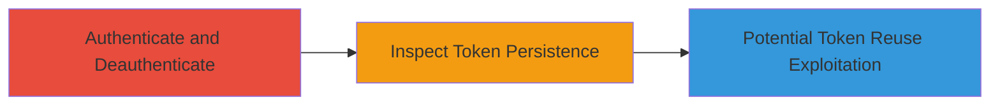

# CSRF Token Reuse Across Multiple Login/Logout Cycles in Liberapay

Multi-stage attack chain demonstrating a complete attack workflow.

## Chain Metrics Dashboard

| Metric | Value |
|--------|-------|
| Chain Status | Unverified |
| Total Steps | 2 |
| Execution Time | ~5 minutes |
| Skill Level | Basic |
| Complexity | Low |
| Impact Level | Medium |

## Attack Flow Visualization

## Prerequisites & Requirements

### Required Tools

- Browser Developer Tools

### Target Environment

- Web application (e.g., Liberapay)
- Required services/ports: HTTPS on port 443
- Network access requirements: Direct access to the target web app

### Initial Access Requirements

- Valid user credentials for the target application
- Network position: External or internal user
- Prior access needed: None, but assumes ability to authenticate

## Detailed Attack Procedures

### Step 1: Authenticate and Deauthenticate
procedure: [[procedures/Test-Login-Logout-Cycles]]

**Objective**: Simulate multiple authentication cycles to test token behavior during state changes.

**Instructions**: Use a browser or curl to perform repeated logins and logouts on the target application, such as Liberapay. For example, navigate to the login page, enter credentials, submit, then logout, and repeat 3-5 times.

**Expected Output**: Successful login and logout confirmations, with session cookies and tokens exchanged.

**Success Indicators**:
- Multiple successful authentication cycles completed without errors
- Session appears to reset on logout

### Step 2: Inspect Token Persistence
procedure: [[procedures/Inspect-CSRF-Token-Persistence]]

**Objective**: Verify if the CSRF token remains unchanged across sessions, indicating a reuse vulnerability.

**Instructions**: During and after each cycle, inspect the page source or network requests for the CSRF token value. Compare tokens from initial login to subsequent sessions.

**Expected Output**: CSRF token value extracted and compared, showing identical values across cycles.

**Success Indicators**:
- CSRF token does not regenerate or expire
- Same token value observed in multiple sessions

## Attack Chain Summary

### Key Achievements

1. Confirmed CSRF token persistence across login/logout cycles
2. Identified potential for token reuse if stolen via other vectors like XSS
3. Highlighted remediation gap even after fixing token theft mechanisms

## Technique & Tactic Coverage

### MITRE ATT&CK Techniques

- [[Exploit Public-Facing Application]]

### MITRE ATT&CK Tactics

- [[Initial Access]]

---
*Last updated: 2023-10-01T00:00:00Z*
