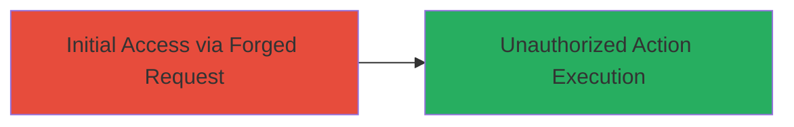

# CSRF Vulnerability Exploitation in HackerOne Platform

Multi-stage attack chain demonstrating a complete attack workflow.

## Chain Metrics Dashboard

| Metric | Value |
|--------|-------|
| Chain Status | Unverified |
| Total Steps | 1 |
| Execution Time | ~5 minutes |
| Skill Level | Novice |
| Complexity | Low |
| Impact Level | Low |

## Attack Flow Visualization



## Prerequisites & Requirements

### Required Tools

- Web browser (e.g., Chrome Developer Tools)

### Target Environment

- Web platform (HackerOne application)
- No specific ports or services required beyond standard HTTPS (443)
- Attacker must trick victim into visiting a malicious page while authenticated to HackerOne

### Initial Access Requirements

- Victim must be authenticated to HackerOne
- Attacker needs to host a malicious webpage or email with a link
- No prior network access beyond internet connectivity

## Detailed Attack Procedures

### Step 1: Forge and Execute CSRF Request
procedure: [[procedures/Exploiting-CSRF-in-HackerOne-Platform]]

**Objective**: Trick an authenticated user into performing unauthorized actions on the HackerOne platform via a forged request.

**Instructions**: Create a malicious HTML page that submits a forged POST request to the vulnerable endpoint on HackerOne. Use browser developer tools to inspect and replicate the target form. Host the malicious page on an attacker-controlled server and lure the victim to visit it while logged in to HackerOne.

For testing, simulate the forged request using [[commands/curl-csrf-forged-request]]:

```bash
curl -X POST 'https://hackerone.com/vulnerable-endpoint' \
  -H 'Cookie: session=authenticated_session_token' \
  -d 'action=unauthorized&param=value' \
  --referer 'http://attacker-site.com/malicious.html'
```

**Expected Output**: The server processes the request as if submitted by the authenticated user, performing the unauthorized action (e.g., modifying profile or submitting data).

**Success Indicators**:
- Request accepted without CSRF token validation
- Unauthorized action completes (e.g., status change or data submission confirmed)
- No errors related to missing tokens

## Attack Chain Summary

### Key Achievements

1. Successful forgery of requests to bypass authentication checks
2. Execution of low-impact unauthorized actions on the platform
3. Demonstration of missing CSRF protections leading to potential account manipulation

## Technique & Tactic Coverage

### MITRE ATT&CK Techniques

- [[Exploit Public-Facing Application]]

### MITRE ATT&CK Tactics

- [[Initial Access]]

---
*Last updated: 2023-10-01T00:00:00Z*
