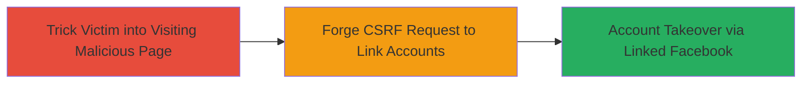

# CSRF Vulnerability in Facebook Linkage Leading to Social Club Account Takeover

Multi-stage attack chain demonstrating a complete attack workflow exploiting a CSRF vulnerability in the account linking process.

## Chain Metrics Dashboard

| Metric | Value |
|--------|-------|
| Chain Status | Unverified |
| Total Steps | 1 |
| Execution Time | ~5 minutes |
| Skill Level | Intermediate |
| Complexity | Medium |
| Impact Level | High |

## Attack Flow Visualization

## Prerequisites & Requirements

### Required Tools

- None (uses standard web browser and HTML crafting)

### Target Environment

- Web platform
- Services: Facebook, Social Club
- No specific ports required

### Initial Access Requirements

- Victim must be authenticated in Social Club
- Attacker must have a Facebook account
- Victim must be deceived into visiting attacker's malicious page (e.g., via phishing email or social engineering)
- Network access to the Social Club linkage page

## Detailed Attack Procedures

### Step 1: Forge and Trigger CSRF Request for Account Linking
procedure: [[procedures/Exploit-CSRF-in-Facebook-Account-Linking]]

**Objective**: Exploit the lack of anti-CSRF tokens in the Facebook linkage process to link the attacker's Facebook account to the victim's Social Club account, enabling full takeover.

**Instructions**: Prepare a malicious HTML page that automatically submits a forged POST request to the Social Club Facebook linkage endpoint. Host this page on an attacker-controlled server and trick the victim into visiting it while logged into Social Club. The request will impersonate the victim and link the specified Facebook account without their consent.

**Expected Output**: Successful linkage confirmation or redirection indicating the accounts are now connected, allowing the attacker to access the victim's Social Club via their Facebook credentials.

**Success Indicators**:
- Victim's Social Club account shows the attacker's Facebook linked
- Attacker can log in to the victim's Social Club using Facebook
- No CSRF token validation error occurs

## Attack Chain Summary

### Key Achievements

1. Bypassed authentication checks in the account linking process
2. Achieved full account takeover without direct credential theft
3. Demonstrated high-impact vulnerability leading to unauthorized access to gaming accounts and associated data

## Technique & Tactic Coverage

### MITRE ATT&CK Techniques

- [[Valid Accounts]]

### MITRE ATT&CK Tactics

- [[Initial Access]]

---
*Last updated: 2023-10-01T00:00:00Z*
