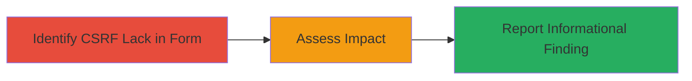

---
tags:
  - csrf
  - web-vulnerability
type: attack_chain
tools: []
tactics:
  - '[[Initial Access]]'
commands: []
platforms:
  - Web
complexity: low
procedures:
  - '[[procedures/Test-for-CSRF-Protection-in-Web-Forms]]'
step_count: 1
techniques:
  - '[[Exploit Public-Facing Application]]'
description: >-
  Demonstrates identification of a CSRF vulnerability in a web email signup
  form, though with negligible impact due to lack of sensitive operations.
skill_level: beginner
impact_level: informational
id: c8fa04b2-13d7-475f-bb1a-cd3e601ada00
created_at: '2025-12-14T17:27:03.058Z'
updated_at: '2025-12-14T17:27:03.058Z'
verified: false
validated: true
submitted: true
mitre_tactics:
  - '[[Initial Access]]'
mitre_techniques:
  - '[[Exploit Public-Facing Application]]'
---
# CSRF Vulnerability in Hiro Email Signup Form Allowing Forged Signups

Multi-stage attack chain demonstrating a complete attack workflow.

## Chain Metrics Dashboard

| Metric | Value |
|--------|-------|
| Chain Status | Unverified |
| Total Steps | 1 |
| Execution Time | ~5 minutes |
| Skill Level | Beginner |
| Complexity | Low |
| Impact Level | Informational |

## Attack Flow Visualization



## Prerequisites & Requirements

### Required Tools

- Browser developer tools

### Target Environment

- Web application with forms (e.g., email signup on Hiro platform)
- Required services/ports: HTTP/HTTPS on port 80/443
- Network access requirements: Direct access to the target website

### Initial Access Requirements

- No credentials required
- Public network access
- No prior access needed

## Detailed Attack Procedures

### Step 1: Identify CSRF Vulnerability
procedure: [[procedures/Test-for-CSRF-Protection-in-Web-Forms]]

**Objective**: Examine the email signup form to detect absence of CSRF token validation, enabling forged requests via external links.

**Instructions**: Inspect the form using browser developer tools to check for CSRF tokens in the HTML source or network requests. Attempt to craft a simple HTML page with a form submission link pointing to the target endpoint without tokens.

For example, create a test HTML file:

```html
<!DOCTYPE html>
<html>
<body>
    <form action="https://hiro-platform.com/signup" method="POST" id="csrf-test">
        <input type="hidden" name="email" value="test@example.com">
    </form>
    <script>document.getElementById('csrf-test').submit();</script>
</body>
</html>
```

Host this on a local server or share as a link, then click to submit and monitor if the request succeeds without authentication or tokens.

**Expected Output**: Successful form submission without CSRF token, confirming the vulnerability.

**Success Indicators**:
- Form submits via forged link without errors
- No token validation enforced in response

## Attack Chain Summary

### Key Achievements

1. Identified lack of CSRF protection in email signup form
2. Demonstrated potential for clickable links to trigger signups
3. Assessed negligible impact due to no sensitive data or state changes

## Technique & Tactic Coverage

### MITRE ATT&CK Techniques

- [[Exploit Public-Facing Application]]

### MITRE ATT&CK Tactics

- [[Initial Access]]

---
*Last updated: 2023-10-01*
