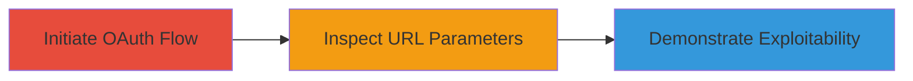

---
tags:
  - csrf
  - oauth
  - slack
  - google-drive
  - session-hijacking
type: attack_chain
tools: []
tactics:
  - '[[Initial Access]]'
verified: false
platforms:
  - Web
submitted: true
complexity: low
created_at: '2023-10-01T00:00:00Z'
procedures:
  - '[[procedures/Initiate-Slack-Google-Drive-OAuth-Flow]]'
  - '[[procedures/Inspect-OAuth-Authorization-URL]]'
  - '[[procedures/Demonstrate-CSRF-Vulnerability-with-Proof]]'
step_count: 3
techniques:
  - '[[Exploit Public-Facing Application]]'
updated_at: '2025-12-14T17:24:35.322Z'
description: >-
  Attack chain demonstrating the discovery and validation of a CSRF
  vulnerability in Slack's Google Drive OAuth integration due to the absence of
  the state parameter, enabling potential session hijacking.
skill_level: intermediate
impact_level: medium
id: 6e5bf7fc-3fb1-4b45-9475-27233d81e249
validated: true
mitre_tactics:
  - '[[Initial Access]]'
mitre_techniques:
  - '[[Exploit Public-Facing Application]]'
---
# CSRF Vulnerability in Slack Google Drive OAuth via Missing State Parameter

Multi-stage attack chain demonstrating the discovery of a CSRF vulnerability in Slack's Google Drive integration, where the OAuth authorization URL lacks the state parameter, allowing potential session hijacking during authentication.

## Chain Metrics Dashboard

| Metric | Value |
|--------|-------|
| Chain Status | Unverified |
| Total Steps | 3 |
| Execution Time | ~5 minutes |
| Skill Level | Intermediate |
| Complexity | Low |
| Impact Level | Medium |

## Attack Flow Visualization

## Prerequisites & Requirements

### Required Tools

- Web browser (e.g., Chrome Developer Tools)
- Video recording software for proof of concept

### Target Environment

- Web platform
- Slack application with Google Drive integration enabled
- Access to Google OAuth endpoints

### Initial Access Requirements

- Valid Slack account
- Network access to Slack and Google services
- No prior privileged access needed

## Detailed Attack Procedures

### Step 1: Initiate OAuth Flow
procedure: [[procedures/Initiate-Slack-Google-Drive-OAuth-Flow]]

**Objective**: Start the Google OAuth authorization process for Slack's Google Drive integration to generate the authorization URL.

**Instructions**: Log in to your Slack workspace, navigate to the Google Drive integration settings, and trigger the OAuth authorization by attempting to connect a Google Drive account. This will redirect to Google's OAuth endpoint.

**Expected Output**: Generation of an OAuth authorization URL in the browser address bar.

**Success Indicators**:
- Redirect to https://accounts.google.com/o/oauth2/auth
- URL contains client_id, scope, and redirect_uri but no state parameter

### Step 2: Inspect Authorization URL
procedure: [[procedures/Inspect-OAuth-Authorization-URL]]

**Objective**: Examine the generated OAuth URL for the presence of security parameters, specifically the state parameter.

**Instructions**: Use browser developer tools to copy and analyze the full authorization URL. Look for the state parameter, which should serve as an anti-CSRF token.

**Expected Output**: URL like https://accounts.google.com/o/oauth2/auth?response_type=code&redirect_uri=https%3A%2F%2Fslack.com%2Fservices%2Fauth%2Fgdrive&client_id=19570130570-tfuuvh6hutjd09bq64is5sao643q67jg.apps.googleusercontent.com&scope=https%3A%2F%2Fwww.googleapis.com%2Fauth%2Fdrive&access_type=offline&approval_prompt=force, confirming absence of state.

**Success Indicators**:
- No state parameter observed
- Potential for CSRF identified due to missing session identity token

### Step 3: Demonstrate Vulnerability
procedure: [[procedures/Demonstrate-CSRF-Vulnerability-with-Proof]]

**Objective**: Validate the vulnerability's exploitability by creating a proof-of-concept demonstration.

**Instructions**: Record a video showing the OAuth flow initiation and URL inspection, highlighting the missing state parameter. Simulate a CSRF scenario if possible, such as embedding the flow in a malicious page, and submit the evidence.

**Expected Output**: Video file demonstrating the issue, e.g., uploaded to Dropbox.

**Success Indicators**:
- Video captures the missing state parameter
- Report accepted by Slack, leading to patch (no bounty awarded)

## Attack Chain Summary

### Key Achievements

1. Identified missing state parameter in Slack's OAuth URL for Google Drive integration.
2. Demonstrated potential for CSRF-based session hijacking.
3. Reported vulnerability, resulting in a patch by Slack.

## Technique & Tactic Coverage

### MITRE ATT&CK Techniques

- [[Exploit Public-Facing Application]]

### MITRE ATT&CK Tactics

- [[Initial Access]]

---
*Last updated: 2023-10-01T00:00:00Z*
