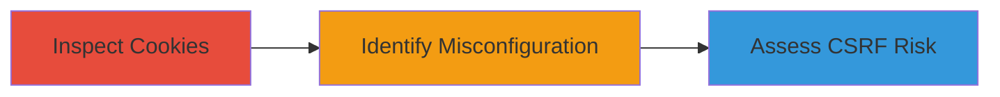

# CSRF Vulnerability via Misconfigured SameSite Cookies on Yelp

Multi-stage attack chain demonstrating the identification of a CSRF vulnerability through cookie inspection on Yelp's website.

## Chain Metrics Dashboard

| Metric | Value |
|--------|-------|
| Chain Status | Unverified |
| Total Steps | 2 |
| Execution Time | ~5 minutes |
| Skill Level | Beginner |
| Complexity | Low |
| Impact Level | Medium |

## Attack Flow Visualization

## Prerequisites & Requirements

### Required Tools

- Browser with developer tools (e.g., Chrome DevTools)

### Target Environment

- Web platform
- Access to www.yelp.com
- No special services or ports required

### Initial Access Requirements

- Public internet access
- No credentials needed for inspection

## Detailed Attack Procedures

### Step 1: Navigate and Inspect Cookies
procedure: [[procedures/Inspect-Website-Cookies-for-CSRF-Misconfigurations]]

**Objective**: Access the target website and examine its cookies for misconfigurations that could enable CSRF.

**Instructions**: Open a web browser and navigate to www.yelp.com. Once loaded, open the browser's developer tools (press F12 or right-click and select Inspect). Go to the Application tab (or Storage in some browsers), expand the Cookies section under the domain www.yelp.com, and review the attributes of each cookie, focusing on SameSite and Secure flags.

**Expected Output**: A list of cookies with their attributes visible, such as Name, Value, Domain, Path, Expires, HttpOnly, Secure, and SameSite.

**Success Indicators**:
- Developer tools open and cookies section accessible
- Cookies loaded and attributes displayed

### Step 2: Observe Cookie Rejection or Misconfiguration
procedure: [[procedures/Inspect-Website-Cookies-for-CSRF-Misconfigurations]]

**Objective**: Identify specific cookies with improper SameSite=None without Secure, assessing potential CSRF exposure.

**Instructions**: In the cookies list, look for entries like 'myCookie' or similar session-related cookies. Check if SameSite is set to None but lacks the Secure attribute. Note any browser warnings about rejection (e.g., in the console). Verify that ideal configurations would use SameSite=Lax, Strict, or None with Secure to mitigate cross-origin risks.

**Expected Output**: Identification of vulnerable cookies, such as "SameSite=None; Secure not present," with notes on potential third-party cookie transmission in cross-origin requests.

**Success Indicators**:
- Misconfigured cookies detected
- Understanding of CSRF risk due to lack of additional protections like tokens

## Attack Chain Summary

### Key Achievements

1. Successful inspection of Yelp's cookies revealing SameSite misconfigurations.
2. Assessment of low-likelihood CSRF impact due to dependencies on absent mitigations.
3. Documentation of vulnerability for potential exploitation or reporting.

## Technique & Tactic Coverage

### MITRE ATT&CK Techniques

- [[Software]] Gather Victim Host Information: Software
- [[Exploit Public-Facing Application]] Exploit Public-Facing Application

### MITRE ATT&CK Tactics

- [[Reconnaissance]] Reconnaissance
- [[Initial Access]] Initial Access

---

*Last updated: 2023-10-01T12:00:00Z*
