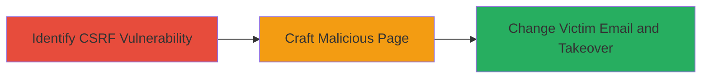

---
tags:
  - csrf
  - account-takeover
  - web
type: attack_chain
tools: []
tactics:
  - '[[Initial Access]]'
commands: []
platforms:
  - Web
complexity: medium
procedures:
  - '[[procedures/Test-for-CSRF-in-Account-Settings]]'
  - '[[procedures/Craft-CSRF-Attack-for-Email-Change]]'
  - '[[procedures/Exploit-Email-Change-for-Account-Takeover]]'
step_count: 3
techniques:
  - '[[Account Manipulation]]'
  - '[[Drive-by Compromise]]'
description: >-
  A multi-stage attack exploiting CSRF vulnerability in account settings to
  change victim email and achieve account takeover.
skill_level: intermediate
impact_level: high
id: 64584d34-5e37-4ea1-bbfb-703c0e731d8b
created_at: '2025-12-14T17:32:58.050Z'
updated_at: '2025-12-14T17:32:58.050Z'
verified: false
validated: true
submitted: true
mitre_tactics:
  - '[[Initial Access]]'
mitre_techniques:
  - '[[Account Manipulation]]'
  - '[[Drive-by Compromise]]'
---
# CSRF-in-Account-Settings-Change-Leading-to-Account-Takeover

Multi-stage attack chain demonstrating a complete attack workflow exploiting CSRF in the FanFootage web application's account settings to enable account takeover.

## Chain Metrics Dashboard

| Metric | Value |
|--------|-------|
| Chain Status | Unverified |
| Total Steps | 3 |
| Execution Time | ~5 minutes |
| Skill Level | Intermediate |
| Complexity | Medium |
| Impact Level | High |

## Attack Flow Visualization



## Prerequisites & Requirements

### Required Tools

- None (manual testing and HTML crafting)

### Target Environment

- Web application (e.g., FanFootage)
- Account settings endpoint accessible
- No specific ports; standard HTTPS/HTTP

### Initial Access Requirements

- Victim must be authenticated and logged in
- Attacker needs knowledge of the account settings form endpoint (e.g., via public testing)
- Social engineering to lure victim to malicious page

## Detailed Attack Procedures

### Step 1: Identify CSRF Vulnerability
procedure: [[procedures/Test-for-CSRF-in-Account-Settings]]

**Objective**: Verify the absence of CSRF token validation in the account settings update endpoint to confirm exploitability.

**Instructions**: Access the account settings page while logged in and inspect the update form (e.g., for email change). Attempt to submit a modified request from a different origin without the session token. For example, use browser developer tools to simulate a form submission to the endpoint like `/account/update` with parameters such as `email=newemail@example.com` without any CSRF token.

**Expected Output**: Successful email update without token validation, confirming the vulnerability.

**Success Indicators**:
- Account details change without requiring a CSRF token
- No errors related to token mismatch

### Step 2: Craft Malicious CSRF Page
procedure: [[procedures/Craft-CSRF-Attack-for-Email-Change]]

**Objective**: Create a forged request that tricks the victim into submitting unauthorized changes to their account while authenticated.

**Instructions**: Develop an HTML page that automatically submits a form to the vulnerable endpoint. Include hidden fields for the malicious email change. Host the page on an attacker-controlled site and lure the victim (e.g., via phishing link). Example HTML structure:

```html
<!DOCTYPE html>
<html>
<body>
<form action="https://fanfootage.com/account/update" method="POST" id="csrf-form">
    <input type="hidden" name="email" value="attacker@evil.com">
</form>
<script>
document.getElementById('csrf-form').submit();
</script>
</body>
</html>
```

**Expected Output**: When victim visits the page while logged in, their email is updated to the attacker's address.

**Success Indicators**:
- Form submission succeeds from external site
- Victim's account email changes

### Step 3: Achieve Account Takeover
procedure: [[procedures/Exploit-Email-Change-for-Account-Takeover]]

**Objective**: Use the changed email to reset the victim's password and gain full control.

**Instructions**: After email change, initiate a password reset on the application using the new (attacker-controlled) email. Receive the reset link and set a new password to access the account. Further actions may include data exfiltration or additional changes.

**Expected Output**: Access to the victim's account dashboard with full privileges.

**Success Indicators**:
- Password reset email received by attacker
- Successful login with new credentials

## Attack Chain Summary

### Key Achievements

1. Confirmed CSRF vulnerability in account settings
2. Successfully changed victim email via forged request
3. Achieved full account takeover through password reset

## Technique & Tactic Coverage

### MITRE ATT&CK Techniques

- [[Account Manipulation]]
- [[Drive-by Compromise]]

### MITRE ATT&CK Tactics

- [[Initial Access]]

---
*Last updated: 2023-10-01*
