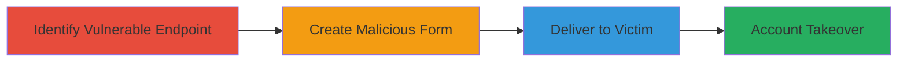

# CSRF in Concrete CMS Profile Preferences Leading to Full Account Takeover

Multi-stage attack chain demonstrating a complete CSRF-based account takeover workflow in Concrete CMS.

## Chain Metrics Dashboard

| Metric | Value |
|--------|-------|
| Chain Status | Unverified |
| Total Steps | 3 |
| Execution Time | ~5 minutes |
| Skill Level | Intermediate |
| Complexity | Medium |
| Impact Level | High |

## Attack Flow Visualization

## Prerequisites & Requirements

### Required Tools

- None (uses standard web development tools like a text editor)

### Target Environment

- Concrete CMS platform
- Web browser for testing
- Access to a hosting service for the malicious page (e.g., local server or public host)

### Initial Access Requirements

- Victim must be authenticated to the Concrete CMS instance
- Attacker needs to know the target site's URL
- No prior credentials required for the attacker

## Detailed Attack Procedures

### Step 1: Identify Vulnerable Endpoint
procedure: [[procedures/Identify-Vulnerable-CSRF-Endpoint-in-Concrete-CMS]]

**Objective**: Locate the profile preferences save endpoint lacking CSRF protection to confirm exploitability.

**Instructions**: Analyze the Concrete CMS source or use browser developer tools to inspect network requests during profile updates. Verify the POST endpoint at `https://target.com/profile/preferences/-/save/` accepts updates without CSRF tokens or password confirmation.

**Expected Output**: Confirmation that the endpoint processes POST requests with fields like `uName`, `uEmail`, and `uAccountType` without validation.

**Success Indicators**:
- Endpoint identified and tested via manual POST (e.g., using browser tools)
- No CSRF token required in successful requests

### Step 2: Create Malicious HTML Form
procedure: [[procedures/Create-Malicious-HTML-Form-for-Concrete-CMS-CSRF]]

**Objective**: Build a forged HTML form that submits unauthorized profile changes to the vulnerable endpoint.

**Instructions**: Use a text editor to create an HTML file with a hidden form targeting the endpoint. Set form fields to desired values (e.g., change email to attacker's and account type to 'owner'). Include JavaScript to auto-submit the form on page load.

**Expected Output**: A self-contained HTML page that, when loaded, sends the forged POST request.

**Success Indicators**:
- Form submits correctly when tested in an authenticated browser session
- Profile details update without errors

### Step 3: Deliver CSRF Payload to Victim
procedure: [[procedures/Deliver-CSRF-Payload-to-Victim-for-Account-Takeover]]

**Objective**: Trick the authenticated victim into loading the malicious page, triggering the account takeover.

**Instructions**: Host the malicious HTML on a server (e.g., via GitHub Pages or local ngrok tunnel) and send the link to the victim via email, social engineering, or phishing. Ensure the victim is logged into the target Concrete CMS site when they visit the link.

**Expected Output**: Victim's account details overwritten, granting attacker control (e.g., via new email).

**Success Indicators**:
- Victim loads the page while authenticated
- Attacker gains access to the hijacked account

## Attack Chain Summary

### Key Achievements

1. Identified CSRF vulnerability in profile update endpoint
2. Forged requests to change username, email, and elevate account type
3. Achieved full account takeover without direct authentication

## Technique & Tactic Coverage

### MITRE ATT&CK Techniques

- [[Drive-by Compromise]] Drive-by Compromise

### MITRE ATT&CK Tactics

- [[Initial Access]] Initial Access

---
*Last updated: 2023-10-01T00:00:00Z*
