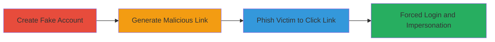

---
tags:
  - csrf
  - web
  - impersonation
  - account-takeover
type: attack_chain
tools: []
tactics:
  - '[[Initial Access]]'
verified: false
platforms:
  - Web
submitted: true
complexity: medium
created_at: '2023-10-01T00:00:00Z'
procedures:
  - >-
    [[procedures/Create-Fake-Account-and-Change-Email-to-Generate-Confirmation-Link]]
  - '[[procedures/Exploit-CSRF-via-Malicious-Confirmation-Link-for-Victim-Login]]'
step_count: 2
techniques:
  - '[[Exploit Public-Facing Application]]'
  - '[[Drive-by Compromise]]'
updated_at: '2025-12-14T17:27:43.133Z'
description: >-
  A multi-stage CSRF attack exploiting the email confirmation process on
  HackerOne to force victim login into an attacker-controlled account, enabling
  monitoring and impersonation.
skill_level: intermediate
impact_level: high
id: 771d206b-69be-4dce-82ae-5dae29647f2e
validated: true
mitre_tactics:
  - '[[Initial Access]]'
mitre_techniques:
  - '[[Exploit Public-Facing Application]]'
  - '[[Drive-by Compromise]]'
---
# CSRF in Email Confirmation for Forced Login and Account Impersonation

Multi-stage attack chain demonstrating a complete attack workflow exploiting CSRF in HackerOne's email change confirmation to impersonate victims.

## Chain Metrics Dashboard

| Metric | Value |
|--------|-------|
| Chain Status | Unverified |
| Total Steps | 2 |
| Execution Time | ~5 minutes |
| Skill Level | Intermediate |
| Complexity | Medium |
| Impact Level | High |

## Attack Flow Visualization

## Prerequisites & Requirements

### Required Tools

- Web browser for account creation and link crafting
- Email service to control the confirmation address

### Target Environment

- Web platform (HackerOne-like bug bounty site)
- Required services/ports: HTTPS on port 443
- Network access requirements: Internet access to the target site

### Initial Access Requirements

- No prior credentials needed
- Ability to create accounts on the target platform
- Social engineering capability for phishing the link

## Detailed Attack Procedures

### Step 1: Create Fake Account and Prepare Confirmation Link
procedure: [[procedures/Create-Fake-Account-and-Change-Email-to-Generate-Confirmation-Link]]

**Objective**: Establish an attacker-controlled account and generate a CSRF-vulnerable confirmation link for email change.

**Instructions**: Register a new account on the target platform using arbitrary credentials. Navigate to the account settings, initiate an email change to an attacker-controlled email address, and obtain the generated confirmation link from the email. This link lacks CSRF protection, allowing cross-origin access.

**Expected Output**: A unique confirmation URL that, when accessed, processes the email change without authentication checks.

**Success Indicators**:
- Fake account created successfully
- Confirmation email received with clickable link
- Link parsed to confirm it points to the email change endpoint

### Step 2: Deliver Link to Victim for Forced Login
procedure: [[procedures/Exploit-CSRF-via-Malicious-Confirmation-Link-for-Victim-Login]]

**Objective**: Trick the victim into clicking the link, forcing them to log in as the attacker and enabling impersonation or monitoring.

**Instructions**: Distribute the confirmation link to the victim via phishing email, social engineering, or other means. Upon clicking, the link automatically authenticates the victim's browser session to the fake account due to missing CSRF tokens and session verification. The attacker can then observe the victim's interactions or perform actions as the victim.

**Expected Output**: Victim's browser logs into the fake account; attacker gains visibility or control over the session.

**Success Indicators**:
- Victim accesses the link and is redirected to the logged-in fake account
- Attacker confirms session takeover via monitoring tools or direct access
- No additional authentication prompts appear

## Attack Chain Summary

### Key Achievements

1. Bypassed authentication via CSRF in email confirmation
2. Forced victim login into attacker-controlled account
3. Enabled real-time monitoring and impersonation of victim actions

## Technique & Tactic Coverage

### MITRE ATT&CK Techniques

- [[Exploit Public-Facing Application]]
- [[Drive-by Compromise]]

### MITRE ATT&CK Tactics

- [[Initial Access]]

---

*Last updated: 2023-10-01T00:00:00Z*
