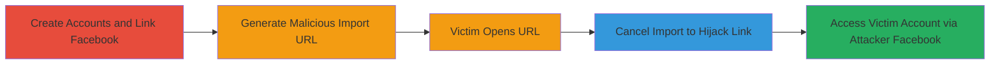

---
tags:
  - csrf
  - account-takeover
  - facebook-integration
  - web-vulnerability
  - badoo
  - bumble
type: attack_chain
tools: []
tactics:
  - '[[Initial Access]]'
  - '[[Persistence]]'
verified: false
platforms:
  - Web
submitted: true
created_at: '2023-10-01T00:00:00Z'
procedures:
  - >-
    [[procedures/Create-Attacker-and-Victim-Accounts-with-Linked-Facebook-Profiles]]
  - '[[procedures/Generate-Facebook-Photo-Import-URL-with-Token]]'
  - '[[procedures/Trick-Victim-into-Opening-Malicious-URL]]'
  - '[[procedures/Trigger-Account-Link-Hijack-by-Canceling-Import]]'
  - '[[procedures/Take-Over-Victim-Account-Using-Attacker-Facebook]]'
step_count: 5
techniques:
  - '[[Exploit Public-Facing Application]]'
  - '[[Valid Accounts]]'
  - '[[Account Manipulation]]'
updated_at: '2025-12-14T17:33:11.994Z'
description: >-
  A multi-stage CSRF attack exploiting the Facebook photo import feature in
  Badoo (and applicable to Bumble) to hijack a victim's linked Facebook account,
  enabling full account takeover.
id: 18b847cc-a567-4a0b-8169-0af72a18f089
validated: true
mitre_tactics:
  - '[[Initial Access]]'
  - '[[Persistence]]'
mitre_techniques:
  - '[[Exploit Public-Facing Application]]'
  - '[[Valid Accounts]]'
  - '[[Account Manipulation]]'
---
# CSRF in Facebook Photo Import Leading to Account Takeover in Badoo/Bumble

Multi-stage attack chain demonstrating a complete attack workflow exploiting a CSRF vulnerability in the Facebook photo import feature of Badoo (tested on m.badoo.com, reported for Bumble), allowing an attacker to replace the victim's linked Facebook account with their own, resulting in full account takeover. The attacker can then access the victim's profile, data, and functionality using their own Facebook credentials.

## Chain Metrics Dashboard

| Metric | Value |
|--------|-------|
| Chain Status | Unverified |
| Total Steps | 5 |
| Execution Time | ~10 minutes |
| Skill Level | Intermediate |
| Complexity | Medium |
| Impact Level | High |

## Attack Flow Visualization

## Prerequisites & Requirements

### Required Tools

- Web browser (e.g., Chrome, Firefox)
- Two Facebook accounts (attacker and victim)

### Target Environment

- Badoo mobile web (m.badoo.com) or Bumble web app
- Facebook integration enabled
- No special ports or services beyond standard HTTPS (443)

### Initial Access Requirements

- Attacker must have a Badoo account
- Victim must have a Badoo account linked to a different Facebook profile
- Social engineering to get victim to open URL (e.g., via phishing email or message)
- No prior network access needed; attack is cross-origin via URL

## Detailed Attack Procedures

### Step 1: Create Accounts and Link Facebook
procedure: [[procedures/Create-Attacker-and-Victim-Accounts-with-Linked-Facebook-Profiles]]

**Objective**: Set up controlled attacker and victim environments by registering Badoo accounts and linking distinct Facebook profiles to simulate the attack scenario.

**Instructions**: Register two separate Badoo accounts using email or phone. For the attacker account, navigate to account settings and link it to the attacker's Facebook profile via the 'Connect with Facebook' option. Repeat for the victim account using a different Facebook profile. Ensure both links are active by verifying in the account settings.

**Expected Output**: Two Badoo accounts, each successfully linked to unique Facebook profiles, confirmed via profile display or login tests.

**Success Indicators**:
- Attacker Badoo account shows attacker's Facebook details
- Victim Badoo account shows victim's Facebook details
- No errors in linking process

### Step 2: Generate Malicious Photo Import URL
procedure: [[procedures/Generate-Facebook-Photo-Import-URL-with-Token]]

**Objective**: As the attacker, initiate the Facebook photo import process to generate a URL containing a token that can be used to override account links without authentication.

**Instructions**: Log in to the attacker's Badoo account on m.badoo.com. Navigate to the profile photo section and select 'Import photos via Facebook'. This generates a URL in the browser address bar, such as `https://m.badoo.com/photo/import_fb?token=abc123...`. Copy the full URL, including the token parameter, which is valid for linking or importing actions.

**Expected Output**: A browser URL with a token query parameter, ready to be shared with the victim.

**Success Indicators**:
- URL contains a valid token (e.g., long alphanumeric string)
- Token is generated without errors during import initiation

### Step 3: Trick Victim into Opening Malicious URL
procedure: [[procedures/Trick-Victim-into-Opening-Malicious-URL]]

**Objective**: Deliver the attacker's generated URL to the victim while they are logged into their Badoo account, triggering the import process in the victim's session.

**Instructions**: Use social engineering (e.g., send via email, chat, or link in a message) to get the victim to open the copied URL from Step 2. Ensure the victim is logged into their Badoo account in a separate browser session or incognito window. Upon opening, the URL will initiate the Facebook photo import dialog in the victim's context.

**Expected Output**: Victim's browser loads the Badoo photo import page, showing the Facebook import prompt tied to the attacker's token.

**Success Indicators**:
- Import dialog appears in victim's session
- No immediate errors or redirects away from the page

### Step 4: Trigger Account Link Hijack by Canceling Import
procedure: [[procedures/Trigger-Account-Link-Hijack-by-Canceling-Import]]

**Objective**: In the victim's session, cancel the import prompt to exploit the lack of CSRF protection, replacing the victim's Facebook link with the attacker's.

**Instructions**: With the import dialog open in the victim's browser, click the 'Cancel' button. This action sends a request (without CSRF token validation) that unlinks the victim's original Facebook account and links the attacker's Facebook account instead, using the token from the URL.

**Expected Output**: The import dialog closes, and checking the victim's Badoo account settings shows the Facebook link now points to the attacker's profile.

**Success Indicators**:
- Victim's Facebook link updated to attacker's without re-authentication
- Original victim Facebook no longer accessible via Badoo login

### Step 5: Take Over Victim Account Using Attacker Facebook
procedure: [[procedures/Take-Over-Victim-Account-Using-Attacker-Facebook]]

**Objective**: Use the hijacked Facebook link to authenticate as the attacker into the victim's Badoo account, gaining full access to their data and features.

**Instructions**: Log out of the victim's Badoo session if needed. Attempt to log in to the victim's Badoo account using the attacker's Facebook credentials. Since the link has been overridden, Facebook authentication will grant access to the victim's profile.

**Expected Output**: Successful login to the victim's Badoo account using attacker's Facebook, displaying the victim's profile data, messages, and settings.

**Success Indicators**:
- Access to victim's private data (e.g., photos, matches, chats)
- Ability to perform actions as the victim (e.g., edit profile, send messages)

## Attack Chain Summary

### Key Achievements

1. Bypassed authentication and CSRF protections to hijack Facebook account linking
2. Achieved full account takeover without direct credential theft
3. Demonstrated impact on user privacy and data access in social dating apps

## Technique & Tactic Coverage

### MITRE ATT&CK Techniques

- [[Exploit Public-Facing Application]] Exploit Public-Facing Application
- [[Valid Accounts]] Valid Accounts
- [[Account Manipulation]] Account Manipulation

### MITRE ATT&CK Tactics

- [[Initial Access]] Initial Access
- [[Persistence]] Persistence

---
*Last updated: 2023-10-01T00:00:00Z*
