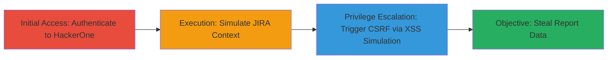

---
tags:
  - csrf
  - xss
  - web
  - hackerone
  - jira
  - data-theft
type: attack_chain
tools: []
tactics:
  - '[[Initial Access]]'
  - '[[Execution]]'
  - '[[Collection]]'
verified: false
platforms:
  - Web
submitted: true
complexity: medium
created_at: '2023-10-01T00:00:00Z'
procedures:
  - '[[procedures/Authenticate-to-HackerOne-Platform]]'
  - '[[procedures/Prepare-JIRA-Context-Simulation-Page]]'
  - '[[procedures/Simulate-XSS-and-Trigger-CSRF-via-JavaScript]]'
  - '[[procedures/Execute-Data-Theft-POC-via-Button-Click]]'
step_count: 4
techniques:
  - '[[JavaScript]]'
  - '[[Drive-by Compromise]]'
updated_at: '2025-12-14T17:29:57.300Z'
description: >-
  A multi-stage attack exploiting CSRF in HackerOne's report escalation to JIRA,
  chained with unauthenticated XSS in JIRA Cloud to steal sensitive report
  details without user interaction.
skill_level: intermediate
impact_level: high
id: f5a0371f-e333-4e2d-81b6-747e5f61e46f
validated: true
mitre_tactics:
  - '[[Initial Access]]'
  - '[[Execution]]'
  - '[[Collection]]'
mitre_techniques:
  - '[[JavaScript]]'
  - '[[Drive-by Compromise]]'
---
# CSRF in HackerOne Report Escalation Chained with JIRA XSS for Private Report Theft

Multi-stage attack chain demonstrating a complete attack workflow exploiting CSRF in HackerOne's report escalation feature to JIRA, chained with unauthenticated XSS in JIRA Cloud to bypass warnings and steal private report details like descriptions without user interaction.

## Chain Metrics Dashboard

| Metric | Value |
|--------|-------|
| Chain Status | Unverified |
| Total Steps | 4 |
| Execution Time | ~5 minutes |
| Skill Level | Intermediate |
| Complexity | Medium |
| Impact Level | High |

## Attack Flow Visualization

## Prerequisites & Requirements

### Required Tools

- Browser with developer console (e.g., Chrome DevTools)

### Target Environment

- Web platform
- Required services: HackerOne platform, JIRA Cloud
- Network access requirements: Internet access to hackerone.com and JIRA endpoints

### Initial Access Requirements

- Valid HackerOne credentials (username and password)
- Network position: Logged-in user session on HackerOne
- Prior access needed: None beyond authentication

## Detailed Attack Procedures

### Step 1: Authenticate to HackerOne
procedure: [[procedures/Authenticate-to-HackerOne-Platform]]

**Objective**: Establish a valid session on the HackerOne platform to enable authenticated actions like report escalation.

**Instructions**: Open a web browser and navigate to the HackerOne login page. Enter the provided credentials to sign in.

**Expected Output**: Successful login redirect to the HackerOne dashboard, with a valid session cookie established.

**Success Indicators**:
- Dashboard loads without errors
- User profile shows logged-in state

### Step 2: Prepare JIRA Context Simulation
procedure: [[procedures/Prepare-JIRA-Context-Simulation-Page]]

**Objective**: Set up an HTML page that simulates the JIRA context to facilitate the chaining of XSS exploitation.

**Instructions**: While logged into HackerOne, open a new tab and navigate to the prepared HTML page at http://[redacted]/[redacted]/css/h1_jira_redirect.html. This page mimics the JIRA environment to prepare for the XSS payload injection.

**Expected Output**: The simulation page loads, ready for JavaScript execution in a context resembling JIRA Cloud.

**Success Indicators**:
- Page renders without errors
- Browser console is accessible for further scripting

### Step 3: Simulate XSS and Trigger CSRF
procedure: [[procedures/Simulate-XSS-and-Trigger-CSRF-via-JavaScript]]

**Objective**: Use JavaScript to simulate the unauthenticated XSS in JIRA, open a window to the vulnerable escalation endpoint, and extract sensitive data from the redirect URL.

**Instructions**: In the browser console on the simulation page, paste and execute the JavaScript code that opens a new window to https://hackerone.com/reports/[id]/escalate, waits for the escalation to occur, extracts the report description using regex from the redirect URL, closes the window, and redirects to another HTML page displaying the stolen data.

**Expected Output**: New window opens and closes automatically; stolen report description appears on the final redirect page.

**Success Indicators**:
- Escalation completes without user confirmation
- Report details (e.g., description) are captured and displayed

### Step 4: Execute Data Theft POC
procedure: [[procedures/Execute-Data-Theft-POC-via-Button-Click]]

**Objective**: Initiate the full proof-of-concept attack to force report escalation and exfiltrate data via the chained vulnerabilities.

**Instructions**: On the simulation page, click the generated button labeled 'H1 XSRF PoC', which triggers the XSRF() function to perform the escalation, simulate XSS, and steal the data.

**Expected Output**: Button click leads to automatic escalation and data theft, with sensitive information extracted and visible.

**Success Indicators**:
- Report is escalated to JIRA without interaction
- Private details like report description are stolen and displayed

## Attack Chain Summary

### Key Achievements

1. Forced unauthorized escalation of private HackerOne reports to JIRA via CSRF on a GET endpoint.
2. Bypassed user warnings and interaction requirements using chained unauthenticated XSS in JIRA Cloud.
3. Successfully exfiltrated sensitive report details, such as descriptions, demonstrating high-impact data theft.

## Technique & Tactic Coverage

### MITRE ATT&CK Techniques

- [[JavaScript]]
- [[Drive-by Compromise]]

### MITRE ATT&CK Tactics

- [[Initial Access]]
- [[Execution]]
- [[Collection]]

---
*Last updated: 2023-10-01T00:00:00Z*
