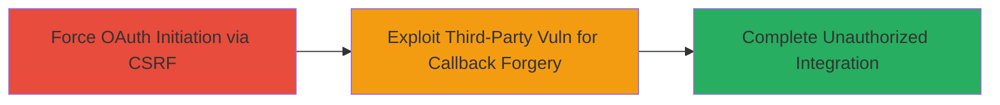

# CSRF in HackerOne Slack OAuth Integration Leading to Unauthorized Team Account Connection

Multi-stage attack chain demonstrating exploitation of CSRF in HackerOne's Slack integration setup, allowing attackers to force logged-in users to connect malicious Slack accounts to their teams via malicious links or forms, potentially enabling unauthorized access or escalation through future integrations.

## Chain Metrics Dashboard

| Metric | Value |
|--------|-------|
| Chain Status | Unverified |
| Total Steps | 2 |
| Execution Time | ~5 minutes |
| Skill Level | Intermediate |
| Complexity | Medium |
| Impact Level | High |

## Attack Flow Visualization



## Prerequisites & Requirements

### Required Tools

- Browser with developer tools for crafting malicious links
- Access to a Slack workspace (attacker-controlled)

### Target Environment

- HackerOne platform (web application)
- Required services: Slack OAuth integration
- Network access: Internet connectivity to hackerone.com and slack.com

### Initial Access Requirements

- Victim must be logged into HackerOne
- Attacker needs a way to deliver malicious link/form (e.g., phishing email or XSS in another context)
- No prior credentials on HackerOne required, but victim authentication assumed

## Detailed Attack Procedures

### Step 1: Force OAuth Initiation
procedure: [[procedures/Initiate-CSRF-Unprotected-Slack-OAuth-Flow]]

**Objective**: Trick a logged-in HackerOne user into starting the Slack OAuth flow without CSRF protection, redirecting them to Slack's authorize endpoint.

**Instructions**: Craft a malicious webpage or link that submits a GET request to the vulnerable endpoint using [[commands/get-hackerone-slack-auth]]:

```bash
GET https://hackerone.com/auth/slack HTTP/1.1
```

This initiates the redirect to Slack. Embed this in an HTML form or iframe on an attacker-controlled site to force the victim's browser to trigger it while authenticated.

**Expected Output**: Browser redirects to `https://slack.com/oauth/authorize?client_id=2174110321.11522100978&redirect_uri=https%3A%2F%2Fhackerone.com%2Fauth%2Fslack%2Fcallback&response_type=code&scope=incoming-webhook&state=379fd8f1baa8d80516e2f706f025057ad0ce2cca0bbbd56c`.

**Success Indicators**:
- Victim's browser initiates the OAuth flow to Slack
- State parameter is generated by Slack but not validated by HackerOne on initiation

### Step 2: Forge and Complete OAuth Callback
procedure: [[procedures/Exploit-Third-Party-Vulnerability-for-OAuth-Forgery]]

**Objective**: Leverage a vulnerability in Slack (e.g., XSS) to manipulate the OAuth state and code, forging the callback to connect the attacker's Slack account.

**Instructions**: Once the flow starts, use an exploitable flaw in Slack (like XSS) to intercept or alter the state parameter. Then, direct the callback to `https://hackerone.com/auth/slack/callback` with a forged `code` and `state` obtained from the attacker's own Slack authorization.

No direct command needed here, but monitor network traffic in browser dev tools to capture and replay the callback parameters.

**Expected Output**: Successful OAuth completion, linking the attacker's Slack workspace to the victim's HackerOne team.

**Success Indicators**:
- Integration appears in victim's HackerOne team settings under `/[YOUR_TEAM]/integrations`
- Attacker gains access to team notifications or data via the connected Slack

## Attack Chain Summary

### Key Achievements

1. Bypassed CSRF protection in OAuth initiation, forcing unauthorized flow start
2. Exploited third-party (Slack) vulnerability to control callback and state
3. Achieved unauthorized Slack integration, enabling potential data exfiltration or escalation

## Technique & Tactic Coverage

### MITRE ATT&CK Techniques

- [[Exploit Public-Facing Application]] Exploit Public-Facing Application
- [[Drive-by Compromise]] Drive-by Compromise

### MITRE ATT&CK Tactics

- [[Initial Access]] Initial Access

---

*Last updated: 2023-10-01T00:00:00Z*
