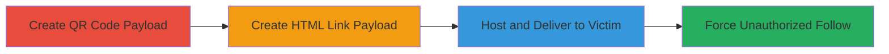

# CSRF in Periscope iOS App Follow Action via Deeplinks

Multi-stage attack chain demonstrating a complete attack workflow exploiting a CSRF vulnerability in the Periscope iOS app's follow action through deeplinks.

## Chain Metrics Dashboard

| Metric | Value |
|--------|-------|
| Chain Status | Unverified |
| Total Steps | 3 |
| Execution Time | ~5 minutes |
| Skill Level | Intermediate |
| Complexity | Medium |
| Impact Level | High |

## Attack Flow Visualization

## Prerequisites & Requirements

### Required Tools

- QR code generator (e.g., online tool or library like qrencode)
- Local web server (e.g., Python's http.server)

### Target Environment

- iOS device with Periscope app installed and user logged in
- No specific ports or services beyond app URI scheme handling
- Network access: Victim must scan QR or click link while app is accessible

### Initial Access Requirements

- No credentials required for attacker
- Victim must have app installed and be logged in
- Delivery via social engineering (e.g., shared QR or link)

## Detailed Attack Procedures

### Step 1: Create Malicious QR Code
procedure: [[procedures/Create-Malicious-QR-Code-for-Periscope-Deeplink-CSRF]]

**Objective**: Generate a QR code embedding the deeplink to trigger the CSRF follow action in the Periscope app.

**Instructions**: Use a QR code generator to encode the deeplink `pscp://user/periscopeco/follow`. This opens the app and forces a follow without confirmation if the victim scans it on an iOS device with the app installed and logged in.

**Expected Output**: A QR code image file that, when scanned, launches the app and performs the unauthorized follow.

**Success Indicators**:
- QR code generated successfully
- Scanning on target device triggers app open and follow action

### Step 2: Create HTML Page with Link
procedure: [[procedures/Create-HTML-Page-with-Periscope-Deeplink-for-CSRF]]

**Objective**: Build an HTML page containing a clickable link to the deeplink, enabling delivery via web browsers.

**Instructions**: Create an HTML file with an anchor tag like `<a href="pscp://user/<any user-id>/follow">CSRF DEMO</a>`. This link, when clicked on a device with the Periscope app, will open the app and execute the follow.

**Expected Output**: An HTML file ready for hosting, where clicking the link forces the app interaction.

**Success Indicators**:
- HTML page renders the link correctly
- Clicking the link on iOS with app installed triggers the follow

### Step 3: Host and Deliver Payload
procedure: [[procedures/Host-and-Deliver-Periscope-CSRF-Payload]]

**Objective**: Host the HTML or use data URI to deliver the payload and trick the victim into interaction.

**Instructions**: Host the HTML on a local server (e.g., `python -m http.server 8000`) or use a data URI like `data:text/html,<html><a href="pscp://user/periscopeco/follow">CSRF DEMO</a></html>`. Deliver via email, messaging, or website while the victim has the app open and logged in. Note: Data URIs may not work in Safari; prefer hosted HTML.

**Expected Output**: Victim interacts, app opens, and unauthorized follow occurs.

**Success Indicators**:
- Payload accessible to victim
- App launches and follow is executed without confirmation

## Attack Chain Summary

### Key Achievements

1. Successful creation of QR code and HTML payloads exploiting deeplink CSRF
2. Forced unauthorized follow in Periscope app without user consent
3. Potential for spam or unwanted subscriptions via social engineering delivery

## Technique & Tactic Coverage

### MITRE ATT&CK Techniques

- [[Drive-by Compromise]]
- [[Exploit Public-Facing Application]]

### MITRE ATT&CK Tactics

- [[Initial Access]]

---
*Last updated: 2023-10-01T12:00:00Z*
