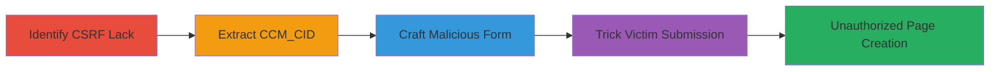

---
tags:
  - csrf
  - concrete-cms
  - problog
  - web-vulnerability
  - information-disclosure
  - input-validation
type: attack_chain
tools: []
tactics:
  - '[[Initial Access]]'
  - '[[Discovery]]'
verified: false
platforms:
  - Web
  - PHP
submitted: true
complexity: medium
created_at: '2023-10-01T00:00:00Z'
procedures:
  - '[[procedures/Identify-CSRF-Vulnerability-in-ProBlog-addBlog-Endpoint]]'
  - '[[procedures/Extract-CCM-CID-Values-for-Site-Structure]]'
  - '[[procedures/Craft-Malicious-CSRF-Form-for-Page-Creation]]'
  - '[[procedures/Trick-Victim-into-Submitting-CSRF-Form]]'
step_count: 4
techniques:
  - '[[Exploit Public-Facing Application]]'
  - '[[Gather Victim Host Information]]'
updated_at: '2025-12-14T17:27:03.263Z'
description: >-
  A multi-stage CSRF attack exploiting the ProBlog 2.6.6 plugin in Concrete CMS
  to create unauthorized pages with JavaScript payloads from a logged-in
  victim's browser.
skill_level: intermediate
impact_level: high
id: ead243bb-c6ae-4431-8ff2-5a966304f05f
validated: true
mitre_tactics:
  - '[[Initial Access]]'
  - '[[Discovery]]'
mitre_techniques:
  - '[[Exploit Public-Facing Application]]'
  - '[[Gather Victim Host Information]]'
---
# CSRF in ProBlog Plugin to Create Malicious Pages in Concrete CMS

Multi-stage attack chain demonstrating a complete CSRF workflow in Concrete CMS using the ProBlog 2.6.6 plugin.

## Chain Metrics Dashboard

| Metric | Value |
|--------|-------|
| Chain Status | Unverified |
| Total Steps | 4 |
| Execution Time | ~5 minutes |
| Skill Level | Intermediate |
| Complexity | Medium |
| Impact Level | High |

## Attack Flow Visualization

## Prerequisites & Requirements

### Required Tools

- None (relies on HTML crafting and browser interaction)

### Target Environment

- Concrete CMS with ProBlog 2.6.6 plugin
- PHP-based web platform
- Authenticated user session

### Initial Access Requirements

- Victim must be logged in as a user with page creation permissions
- Attacker needs to deliver a malicious link or embed (e.g., via phishing email or compromised site)
- No direct network access to the server required

## Detailed Attack Procedures

### Step 1: Identify CSRF Vulnerability
procedure: [[procedures/Identify-CSRF-Vulnerability-in-ProBlog-addBlog-Endpoint]]

**Objective**: Confirm the absence of CSRF protection in the ProBlog addBlog endpoint to enable forged requests.

**Instructions**: Analyze the plugin's source code or test the POST endpoint directly. Submit a test POST request without an anti-CSRF token to verify if a blog/page is created.

**Expected Output**: Successful page creation without token validation.

**Success Indicators**:
- POST to addBlog succeeds without CSRF token
- No error for missing token

### Step 2: Extract Site Structure
procedure: [[procedures/Extract-CCM-CID-Values-for-Site-Structure]]

**Objective**: Gather internal collection IDs (CCM_CID) to target specific parent locations for page placement.

**Instructions**: Inspect the target's pages in a browser. View page source and locate <script> tags containing CCM_CID values, which reveal the site map hierarchy.

**Expected Output**: List of CCM_CID values for parent pages.

**Success Indicators**:
- CCM_CID values extracted from scripts
- Site tree structure mapped for targeting high-traffic or hidden areas

### Step 3: Craft Malicious Form
procedure: [[procedures/Craft-Malicious-CSRF-Form-for-Page-Creation]]

**Objective**: Build an HTML form that submits a forged request to create a malicious page under a chosen parentID.

**Instructions**: Create an HTML snippet with a form targeting the addBlog endpoint, setting parentID to a disclosed CCM_CID and blogBody to a JavaScript payload (e.g., for data exfiltration). Style it as a benign link or image.

**Expected Output**: Malicious HTML ready for delivery.

**Success Indicators**:
- Form validates locally (e.g., via browser dev tools)
- Payload includes arbitrary JavaScript for exploitation

### Step 4: Trick Victim Submission
procedure: [[procedures/Trick-Victim-into-Submitting-CSRF-Form]]

**Objective**: Induce the authenticated victim to trigger the form submission, creating the unauthorized page.

**Instructions**: Deliver the malicious HTML via email, social engineering, or a controlled site. The victim's browser, with active session, will submit the POST request automatically upon interaction.

**Expected Output**: New page created on the target site with the injected payload.

**Success Indicators**:
- Victim interacts with the lure
- Unauthorized page appears in the site tree
- Payload executes (e.g., JS alert or exfil)

## Attack Chain Summary

### Key Achievements

1. Bypassed CSRF protections to forge authenticated requests
2. Leveraged information disclosure for precise targeting
3. Created persistent malicious pages for further attacks like data harvesting or malware
4. Demonstrated potential for site-wide compromise without direct access

## Technique & Tactic Coverage

### MITRE ATT&CK Techniques

- [[Exploit Public-Facing Application]] Exploit Public-Facing Application
- [[Gather Victim Host Information]] Gather Victim Host Information

### MITRE ATT&CK Tactics

- [[Initial Access]] Initial Access
- [[Discovery]] Discovery

---

*Last updated: 2023-10-01T00:00:00Z*
