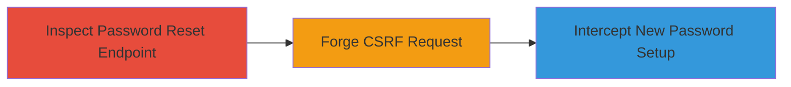

---
tags:
  - csrf
  - password-reset
  - account-takeover
  - web-vulnerability
type: attack_chain
tools: []
tactics:
  - '[[Initial Access]]'
commands: []
platforms:
  - Web
complexity: medium
procedures:
  - '[[procedures/Inspect-Password-Reset-for-CSRF-Protection]]'
  - '[[procedures/Forge-Password-Reset-Request-via-CSRF]]'
step_count: 2
techniques:
  - '[[Exploit Public-Facing Application]]'
description: >-
  A multi-stage attack exploiting the absence of CSRF protection in RelateIQ's
  password reset functionality to force unauthorized password changes and gain
  account access.
skill_level: intermediate
impact_level: high
id: a1b2c6c3-9483-4a6c-8090-c38e3359a11c
created_at: '2025-12-14T17:27:23.445Z'
updated_at: '2025-12-14T17:27:23.445Z'
verified: false
validated: true
submitted: true
mitre_tactics:
  - '[[Initial Access]]'
mitre_techniques:
  - '[[Exploit Public-Facing Application]]'
---
# CSRF in RelateIQ Password Reset Leading to Unauthorized Account Access

Multi-stage attack chain demonstrating a complete attack workflow.

## Chain Metrics Dashboard

| Metric | Value |
|--------|-------|
| Chain Status | Unverified |
| Total Steps | 2 |
| Execution Time | ~5 minutes |
| Skill Level | Intermediate |
| Complexity | Medium |
| Impact Level | High |

## Attack Flow Visualization

## Prerequisites & Requirements

### Required Tools

- Web browser with developer tools (e.g., Chrome DevTools)
- Text editor for creating HTML POC

### Target Environment

- RelateIQ web application
- Accessible password reset endpoint
- No specific ports required beyond standard HTTPS (443)

### Initial Access Requirements

- Attacker must be able to deliver a malicious link or page to the victim (e.g., via phishing email or social engineering)
- Victim must be authenticated or have access to the password reset flow
- Network access to the RelateIQ domain

## Detailed Attack Procedures

### Step 1: Inspect Password Reset Endpoint
procedure: [[procedures/Inspect-Password-Reset-for-CSRF-Protection]]

**Objective**: Identify the password reset endpoint and confirm the absence of CSRF token validation to assess exploitability.

**Instructions**: Open the RelateIQ application in a web browser and navigate to the password reset functionality. Use developer tools to inspect the network requests during the reset process. Look for form submissions or API calls to the password reset endpoint, such as `/reset-password` or similar, and verify that no CSRF token is included in the request headers, body, or as a hidden form field.

**Expected Output**: Network tab shows POST requests to the endpoint without anti-CSRF measures like tokens or origin checks.

**Success Indicators**:
- Request structure observed without CSRF token
- Endpoint URL and parameters documented (e.g., email or token in query/body)

### Step 2: Forge Password Reset Request
procedure: [[procedures/Forge-Password-Reset-Request-via-CSRF]]

**Objective**: Create and deliver a forged request to trick the victim into resetting their password, allowing the attacker to potentially intercept the new password setup.

**Instructions**: Develop a malicious HTML page that automatically submits a form to the identified password reset endpoint using the victim's email. Host this page on an attacker-controlled domain or deliver it via a link. When the victim visits the page (e.g., while logged in to RelateIQ), the browser will forge the cross-origin request. Monitor the subsequent password setup link sent to the victim's email or predict it if possible.

**Expected Output**: Victim's browser submits the forged request, triggering a password reset email without their intent; attacker gains access if they can control the new password.

**Success Indicators**:
- Forged request executed successfully (visible in victim's browser console or network tab)
- Password reset email sent to victim, enabling interception or takeover

## Attack Chain Summary

### Key Achievements

1. Confirmed CSRF vulnerability in password reset by inspecting requests
2. Demonstrated exploitation via a proof-of-concept HTML page
3. Enabled potential account takeover through forced password reset

## Technique & Tactic Coverage

### MITRE ATT&CK Techniques

- [[Exploit Public-Facing Application]]

### MITRE ATT&CK Tactics

- [[Initial Access]]

---
*Last updated: 2024-10-01*
