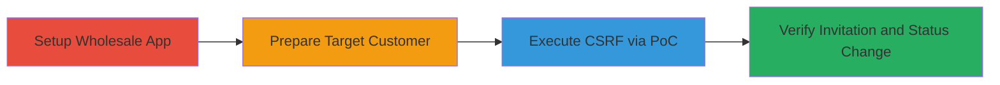

---
tags:
  - csrf
  - shopify
  - wholesale
  - invitation-token
  - web-vulnerability
type: attack_chain
tools: []
tactics:
  - '[[Initial Access]]'
verified: false
platforms:
  - Web
submitted: true
complexity: medium
created_at: '2023-10-01T00:00:00Z'
procedures:
  - '[[procedures/Configure-Shopify-Wholesale-App-and-Price-List]]'
  - '[[procedures/Tag-Customer-for-Wholesale-Access]]'
  - '[[procedures/Execute-CSRF-to-Generate-Invitation-Token]]'
  - '[[procedures/Verify-Customer-Status-Change]]'
step_count: 4
techniques:
  - '[[Drive-by Compromise]]'
updated_at: '2025-12-14T17:27:50.044Z'
description: >-
  A multi-stage attack exploiting CSRF in Shopify's Wholesale app to
  unauthorizedly invite tagged customers, changing their status and generating
  invite tokens without authentication.
skill_level: intermediate
impact_level: high
id: f9ac9022-8805-4a30-9890-6da0f81c3487
validated: true
mitre_tactics:
  - '[[Initial Access]]'
mitre_techniques:
  - '[[Drive-by Compromise]]'
---
# CSRF in Shopify Wholesale App to Generate Unauthorized Customer Invitations

Multi-stage attack chain demonstrating a complete attack workflow exploiting CSRF in Shopify's Wholesale application to unauthorizedly generate invitation tokens for tagged customers.

## Chain Metrics Dashboard

| Metric | Value |
|--------|-------|
| Chain Status | Unverified |
| Total Steps | 4 |
| Execution Time | ~5 minutes |
| Skill Level | Intermediate |
| Complexity | Medium |
| Impact Level | High |

## Attack Flow Visualization

## Prerequisites & Requirements

### Required Tools

- Web browser (e.g., Chrome with developer tools for inspection)
- Access to a Shopify store admin panel

### Target Environment

- Shopify platform with Wholesale app installed
- Web-based, no specific ports required beyond standard HTTPS (443)
- Attacker needs a malicious webpage host (e.g., local server or public URL for PoC)

### Initial Access Requirements

- Attacker must have the victim authenticated in Shopify admin (e.g., store owner session)
- No direct credentials needed for attacker; relies on victim's active session
- Network access to Shopify admin and PoC host

## Detailed Attack Procedures

### Step 1: Setup Wholesale App
procedure: [[procedures/Configure-Shopify-Wholesale-App-and-Price-List]]

**Objective**: Prepare the Shopify environment by installing and configuring the Wholesale app with a price list to enable invitation functionality.

**Instructions**: Log in to the Shopify admin panel and install the Wholesale app from the app store. Create a new price list and associate it with wholesale-tagged customers. This sets up the backend for customer invitations.

**Expected Output**: Wholesale app dashboard accessible, price list created and visible in app settings.

**Success Indicators**:
- Wholesale app installed and configured
- Price list added without errors

### Step 2: Prepare Target Customer
procedure: [[procedures/Tag-Customer-for-Wholesale-Access]]

**Objective**: Identify and tag a target customer as 'wholesale' to make them eligible for invitations via the vulnerable endpoint.

**Instructions**: In the Shopify customers section, create or select an existing customer and apply the 'wholesale' tag. Adjust the price list to include customers with this tag. Verify the customer appears in the Wholesale app's customer section.

**Expected Output**: Customer listed in Wholesale app with 'wholesale' tag applied, status initially not 'invited'.

**Success Indicators**:
- Tag applied successfully
- Customer visible in Wholesale customer section

### Step 3: Execute CSRF Attack
procedure: [[procedures/Execute-CSRF-to-Generate-Invitation-Token]]

**Objective**: Trick the authenticated victim into loading a malicious PoC page that forges a request to the invitation endpoint, generating a token and changing customer status.

**Instructions**: Host or direct the victim to the malicious PoC webpage (e.g., https://poc.rhynorater.com/wholesaleShopify/CSRF.html or PHP variant with customer ID). Ensure the victim is logged into Shopify admin. The PoC sends a forged POST request to the vulnerable endpoint like /admin/shops/{shop_id}/accounts/{customer_id}/invite_link_modal_single.

**Expected Output**: Silent request execution; no visible feedback on PoC, but backend processes the invitation.

**Success Indicators**:
- PoC page loads without errors
- Network tab shows request to Shopify endpoint (use browser dev tools to inspect)

### Step 4: Verify Impact
procedure: [[procedures/Verify-Customer-Status-Change]]

**Objective**: Confirm the attack success by checking the customer's updated status and generated invite link.

**Instructions**: After ~30 seconds, refresh the Wholesale app's customer section. Observe the target customer's status changed to 'invited' and an invitation token generated.

**Expected Output**: Customer status updated to 'invited'; invite link available in the app.

**Success Indicators**:
- Status change visible
- Invitation token generated, potentially usable for further access or spam

## Attack Chain Summary

### Key Achievements

1. Unauthorized configuration of Wholesale app and price lists
2. Forged invitation request via CSRF, bypassing authentication
3. Customer status modification and token generation, enabling potential spam or access escalation

## Technique & Tactic Coverage

### MITRE ATT&CK Techniques

- [[Drive-by Compromise]]

### MITRE ATT&CK Tactics

- [[Initial Access]]

---
*Last updated: 2023-10-01T00:00:00Z*
