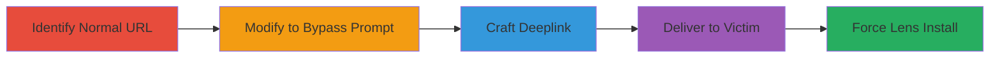

# CSRF in Snapchat Lens Unlocking to Force Install Unwanted Lenses

Multi-stage attack chain demonstrating a complete CSRF workflow to force Snapchat lens installations without user consent.

## Chain Metrics Dashboard

| Metric | Value |
|--------|-------|
| Chain Status | Unverified |
| Total Steps | 4 |
| Execution Time | ~1 minute |
| Skill Level | Low |
| Complexity | Low |
| Impact Level | Medium |

## Attack Flow Visualization

## Prerequisites & Requirements

### Required Tools

- None (relies on URL crafting)

### Target Environment

- Snapchat app installed on Android or iOS device
- Web browser for link delivery
- No specific ports or services beyond Snapchat's unlock endpoint

### Initial Access Requirements

- Ability to send links to victims (e.g., via messaging apps)
- Knowledge of target lens UUID
- No prior authentication needed

## Detailed Attack Procedures

### Step 1: Identify Normal Lens Unlock URL
procedure: [[procedures/Identify-Normal-Snapchat-Lens-Unlock-URL]]

**Objective**: Locate the standard Snapchat lens unlock URL format that requires user confirmation.

**Instructions**: Examine Snapchat's lens sharing features to obtain the base unlock URL for a specific lens. Use a lens UUID like 6ff5a565fca249a1948b1963ee2881b4.

**Expected Output**: A URL like https://www.snapchat.com/unlock/?type=SNAPCODE&uuid=6ff5a565fca249a1948b1963ee2881b4&metadata=01 that prompts for confirmation when opened.

**Success Indicators**:
- URL opens Snapchat with a user prompt for lens unlock
- Lens details are visible but not installed without interaction

### Step 2: Modify URL to Bypass Prompt
procedure: [[procedures/Modify-Snapchat-Unlock-URL-to-Bypass-Prompt]]

**Objective**: Alter the URL parameter to eliminate the user confirmation prompt and force the lens unlock.

**Instructions**: Change the 'type' parameter from SNAPCODE to SNAPCODE_NO_PROMPT in the identified URL.

**Expected Output**: Modified URL https://www.snapchat.com/unlock/?type=SNAPCODE_NO_PROMPT&uuid=6ff5a565fca249a1948b1963ee2881b4&metadata=01 that installs the lens silently upon opening in Snapchat.

**Success Indicators**:
- Lens is unlocked and added to the account without any prompt
- No user interaction required for installation

### Step 3: Craft Deeplink for Mobile Exploitation
procedure: [[procedures/Craft-Snapchat-Deeplink-for-CSFR-Exploitation]]

**Objective**: Convert the modified URL into a deeplink format for direct app invocation on mobile devices.

**Instructions**: Prefix the modified URL with the Snapchat scheme to create a deeplink: snapchat://unlock/?type=SNAPCODE_NO_PROMPT&uuid=6ff5a565fca249a1948b1963ee2881b4&metadata=01.

**Expected Output**: Deeplink that triggers the forceful unlock when accessed on a device with Snapchat installed.

**Success Indicators**:
- Link opens Snapchat directly and installs the lens
- Works on Android and likely iOS without browser intermediary

### Step 4: Deliver Crafted Link to Victim
procedure: [[procedures/Deliver-CSFR-Link-to-Victim]]

**Objective**: Trick the victim into opening the malicious link, resulting in unauthorized lens installation.

**Instructions**: Embed the crafted web URL or deeplink in a message, email, or social media post, disguising it as a legitimate lens share.

**Expected Output**: Victim's Snapchat account adds the unwanted lens, persisting for up to 48 hours.

**Success Indicators**:
- Victim reports unexpected lens in their collection
- Lens usage metrics for the developer increase artificially
- Victim must manually remove the lens

## Attack Chain Summary

### Key Achievements

1. Bypassed user confirmation in Snapchat's lens unlock process
2. Enabled silent installation of lenses via CSRF
3. Demonstrated cross-platform exploitation on web and mobile
4. Highlighted risks of parameter tampering without CSRF tokens

## Technique & Tactic Coverage

### MITRE ATT&CK Techniques

- [[Drive-by Compromise]]

### MITRE ATT&CK Tactics

- [[Initial Access]]

---
*Last updated: 2023-10-01T00:00:00Z*
