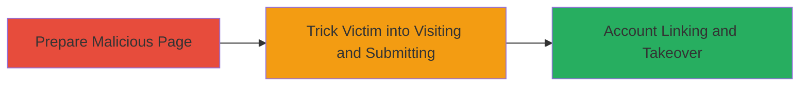

---
tags:
  - csrf
  - account-takeover
  - web-vulnerability
  - social-club
type: attack_chain
tools: []
tactics:
  - '[[Initial Access]]'
  - '[[Credential Access]]'
commands: []
platforms:
  - Web
complexity: low
procedures:
  - '[[procedures/Exploit-CSRF-in-Account-Linking]]'
step_count: 2
techniques:
  - '[[Exploit Public-Facing Application]]'
  - '[[Valid Accounts]]'
description: >-
  A Cross-Site Request Forgery attack exploiting the lack of anti-CSRF tokens in
  the Rockstar Games Social Club Facebook account-linking endpoint, allowing
  unauthorized linking of a victim's account to an attacker's Facebook profile
  and subsequent account takeover.
skill_level: intermediate
impact_level: high
id: 6e583872-baf9-406b-b926-e8f7305ced3b
created_at: '2025-12-14T17:27:57.742Z'
updated_at: '2025-12-14T17:27:57.742Z'
verified: false
validated: true
submitted: true
mitre_tactics:
  - '[[Initial Access]]'
  - '[[Credential Access]]'
mitre_techniques:
  - '[[Exploit Public-Facing Application]]'
  - '[[Valid Accounts]]'
---
# CSRF in Social Club Facebook Account Linking Leading to Account Takeover

## Overview

This attack chain demonstrates a Cross-Site Request Forgery (CSRF) vulnerability in the Rockstar Games Social Club authentication flow at https://signin.rockstargames.com/tpa/facebook/link/. The endpoint lacks proper anti-CSRF protections, enabling an attacker to craft a malicious webpage that forges a request to link the victim's Social Club account to the attacker's Facebook account. Once linked, the attacker can authenticate as the victim using their own Facebook credentials, resulting in full account takeover. This could allow access to in-game purchases, personal data, and linked services. The attack requires the victim to be authenticated in Social Club and visit a malicious site, typically via phishing or social engineering.

## Chain Metrics Dashboard

| Metric | Value |
|--------|-------|
| Chain Status | Unverified |
| Total Steps | 2 |
| Execution Time | ~5 minutes |
| Skill Level | Intermediate |
| Complexity | Low |
| Impact Level | High |

## Attack Flow Visualization

## Prerequisites & Requirements

### Required Tools

- Web browser for testing
- Text editor for crafting HTML PoC

### Target Environment

- Web platform
- Social Club service with Facebook integration
- Victim must be logged into Social Club in their browser

### Initial Access Requirements

- Attacker must have a Facebook account
- Victim's Social Club session active
- Delivery method for malicious link (e.g., email, social media)

## Detailed Attack Procedures

### Step 1: Craft Malicious CSRF PoC
procedure: [[procedures/Exploit-CSRF-in-Account-Linking]]

**Objective**: Create an HTML page that automatically submits a forged request to the vulnerable endpoint, linking the victim's account to the attacker's Facebook.

**Instructions**: Use a text editor to create an HTML file with an auto-submitting form targeting https://signin.rockstargames.com/tpa/facebook/link/. Include necessary parameters such as the attacker's Facebook ID or token (obtained via legitimate Facebook login). Host this on a controllable server (e.g., GitHub Pages or local server) and obtain a URL.

**Expected Output**: A hosted malicious webpage that, when loaded by the victim, triggers the linking request invisibly.

**Success Indicators**:
- Form submission occurs without user interaction
- No CSRF token validation error

### Step 2: Deliver and Execute Attack
procedure: [[procedures/Exploit-CSRF-in-Account-Linking]]

**Objective**: Induce the victim to load the malicious page while authenticated in Social Club, completing the unauthorized linking and enabling takeover.

**Instructions**: Send the malicious URL to the victim via phishing email, social media, or malicious link. Once visited, the page submits the CSRF request. Verify success by attempting to log in to the victim's Social Club using the attacker's Facebook credentials.

**Expected Output**: Victim's Social Club account now linked to attacker's Facebook; successful login as victim.

**Success Indicators**:
- Attacker can access victim's account dashboard
- Account settings show new Facebook linkage

## Attack Chain Summary

### Key Achievements

1. Unauthorized account linking without victim consent
2. Full account takeover via Facebook credentials
3. Potential access to sensitive game data and purchases

## Technique & Tactic Coverage

### MITRE ATT&CK Techniques

- [[Exploit Public-Facing Application]]
- [[Valid Accounts]]

### MITRE ATT&CK Tactics

- [[Initial Access]]
- [[Credential Access]]

---
*Last updated: 2023-10-01*
