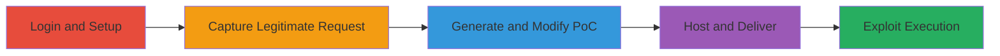

---
tags:
  - csrf
  - web
  - authorization-bypass
  - data-modification
type: attack_chain
tools:
  - '[[tools/Burp-Suite]]'
tactics:
  - '[[Initial Access]]'
verified: false
platforms:
  - Web
submitted: true
complexity: medium
created_at: '2023-10-01T00:00:00Z'
procedures:
  - '[[procedures/Login-to-Tucows-Platform-After-Order]]'
  - '[[procedures/Save-Shared-Note-on-Tucows]]'
  - '[[procedures/Capture-Note-Saving-Request-with-Burp-Suite]]'
  - '[[procedures/Generate-CSRF-POC-from-Captured-Request]]'
  - '[[procedures/Modify-CSRF-POC-for-Target-Victim]]'
  - '[[procedures/Host-Malicious-CSRF-HTML-File]]'
  - '[[procedures/Trick-Victim-into-Visiting-Hosted-POC]]'
step_count: 7
techniques:
  - '[[Exploit Public-Facing Application]]'
  - '[[Drive-by Compromise]]'
updated_at: '2025-12-14T17:30:07.449Z'
description: >-
  A multi-step attack exploiting a CSRF vulnerability in the Tucows platform's
  Shared Notes feature to unauthorizedly modify or delete user notes by tricking
  victims into visiting a malicious link.
skill_level: intermediate
impact_level: high
id: 0d38ba63-28c0-48ef-98da-5e644ef3e3f0
validated: true
mitre_tactics:
  - '[[Initial Access]]'
mitre_techniques:
  - '[[Exploit Public-Facing Application]]'
  - '[[Drive-by Compromise]]'
---
# CSRF in Tucows Shared Notes Allowing Unauthorized Modification or Deletion

Multi-stage attack chain demonstrating a complete CSRF exploitation workflow on the Tucows platform to modify or delete shared notes without authorization.

## Chain Metrics Dashboard

| Metric | Value |
|--------|-------|
| Chain Status | Unverified |
| Total Steps | 7 |
| Execution Time | ~15 minutes |
| Skill Level | Intermediate |
| Complexity | Medium |
| Impact Level | High |

## Attack Flow Visualization

## Prerequisites & Requirements

### Required Tools

- [[tools/Burp-Suite]]

### Target Environment

- Tucows web platform
- Access to victim's client_id (easily obtainable in same organization)
- Web hosting service for PoC

### Initial Access Requirements

- Attacker account on Tucows
- Victim must be logged in when tricked into visiting the malicious page
- No special credentials beyond platform access

## Detailed Attack Procedures

### Step 1: Login to Platform After Order
procedure: [[procedures/Login-to-Tucows-Platform-After-Order]]

**Objective**: Gain access to the Shared Notes feature post-order to set up legitimate interaction for request capture.

**Instructions**: Navigate to the Tucows login endpoint after placing an order to access the Shared Notes field. Use standard login credentials for your attacker account.

**Expected Output**: Successful login and access to the notes interface.

**Success Indicators**:
- User dashboard loads with Shared Notes visible
- Order confirmation leads to notes editing page

### Step 2: Save Shared Note
procedure: [[procedures/Save-Shared-Note-on-Tucows]]

**Objective**: Perform a legitimate note save to generate a capturable POST request.

**Instructions**: Enter arbitrary text into the Shared Notes field and submit via POST to the notes endpoint. Include parameters such as ajax=save_note, client_id (your own), note (the text), and area=client.

**Expected Output**: Note saved successfully, confirmation message or updated notes display.

**Success Indicators**:
- POST request sent to endpoint (e.g., /notes with specified params)
- Notes field reflects the saved content

### Step 3: Capture Note Saving Request with Burp Suite
procedure: [[procedures/Capture-Note-Saving-Request-with-Burp-Suite]]

**Objective**: Intercept the legitimate POST request to analyze and replicate for CSRF exploitation.

**Instructions**: Configure Burp Suite as a proxy, then navigate to the HTTP history tab after saving the note. The request will appear in the history for further use.

**Expected Output**: Captured POST request visible in Burp's history tab, showing full details like headers, body, and parameters.

**Success Indicators**:
- Request logged with ajax=save_note and other params
- No errors in proxy interception

### Step 4: Generate CSRF PoC from Captured Request
procedure: [[procedures/Generate-CSRF-POC-from-Captured-Request]]

**Objective**: Create an initial HTML-based CSRF proof-of-concept from the captured request.

**Instructions**: In Burp Suite, locate the POST request to the redacted endpoint (e.g., involving ajax=save_note), right-click, and select Engagement tools → Generate CSRF PoC. This produces an HTML file with an auto-submitting form.

**Expected Output**: HTML file generated, containing a form that mimics the POST request with JavaScript auto-submit.

**Success Indicators**:
- PoC HTML file downloadable
- Form includes correct endpoint, method, and parameters

### Step 5: Modify CSRF PoC for Target Victim
procedure: [[procedures/Modify-CSRF-POC-for-Target-Victim]]

**Objective**: Customize the PoC to target a specific victim's client_id for unauthorized actions.

**Instructions**: Open the generated HTML in a text editor and edit the client_id input field to the victim's ID, e.g., change <input type="hidden" name="client_id" value="your_id"> to <input type="hidden" name="client_id" value="victim_id">. Adjust the note parameter for modification or deletion (e.g., empty note for delete).

**Expected Output**: Updated HTML file ready for hosting, with victim's client_id embedded.

**Success Indicators**:
- client_id value matches target's
- Form still auto-submits via document.forms[0].submit()

### Step 6: Host Malicious CSRF HTML File
procedure: [[procedures/Host-Malicious-CSRF-HTML-File]]

**Objective**: Make the PoC accessible via a link to deliver to the victim.

**Instructions**: Upload the modified HTML file to any web hosting service or personal server, obtaining a public URL for the page.

**Expected Output**: Hosted page accessible via URL, loads without errors.

**Success Indicators**:
- Page URL works in browser
- Form visible (though auto-submits)

### Step 7: Trick Victim into Visiting Hosted PoC
procedure: [[procedures/Trick-Victim-into-Visiting-Hosted-POC]]

**Objective**: Execute the CSRF by inducing the victim to load the page while logged in, triggering unauthorized note changes.

**Instructions**: Send the hosted URL to the victim via email, chat, or phishing, disguised as a legitimate link. When loaded, the JavaScript auto-submits the form, sending the POST to Tucows endpoint.

**Expected Output**: Victim's notes modified or deleted; attacker can verify by accessing shared notes if possible.

**Success Indicators**:
- POST request sent from victim's browser
- Notes changed (data loss, phishing injection)

## Attack Chain Summary

### Key Achievements

1. Captured and replicated vulnerable endpoint without CSRF tokens
2. Customized PoC for targeted unauthorized note manipulation
3. Demonstrated high-impact data loss and privacy risks in organizational settings

## Technique & Tactic Coverage

### MITRE ATT&CK Techniques

- [[Exploit Public-Facing Application]]
- [[Drive-by Compromise]]

### MITRE ATT&CK Tactics

- [[Initial Access]]

---

*Last updated: 2023-10-01T00:00:00Z*
