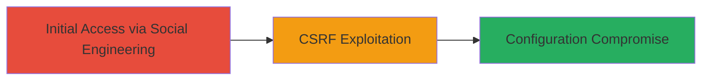

---
tags:
  - csrf
  - web-vulnerability
  - unifi
  - configuration-compromise
type: attack_chain
tools: []
tactics:
  - '[[Initial Access]]'
verified: false
platforms:
  - Web
submitted: true
complexity: medium
created_at: '2023-10-01T00:00:00Z'
procedures:
  - '[[procedures/Exploit-UniFi-Video-Server-CSRF-for-Config-Restore]]'
step_count: 2
techniques:
  - '[[Exploit Public-Facing Application]]'
updated_at: '2025-12-14T17:27:42.849Z'
description: >-
  A CSRF attack exploiting the lack of protection in the UniFi Video Server web
  interface's Configuration Restore feature, allowing unauthorized configuration
  changes and full application compromise.
skill_level: intermediate
impact_level: high
id: 797fb3a8-f709-4ad1-89ba-84683a126d03
validated: true
mitre_tactics:
  - '[[Initial Access]]'
mitre_techniques:
  - '[[Exploit Public-Facing Application]]'
---
# CSRF in UniFi Video Server Configuration Restore Leading to Full Application Compromise

Multi-stage attack chain demonstrating a complete attack workflow exploiting a CSRF vulnerability in the UniFi Video Server web interface (version 3.10.0) to perform unauthorized configuration restores, leading to full application compromise.

## Chain Metrics Dashboard

| Metric | Value |
|--------|-------|
| Chain Status | Unverified |
| Total Steps | 2 |
| Execution Time | ~5 minutes |
| Skill Level | Intermediate |
| Complexity | Medium |
| Impact Level | High |

## Attack Flow Visualization



## Prerequisites & Requirements

### Required Tools

- Web browser for testing
- Text editor for crafting HTML

### Target Environment

- UniFi Video Server version 3.10.0 or vulnerable equivalents
- Web interface accessible (typically port 7443 or 80/443)
- Authenticated user session

### Initial Access Requirements

- Victim must be authenticated to the UniFi Video Server web interface
- Attacker must be able to host or send a malicious HTML page (e.g., via phishing email or malicious website)
- Network access to the victim's browser

## Detailed Attack Procedures

### Step 1: Prepare Malicious CSRF Payload
procedure: [[procedures/Exploit-UniFi-Video-Server-CSRF-for-Config-Restore]]

**Objective**: Craft and host a malicious HTML page that automatically submits a forged request to the Configuration Restore endpoint, altering server settings without user knowledge.

**Instructions**: Create an HTML file with a form that targets the vulnerable Web API endpoint for configuration restore. The form should include a malicious configuration file upload or parameter manipulation to change server settings, such as enabling unauthorized access or disabling security features. Host this file on an attacker-controlled server (e.g., using a simple HTTP server).

For example, use a basic HTML form:

```html
<!DOCTYPE html>
<html>
<body>
<form action="https://target-unifi-server:7443/api/config/restore" method="post" enctype="multipart/form-data">
    <input type="file" name="config" value="malicious-config.xml" style="display:none;">
    <input type="submit" value="Click Here" style="display:none;">
</form>
<script>document.forms[0].submit();</script>
</body>
</html>
```

Upload a tampered configuration file (e.g., malicious-config.xml) that includes changes like adding backdoor admin credentials or exposing the server.

**Expected Output**: The HTML page auto-submits the form when loaded, sending the restore request to the target's Web API.

**Success Indicators**:
- Form submission occurs automatically in the victim's browser
- No user interaction required beyond loading the page

### Step 2: Lure and Execute
procedure: [[procedures/Exploit-UniFi-Video-Server-CSRF-for-Config-Restore]]

**Objective**: Trick an authenticated user into loading the malicious page, triggering the CSRF request and compromising the server configuration.

**Instructions**: Distribute the malicious HTML page via social engineering, such as embedding it in a phishing email, linking from a compromised site, or using a shortened URL. Ensure the victim is logged into the UniFi Video Server web interface when they access the page. The browser will include the victim's session cookies in the forged request, bypassing authentication checks.

Monitor for success by attempting to access altered configurations or verifying changes like new admin accounts.

**Expected Output**: Server configuration updated with attacker-specified changes, granting unauthorized control.

**Success Indicators**:
- Victim loads the page while authenticated
- Attacker observes or tests for configuration changes (e.g., login with new credentials)
- Full application compromise achieved

## Attack Chain Summary

### Key Achievements

1. Bypassed CSRF protections to forge configuration restore requests
2. Achieved unauthorized server reconfiguration without direct access
3. Enabled full compromise of the UniFi Video Server application

## Technique & Tactic Coverage

### MITRE ATT&CK Techniques

- [[Exploit Public-Facing Application]]

### MITRE ATT&CK Tactics

- [[Initial Access]]

---
*Last updated: 2023-10-01T00:00:00Z*
