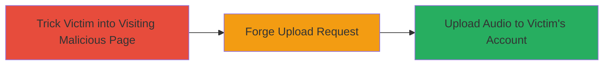

# CSRF in VK.com Audio Upload Allowing Unauthorized Audio File Uploads

Multi-stage attack chain demonstrating a complete CSRF exploitation workflow on VK.com's audio upload feature.

## Chain Metrics Dashboard

| Metric | Value |
|--------|-------|
| Chain Status | Unverified |
| Total Steps | 2 |
| Execution Time | ~5 minutes |
| Skill Level | Intermediate |
| Complexity | Medium |
| Impact Level | Medium |

## Attack Flow Visualization

## Prerequisites & Requirements

### Required Tools

- Browser with developer tools
- Malicious HTML page hosting (e.g., attacker-controlled server)

### Target Environment

- VK.com web platform
- Victim must be authenticated (logged in) to VK.com
- No specific ports or services beyond standard HTTPS (443)

### Initial Access Requirements

- Social engineering to lure victim to attacker's page
- Victim's session must be active on VK.com
- Attacker needs a prepared audio file for upload

## Detailed Attack Procedures

### Step 1: Prepare Malicious Page

**Objective**: Create and host a page that tricks the victim into loading a forged CSRF request to VK.com's audio upload endpoint.

**Instructions**: Develop an HTML page with an auto-submitting form targeting the vulnerable upload endpoint. Host it on an attacker-controlled domain. Use browser developer tools to inspect and replicate the upload form from VK.com, omitting the hash check.

**Expected Output**: A hosted HTML file that, when visited, automatically submits the forged request.

**Success Indicators**:
- Page loads without errors
- Form submission triggers network request to VK.com

### Step 2: Execute CSRF Upload
procedure: [[procedures/Forge-CSRF-Request-for-Audio-Upload]]

**Objective**: Forge and send the CSRF request to upload an audio file to the victim's VK.com account without consent.

**Instructions**: Lure the victim to the malicious page via phishing or social engineering. Upon visit, the page submits the request using the victim's active session cookies, bypassing hash checks.

**Expected Output**: Audio file uploaded to victim's VK.com account.

**Success Indicators**:
- Confirmation of upload in victim's account
- No user interaction required beyond visiting the page

## Attack Chain Summary

### Key Achievements

1. Successful forgery of audio upload request without CSRF protection
2. Unauthorized addition of audio files to victim's account
3. Demonstration of medium-impact account manipulation

## Technique & Tactic Coverage

### MITRE ATT&CK Techniques

- [[Exploit Public-Facing Application]]

### MITRE ATT&CK Tactics

- [[Initial Access]]

---
*Last updated: 2023-10-01T12:00:00Z*
