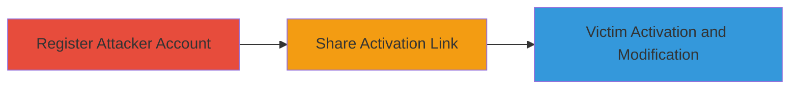

---
tags:
  - csrf
  - weblate
  - account-modification
  - web-vulnerability
type: attack_chain
tools: []
tactics:
  - '[[Initial Access]]'
verified: false
platforms:
  - Web
submitted: true
complexity: medium
procedures:
  - '[[procedures/Register-Attacker-Account-on-Weblate]]'
  - '[[procedures/Craft-and-Share-Weblate-Activation-Link]]'
  - '[[procedures/Induce-Victim-Click-for-Account-Modification]]'
step_count: 3
techniques:
  - '[[Exploit Public-Facing Application]]'
description: >-
  A multi-step CSRF attack exploiting Weblate's account activation process to
  modify a victim's account details without proper protection.
skill_level: intermediate
impact_level: medium
id: f668fb9c-e689-4947-9615-9d3c314e1ca8
created_at: '2025-12-14T17:27:15.395Z'
updated_at: '2025-12-14T17:27:15.395Z'
validated: true
mitre_tactics:
  - '[[Initial Access]]'
mitre_techniques:
  - '[[Exploit Public-Facing Application]]'
---
# CSRF in Weblate Account Activation Leading to Unauthorized Account Modification

Multi-stage attack chain demonstrating a complete CSRF workflow in Weblate, a Python/Django-based translation platform. The attack leverages the lack of CSRF protection in the account activation endpoint, allowing an attacker to trick a logged-in victim into modifying their own account details via a malicious GET request.

## Chain Metrics Dashboard

| Metric | Value |
|--------|-------|
| Chain Status | Unverified |
| Total Steps | 3 |
| Execution Time | ~5 minutes |
| Skill Level | Intermediate |
| Complexity | Medium |
| Impact Level | Medium |

## Attack Flow Visualization

## Prerequisites & Requirements

### Required Tools

- None (relies on web browser and email/social engineering)

### Target Environment

- Weblate platform (Python/Django-based web application)
- Web access to registration and activation endpoints
- No specific ports required beyond standard HTTPS (443)

### Initial Access Requirements

- Attacker must have ability to register a new account
- Victim must be logged into their Weblate account
- Network access to share links (e.g., via email or messaging)

## Detailed Attack Procedures

### Step 1: Register Attacker Account
procedure: [[procedures/Register-Attacker-Account-on-Weblate]]

**Objective**: Create a new account to generate an activation link containing attacker-controlled data.

**Instructions**: Navigate to the Weblate registration page and submit a form with attacker details, such as full name and email. Upon submission, Weblate sends an activation email with a unique GET link.

**Expected Output**: Receipt of activation email containing the link (e.g., https://weblate.example.com/activate/user/uid/token/).

**Success Indicators**:
- Registration confirmation email received
- Activation link extracted from email

### Step 2: Craft and Share Activation Link
procedure: [[procedures/Craft-and-Share-Weblate-Activation-Link]]

**Objective**: Prepare and distribute the activation link to the victim without activating it yourself.

**Instructions**: Copy the activation link from the email. Modify or use as-is to include attacker details (e.g., full name). Share via email, chat, or phishing site, enticing the victim to click while logged in.

**Expected Output**: Victim receives and clicks the link.

**Success Indicators**:
- Link shared successfully
- Victim confirms clicking (via social engineering follow-up)

### Step 3: Victim Activation and Account Modification
procedure: [[procedures/Induce-Victim-Click-for-Account-Modification]]

**Objective**: Trigger the CSRF to apply attacker data to the victim's account.

**Instructions**: Ensure the victim is logged into Weblate and clicks the shared link. The GET request processes without CSRF token, changing the victim's full name to the attacker's and adding the attacker's email as secondary.

**Expected Output**: Victim's account modified; attacker can verify via login or secondary email access.

**Success Indicators**:
- Victim's full name updated
- Attacker's email added to victim's account
- Potential for further exploitation like password reset

## Attack Chain Summary

### Key Achievements

1. Successful registration and link generation
2. Social engineering to induce victim click
3. Unauthorized account modification enabling impersonation or takeover risks

## Technique & Tactic Coverage

### MITRE ATT&CK Techniques

- [[Exploit Public-Facing Application]]

### MITRE ATT&CK Tactics

- [[Initial Access]]

---
*Last updated: 2024-10-01T00:00:00Z*
