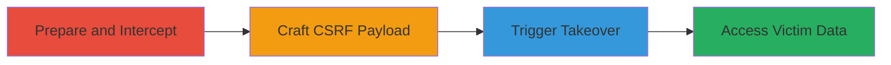

---
tags:
  - csrf
  - account-takeover
  - openid
  - third-party-auth
  - weblate
type: attack_chain
tools:
  - '[[tools/Burp-Suite]]'
tactics:
  - '[[Initial Access]]'
  - '[[Credential Access]]'
verified: false
platforms:
  - Web
submitted: true
complexity: medium
created_at: '2023-10-01T00:00:00Z'
procedures:
  - '[[procedures/Prepare-Attacker-Account-and-Intercept-Auth-Request]]'
  - '[[procedures/Craft-and-Deliver-CSRF-Form-for-Account-Linking]]'
  - '[[procedures/Execute-Account-Takeover-via-Ubuntu-Auth]]'
step_count: 3
techniques:
  - '[[Drive-by Compromise]]'
  - '[[Valid Accounts]]'
updated_at: '2025-12-14T17:33:06.242Z'
description: >-
  A multi-stage attack exploiting a CSRF vulnerability in Weblate's third-party
  Ubuntu One authentication to link an attacker's account to a victim's profile,
  enabling full account takeover.
skill_level: intermediate
impact_level: high
id: 063aacee-ef76-4d36-8489-ea0d0926511e
validated: true
mitre_tactics:
  - '[[Initial Access]]'
  - '[[Credential Access]]'
mitre_techniques:
  - '[[Drive-by Compromise]]'
  - '[[Valid Accounts]]'
---
# CSRF in Weblate Ubuntu One Authentication Leading to Account Takeover

Multi-stage attack chain demonstrating a complete attack workflow exploiting a CSRF flaw in Weblate's Ubuntu One integration for account takeover.

## Chain Metrics Dashboard

| Metric | Value |
|--------|-------|
| Chain Status | Unverified |
| Total Steps | 3 |
| Execution Time | ~10 minutes |
| Skill Level | Intermediate |
| Complexity | Medium |
| Impact Level | High |

## Attack Flow Visualization

## Prerequisites & Requirements

### Required Tools

- [[tools/Burp-Suite]]

### Target Environment

- Web platform with Weblate instance (e.g., demo.weblate.org)
- Ubuntu One OpenID service enabled for third-party auth
- No specific ports; standard HTTPS (443)

### Initial Access Requirements

- Attacker has a valid Weblate account
- Victim has an active Weblate session (e.g., logged in browser)
- Network access to Weblate and Ubuntu One sites
- No prior victim credentials needed; relies on session hijacking via CSRF

## Detailed Attack Procedures

### Step 1: Prepare Attacker Account and Intercept Auth Request
procedure: [[procedures/Prepare-Attacker-Account-and-Intercept-Auth-Request]]

**Objective**: Set up the attacker's Weblate account, initiate Ubuntu One association, and intercept the vulnerable authentication completion request to capture OpenID parameters.

**Instructions**: Log in to your Weblate account, navigate to the profile authentication section, select Ubuntu One, start the auth process, and use Burp Suite to intercept the POST request to /accounts/complete/ubuntu/ before it completes.

**Expected Output**: Intercepted request containing OpenID parameters like openid.identity, openid.ax.value.email.1, janrain_nonce, and signature.

**Success Indicators**:
- Attacker account ready with Ubuntu One selected
- Request dropped and parameters extracted for reuse

### Step 2: Craft and Deliver CSRF Form for Account Linking
procedure: [[procedures/Craft-and-Deliver-CSRF-Form-for-Account-Linking]]

**Objective**: Create an HTML form that resubmits the intercepted OpenID data under the victim's session, forcing the association of the attacker's Ubuntu account to the victim's Weblate profile.

**Instructions**: Build an HTML page with a form posting to https://demo.weblate.org/accounts/complete/ubuntu/, using hidden inputs for all captured parameters. Host the page or send it to the victim (e.g., via phishing) to auto-submit when loaded in their browser while logged into Weblate.

**Expected Output**: Victim's browser submits the form, completing the association silently.

**Success Indicators**:
- Form submission succeeds without CSRF token validation
- Attacker's Ubuntu identity now linked to victim's profile (verifiable via Weblate profile)

### Step 3: Execute Account Takeover via Ubuntu Auth
procedure: [[procedures/Execute-Account-Takeover-via-Ubuntu-Auth]]

**Objective**: Use the newly linked Ubuntu One account to authenticate into the victim's Weblate profile, gaining full access to their data and permissions.

**Instructions**: Log out of Weblate if needed, then authenticate using the attacker's Ubuntu One credentials. The system will recognize the linked identity and grant access to the victim's account.

**Expected Output**: Successful login to victim's Weblate dashboard with their data visible.

**Success Indicators**:
- Access to victim's projects, translations, and profile settings
- Ability to perform actions as the victim

## Attack Chain Summary

### Key Achievements

1. Bypassed CSRF protections in Python Social Auth library for OpenID handling
2. Linked external Ubuntu account to victim profile without their consent
3. Achieved full account takeover, exposing sensitive translation data in Weblate

## Technique & Tactic Coverage

### MITRE ATT&CK Techniques

- [[Drive-by Compromise]]
- [[Valid Accounts]]

### MITRE ATT&CK Tactics

- [[Initial Access]]
- [[Credential Access]]

---
*Last updated: 2023-10-01T00:00:00Z*
