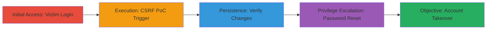

---
id: a1b2c3d4-e5f6-7890-abcd-ef1234567890
name: CSRF on Account Email Change Leading to Full Account Takeover
type: attack_chain
description: A multi-stage attack exploiting the absence of CSRF protection on a web application's account email change feature, allowing unauthorized email modification and subsequent password reset for complete account takeover.
verified: false
submitted: false
step_count: 4
created_at: 2023-10-01T00:00:00Z
updated_at: 2023-10-01T00:00:00Z
procedures: [[procedures/Create-and-Deliver-CSRF-PoC]], [[procedures/Verify-Account-Modification-via-CSRF]], [[procedures/Execute-Password-Reset-for-Takeover]]
techniques: [[Exploit Public-Facing Application]], [[Valid Accounts]]
tactics: [[Initial Access]], [[Credential Access]]
tags: csrf, account-takeover, web-vulnerability, email-change
platforms: Web
tools: []
---

# CSRF on Account Email Change Leading to Full Account Takeover

Multi-stage attack chain demonstrating a complete attack workflow exploiting CSRF in a U.S. Department of Defense web application to achieve account takeover.

## Chain Metrics Dashboard

| Metric | Value |
|--------|-------|
| Chain Status | Unverified |
| Total Steps | 4 |
| Execution Time | ~5 minutes |
| Skill Level | Intermediate |
| Complexity | Medium |
| Impact Level | High |

## Attack Flow Visualization

## Prerequisites & Requirements

### Required Tools

- None (manual browser-based exploitation)

### Target Environment

- Web application with account management features (e.g., U.S. DoD portal)
- No CSRF token validation on POST requests for email changes
- Accessible via standard HTTP/HTTPS

### Initial Access Requirements

- Victim must be authenticated in the application
- Social engineering to trick victim into opening malicious HTML file
- Attacker knowledge of the target's account update endpoint

## Detailed Attack Procedures

### Step 1: Victim Authentication and Account Inspection

**Objective**: Ensure the victim is logged in and gather baseline account details, such as the current email address.

**Instructions**: Manually log in to the web application as the victim (via phishing or shared credentials if available). Navigate to the account settings page and note the current email and other details. No automated tools are required; use the browser's developer tools to inspect the form fields and endpoint URL for the email change functionality (typically a POST to /account/update or similar).

**Expected Output**: Visible account details confirming the victim's current email.

**Success Indicators**:
- Victim session active
- Endpoint URL and form parameters identified (e.g., email, other fields)

### Step 2: Trigger CSRF Exploitation

procedure: [[procedures/Create-and-Deliver-CSRF-PoC]]

**Objective**: Trick the victim into executing a malicious HTML file that forges a POST request to change the account email without CSRF protection.

**Instructions**: Deliver the pre-crafted csrf_POC.html file to the victim via email or social engineering. The file contains a hidden form that auto-submits to the target's update endpoint with attacker-controlled values (e.g., new email address owned by the attacker). When the victim opens the file in their browser (while authenticated), the request executes silently.

**Expected Output**: The victim's email is updated to the attacker's controlled address without user interaction.

**Success Indicators**:
- No error on form submission (silent execution)
- Subsequent login shows updated email (if checked)

### Step 3: Verify Account Modifications

procedure: [[procedures/Verify-Account-Modification-via-CSRF]]

**Objective**: Confirm that the CSRF attack successfully altered the account details, particularly the email.

**Instructions**: After the victim interacts with the PoC, log in as the victim (or use a secondary session) and refresh the account details page. Check for changes in email and any other modified fields specified in the PoC payload.

**Expected Output**: Updated account information reflecting the forged request data.

**Success Indicators**:
- Email changed to attacker-specified value
- No alerts or failed validation triggered

### Step 4: Complete Account Takeover via Password Reset

procedure: [[procedures/Execute-Password-Reset-for-Takeover]]

**Objective**: Use the newly set email to initiate and complete a password reset, gaining full control of the account.

**Instructions**: Navigate to the application's main login or forgot password page. Enter the new (attacker-controlled) email address to request a reset link. Check the attacker's email inbox for the reset instructions, follow the link, and set a new password. Log in with the new credentials to confirm control.

**Expected Output**: Successful password reset and login with new credentials.

**Success Indicators**:
- Reset email received
- Account accessible under attacker control
- Original victim locked out

## Attack Chain Summary

### Key Achievements

1. Unauthorized modification of sensitive account data (email) via CSRF
2. Bypassing authentication controls through chained password reset
3. Full compromise of a high-value DoD account without direct credential theft

## Technique & Tactic Coverage

### MITRE ATT&CK Techniques

- [[Exploit Public-Facing Application]] Exploit Public-Facing Application (CSRF exploitation on web endpoint)
- [[Valid Accounts]] Valid Accounts (leveraging modified credentials for takeover)

### MITRE ATT&CK Tactics

- [[Initial Access]] Initial Access (via drive-by CSRF trigger)
- [[Credential Access]] Credential Access (altering email to hijack reset process)

---
*Last updated: 2023-10-01T00:00:00Z*
