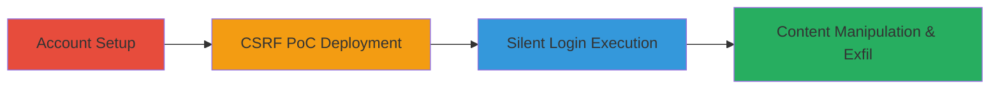

# CSRF on Infogram Login Form for Silent Account Takeover

Multi-stage attack chain demonstrating a complete CSRF exploitation workflow on Infogram's login form, allowing attackers to force victims into their accounts without detection, leading to unauthorized actions and data exposure.

## Chain Metrics Dashboard

| Metric | Value |
|--------|-------|
| Chain Status | Unverified |
| Total Steps | 4 |
| Execution Time | ~10 minutes |
| Skill Level | Intermediate |
| Complexity | Medium |
| Impact Level | High |

## Attack Flow Visualization

## Prerequisites & Requirements

### Required Tools

- Web browser for testing
- Text editor for HTML PoC

### Target Environment

- Infogram platform (web application)
- No specific services/ports required beyond standard HTTPS (443)
- Attacker needs ability to host or deliver malicious HTML (e.g., via phishing email or fake site)

### Initial Access Requirements

- No prior credentials needed; attacker creates accounts freely
- Victim must be a registered Infogram user and interact with the attacker's PoC
- Same-browser session for victim to enable CSRF

## Detailed Attack Procedures

### Step 1: Account Setup
procedure: [[procedures/Create-Test-Accounts-for-CSRF]]

**Objective**: Establish victim and attacker accounts to simulate the environment and prepare for CSRF testing.

**Instructions**: Register a standard victim account on Infogram using basic user details. Then, create a separate attacker account with credentials that will be used in the PoC.

**Expected Output**: Two active accounts on Infogram, confirmed via email verification if required.

**Success Indicators**:
- Victim account login successful
- Attacker account login successful

### Step 2: Craft and Deploy CSRF PoC
procedure: [[procedures/Craft-and-Deploy-CSFR-POC]]

**Objective**: Build an HTML page that submits a forged POST request to Infogram's login endpoint using attacker credentials, disguised to lure the victim.

**Instructions**: Create an HTML file with a form targeting the login endpoint (e.g., /login or similar). Set the form action to POST with fields for username and password populated with attacker details. Disguise it as a blog post or link related to Infogram. Host or deliver via email/social engineering.

**Expected Output**: A functional HTML PoC that, when loaded and submitted, sends the login request.

**Success Indicators**:
- PoC form submits without errors in browser dev tools
- Request intercepted and verified in proxy tools like Burp Suite

### Step 3: Execute Silent Login via CSRF
procedure: [[procedures/Execute-Silent-Login-via-CSFR]]

**Objective**: Trick the victim into loading the PoC in their browser while logged into their own Infogram session, forcing a silent login to the attacker's account.

**Instructions**: Have the victim (in the same browser) load and interact with the PoC page (e.g., click submit). The form auto-submits the POST to the login endpoint. No warnings or prompts appear due to missing CSRF tokens.

**Expected Output**: Victim's session now authenticated as the attacker; dashboard may not update until refresh.

**Success Indicators**:
- Check session cookies in dev tools; login state changed to attacker
- No visible alerts or redirects to the victim

### Step 4: Demonstrate Content Manipulation and Exfiltration
procedure: [[procedures/Demonstrate-Content-Manipulation-and-Exfiltration]]

**Objective**: Leverage the hijacked session to have the victim unknowingly add/edit content, which the attacker can then access and exfiltrate.

**Instructions**: Instruct or lure the victim to interact with Infogram features like the library (e.g., add a Facebook post or chart). Meanwhile, refresh the attacker's session to view changes.

**Expected Output**: New or edited projects appear in the attacker's library, exposing victim-intended data.

**Success Indicators**:
- Attacker sees victim's additions in their account
- Potential for data theft, such as exporting charts or posts

## Attack Chain Summary

### Key Achievements

1. Silent login takeover without user awareness
2. Unauthorized content creation in attacker's account
3. Pathway to data exfiltration and full account compromise

## Technique & Tactic Coverage

### MITRE ATT&CK Techniques

- [[Drive-by Compromise]]
- [[Exploit Public-Facing Application]]

### MITRE ATT&CK Tactics

- [[Initial Access]]

---
*Last updated: 2023-10-01T00:00:00Z*
