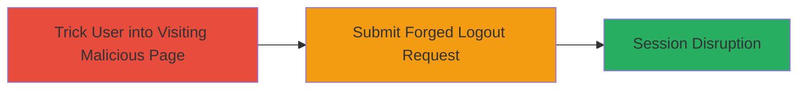

---
tags:
  - csrf
  - web
  - session-disruption
type: attack_chain
tools: []
tactics:
  - '[[Initial Access]]'
verified: false
platforms:
  - Web
submitted: true
complexity: low
created_at: '2023-10-01T00:00:00Z'
procedures:
  - '[[procedures/Craft-CSRF-Page-to-Force-Logout]]'
step_count: 1
techniques:
  - '[[Drive-by Compromise]]'
updated_at: '2025-12-14T17:27:29.507Z'
description: >-
  A Cross-Site Request Forgery attack targeting the logout functionality,
  allowing attackers to force authenticated users to log out by tricking them
  into visiting a malicious webpage.
skill_level: beginner
impact_level: medium
id: f46f350b-cf2f-41a0-9b57-8a4e33a811f9
validated: true
mitre_tactics:
  - '[[Initial Access]]'
mitre_techniques:
  - '[[Drive-by Compromise]]'
---
# CSRF on Logout Endpoint Forcing Involuntary User Logout

Multi-stage attack chain demonstrating a complete attack workflow.

## Chain Metrics Dashboard

| Metric | Value |
|--------|-------|
| Chain Status | Unverified |
| Total Steps | 1 |
| Execution Time | ~1 minute |
| Skill Level | Beginner |
| Complexity | Low |
| Impact Level | Medium |

## Attack Flow Visualization

## Prerequisites & Requirements

### Required Tools

- Web browser for hosting or viewing the malicious page

### Target Environment

- Web application (Legal Robot)
- Authenticated user session

### Initial Access Requirements

- Ability to trick user into visiting attacker's controlled webpage (e.g., via phishing email or malicious link)
- No direct access to target application required

## Detailed Attack Procedures

### Step 1: Deliver Malicious CSRF Page
procedure: [[procedures/Craft-CSRF-Page-to-Force-Logout]]

**Objective**: Force the victim to submit a forged logout request to the target application, resulting in involuntary session termination.

**Instructions**: Create and host a malicious HTML page that automatically submits a form to the target's logout endpoint when loaded. Distribute the link to the victim via social engineering.

**Expected Output**: The victim's browser submits the request, logging them out without interaction.

**Success Indicators**:
- Victim's session ends unexpectedly
- Target application's logs show logout request from victim's IP but without user consent

## Attack Chain Summary

### Key Achievements

1. Successful forced logout via CSRF
2. Disruption of user session without authentication
3. Demonstration of missing CSRF protections

## Technique & Tactic Coverage

### MITRE ATT&CK Techniques

- [[Drive-by Compromise]]

### MITRE ATT&CK Tactics

- [[Initial Access]]

---
*Last updated: 2023-10-01T00:00:00Z*
