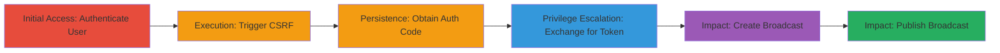

---
tags:
  - csrf
  - oauth
  - api-access
  - account-takeover
type: attack_chain
tools: []
tactics:
  - '[[Initial Access]]'
  - '[[Persistence]]'
commands:
  - '[[commands/curl-exchange-oauth-code]]'
  - '[[commands/curl-create-broadcast]]'
  - '[[commands/curl-publish-broadcast]]'
verified: false
platforms:
  - Web
submitted: true
complexity: medium
created_at: '2023-10-01T00:00:00Z'
procedures:
  - '[[procedures/Establish-Authenticated-Session-in-Periscope-Web]]'
  - '[[procedures/Trigger-CSRF-via-Malicious-Site-to-Obtain-Authorization-Code]]'
  - '[[procedures/Exchange-Authorization-Code-for-Access-Token]]'
  - '[[procedures/Create-Broadcast-Using-Access-Token]]'
  - '[[procedures/Publish-Broadcast-Using-Access-Token]]'
step_count: 6
techniques:
  - '[[Steal Application Access Token]]'
  - '[[Drive-by Compromise]]'
updated_at: '2025-12-14T17:30:35.150Z'
description: >-
  A multi-stage attack exploiting CSRF in Periscope's OAuth flow to trick
  authenticated users into granting attackers full API access, enabling
  broadcast creation and publication.
skill_level: intermediate
impact_level: high
id: 11667a6e-fa88-4d26-967a-f38033b4db3e
validated: true
mitre_tactics:
  - '[[Initial Access]]'
  - '[[Persistence]]'
mitre_techniques:
  - '[[Steal Application Access Token]]'
  - '[[Drive-by Compromise]]'
---
# CSRF on Periscope OAuth Authorization Endpoint Leading to Unauthorized API Access

Multi-stage attack chain demonstrating a complete attack workflow exploiting CSRF in Periscope's OAuth authorization to gain full API access to a victim's account.

## Chain Metrics Dashboard

| Metric | Value |
|--------|-------|
| Chain Status | Unverified |
| Total Steps | 6 |
| Execution Time | ~5 minutes |
| Skill Level | Intermediate |
| Complexity | Medium |
| Impact Level | High |

## Attack Flow Visualization



## Prerequisites & Requirements

### Required Tools

- Web browser (e.g., Chrome)
- curl (for API interactions)

### Target Environment

- Periscope Web (https://periscope.tv)
- Periscope API (https://public-api.periscope.tv/v1)
- Twitter integration for publishing
- No specific ports; web-based over HTTPS

### Initial Access Requirements

- Victim must be logged into Periscope Web
- Attacker controls a malicious site (e.g., PoC page)
- Network access to Periscope endpoints

## Detailed Attack Procedures

### Step 1: Establish Authenticated Session
procedure: [[procedures/Establish-Authenticated-Session-in-Periscope-Web]]

**Objective**: Ensure the victim has an active authenticated session in Periscope Web to enable CSRF exploitation.

**Instructions**: Direct the victim to log in at https://periscope.tv. Verify session by checking for authenticated elements like user profile.

**Expected Output**: Successful login with session cookies set.

**Success Indicators**:
- Victim's browser shows Periscope dashboard
- Session cookies (e.g., auth tokens) present in browser dev tools

### Step 2: Trigger CSRF via Malicious Site
procedure: [[procedures/Trigger-CSRF-via-Malicious-Site-to-Obtain-Authorization-Code]]

**Objective**: Trick the victim into visiting a malicious page that forges an OAuth authorization request, bypassing CSRF protections.

**Instructions**: Host a PoC page (e.g., at http://innerht.ml/pocs/periscope-oauth-csrf/) with an auto-submitting form to https://www.periscope.tv/oauth?client_id=█████████&redirect_uri=https://getmevo.com/oauth/periscope. Lure the victim to visit it while authenticated.

**Expected Output**: Redirect to attacker's redirect_uri with authorization code in query params.

**Success Indicators**:
- Form submission triggers redirect
- Code parameter captured (e.g., ?code=abcde&state=)

### Step 3: Capture Authorization Code
procedure: [[procedures/Trigger-CSRF-via-Malicious-Site-to-Obtain-Authorization-Code]]

**Objective**: Intercept the authorization code from the redirect after CSRF submission.

**Instructions**: Monitor the redirect to https://getmevo.com/oauth/periscope?code=abcde&state=. Manually copy the code parameter from the URL.

**Expected Output**: Authorization code string (e.g., 'abcde').

**Success Indicators**:
- Redirect URL contains 'code' parameter
- No errors in OAuth flow

### Step 4: Exchange Code for Access Token
procedure: [[procedures/Exchange-Authorization-Code-for-Access-Token]]

**Objective**: Use the stolen code to obtain a long-lived access token for API access.

**Instructions**: Execute [[commands/curl-exchange-oauth-code]] with the captured code, client_id, and other required params:

```bash
curl -X POST https://public-api.periscope.tv/v1/oauth/token \
  -d "client_id=█████████" \
  -d "client_secret=█████████" \
  -d "code=abcde" \
  -d "grant_type=authorization_code" \
  -d "redirect_uri=https://getmevo.com/oauth/periscope"
```

**Expected Output**: JSON response with 'access_token' field.

**Success Indicators**:
- 200 OK response
- Access token received

### Step 5: Create Broadcast Using Access Token
procedure: [[procedures/Create-Broadcast-Using-Access-Token]]

**Objective**: Demonstrate API access by initiating a new broadcast.

**Instructions**: Use [[commands/curl-create-broadcast]] with the access token:

```bash
curl -X POST https://public-api.periscope.tv/v1/broadcast/create \
  -H "Authorization: Bearer <access_token>" \
  -d "title=Test Broadcast" \
  -d "description=CSRF Demo"
```

**Expected Output**: JSON with broadcast ID.

**Success Indicators**:
- Broadcast ID returned
- No auth errors

### Step 6: Publish the Broadcast
procedure: [[procedures/Publish-Broadcast-Using-Access-Token]]

**Objective**: Publish the broadcast to Twitter, confirming full account control.

**Instructions**: Execute [[commands/curl-publish-broadcast]] with broadcast details and token:

```bash
curl -X POST https://public-api.periscope.tv/v1/broadcast/publish \
  -H "Authorization: Bearer <access_token>" \
  -d "broadcast_id=<id>" \
  -d "tweet_text=Published via CSRF"
```

**Expected Output**: Confirmation of publication.

**Success Indicators**:
- Broadcast tweeted successfully
- Visible in victim's Periscope/Twitter account

## Attack Chain Summary

### Key Achievements

1. Bypassed OAuth CSRF protections to steal authorization codes
2. Obtained persistent API access tokens
3. Demonstrated account compromise via unauthorized broadcast creation and publication

## Technique & Tactic Coverage

### MITRE ATT&CK Techniques

- [[Steal Application Access Token]] Steal Application Access Token
- [[Drive-by Compromise]] Drive-by Compromise

### MITRE ATT&CK Tactics

- [[Initial Access]] Initial Access
- [[Persistence]] Persistence

---
*Last updated: 2023-10-01T00:00:00Z*
