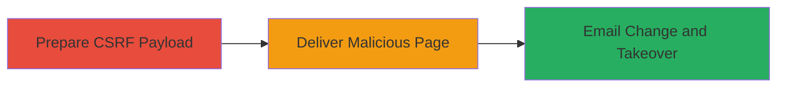

# CSRF on VK.com Email Binding Leading to Account Takeover

Multi-stage attack chain demonstrating a complete attack workflow exploiting a CSRF vulnerability in VK.com's email binding feature.

## Chain Metrics Dashboard

| Metric | Value |
|--------|-------|
| Chain Status | Unverified |
| Total Steps | 3 |
| Execution Time | ~5 minutes |
| Skill Level | Intermediate |
| Complexity | Medium |
| Impact Level | High |

## Attack Flow Visualization



## Prerequisites & Requirements

### Required Tools

- Browser developer tools for crafting requests
- Web server (e.g., local Python server) for hosting PoC

### Target Environment

- Web platform (VK.com)
- Victim must be authenticated to VK.com
- Attacker needs a controlled email address

### Initial Access Requirements

- No prior credentials needed for victim
- Network access to VK.com
- Ability to host a malicious page accessible by victim

## Detailed Attack Procedures

### Step 1: Prepare CSRF Payload
procedure: [[procedures/Exploit-CSRF-to-Change-Email-Binding]]

**Objective**: Craft a malicious HTML page that automatically submits a POST request to VK.com's email binding endpoint, changing the victim's email to the attacker's controlled email.

**Instructions**: Use browser developer tools to inspect the email binding form on VK.com. Identify the endpoint (e.g., /settings/email) and required parameters like user_id, new_email, and any session cookies. Create an HTML file with an auto-submitting form:

```html
<!DOCTYPE html>
<html>
<body>
<form action="https://vk.com/settings/email" method="POST" id="csrf-form">
    <input type="hidden" name="user_id" value="VICTIM_ID">
    <input type="hidden" name="new_email" value="attacker@example.com">
    <!-- Include other required fields -->
</form>
<script>document.getElementById('csrf-form').submit();</script>
</body>
</html>
```

Host this on a local server: `python -m http.server 8000` and access via http://localhost:8000/csrf.html while testing.

**Expected Output**: When loaded by an authenticated victim, the form submits silently, binding the attacker's email.

**Success Indicators**:
- Form submission completes without errors (check network tab)
- Victim's account email updated on VK.com

### Step 2: Deliver CSRF PoC to Victim
procedure: [[procedures/Deliver-CSRF-PoC-to-Victim]]

**Objective**: Trick the victim into loading the malicious page while they are logged into VK.com, triggering the CSRF request.

**Instructions**: Host the PoC HTML on a public server or use a shortened URL. Send it via email, social engineering, or embed in a phishing site. Ensure the victim clicks the link while authenticated to VK.com.

**Expected Output**: Victim visits the page, form auto-submits, and email is changed.

**Success Indicators**:
- Victim confirms visiting the link
- Attacker's email now bound to victim's account (verify via VK.com API or login attempt)

### Step 3: Perform Account Takeover via Password Reset
procedure: [[procedures/Perform-Account-Takeover-via-Password-Reset]]

**Objective**: Use the newly bound email to initiate a password reset and gain control of the victim's account.

**Instructions**: Navigate to VK.com's password reset page, enter the victim's username, and request reset to the bound email. Check the attacker's email for the reset link, click it, and set a new password.

**Expected Output**: Successful password change and login with new credentials.

**Success Indicators**:
- Reset email received
- Access to victim's account dashboard

## Attack Chain Summary

### Key Achievements

1. Unauthorized email binding via CSRF
2. Bypassing authentication for account modification
3. Full account takeover through password reset

## Technique & Tactic Coverage

### MITRE ATT&CK Techniques

- [[Exploit Public-Facing Application]]

### MITRE ATT&CK Tactics

- [[Initial Access]]

---
*Last updated: 2023-10-01T12:00:00Z*
