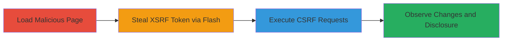

# CSRF on Vimeo via Cross-Site Flashing Leading to Information Disclosure and Unauthorized Video Privacy Changes

Multi-stage attack chain demonstrating a complete attack workflow exploiting Vimeo's permissive crossdomain policy and Flash integration to steal XSRF tokens and perform unauthorized actions.

## Chain Metrics Dashboard

| Metric | Value |
|--------|-------|
| Chain Status | Unverified |
| Total Steps | 4 |
| Execution Time | ~5 minutes |
| Skill Level | Intermediate |
| Complexity | Medium |
| Impact Level | High |

## Attack Flow Visualization

## Prerequisites & Requirements

### Required Tools

- [[tools/evil-swf]]
- [[tools/moogaloop-swf]]
- [[tools/xss-swf]]

### Target Environment

- Web platform with Vimeo logged-in session
- Flash Player enabled in browser (works on Firefox Windows fully, IE partially, Chrome not)
- No specific ports; operates over HTTPS/HTTP

### Initial Access Requirements

- User must be authenticated on Vimeo
- Social engineering to trick user into loading malicious HTML page (e.g., via phishing link)
- Attacker controls external domain hosting evil.swf

## Detailed Attack Procedures

### Step 1: Load Malicious HTML Page
procedure: [[procedures/Load-Malicious-HTML-with-Evil-SWF]]

**Objective**: Deliver the malicious payload by having the victim open an HTML page embedding the evil.swf, initiating the Flash-based attack while the user is logged into Vimeo.

**Instructions**: Host a malicious HTML page (e.g., http://opnsec.com/vimeo/VimeoMoogaloop.html) that embeds the evil.swf using an <object> or <embed> tag. Ensure Flash is enabled in the victim's browser. The page loads evil.swf, which requires an active Vimeo session.

**Expected Output**: evil.swf loads without errors, visible in browser (may show a blank or placeholder Flash object).

**Success Indicators**:
- Flash object renders on the page
- No browser errors related to Flash loading
- Victim remains logged into Vimeo

### Step 2: Steal XSRF Token via Cross-Site Flashing
procedure: [[procedures/Steal-XSRF-Token-via-Cross-Site-Flashing]]

**Objective**: Use the loaded evil.swf to load Vimeo's moogaloop.swf and access the /moogaloop 404 page, extracting the XSRF token due to permissive crossdomain policy.

**Instructions**: evil.swf dynamically loads https://f.vimeocdn.com/p/flash/moogaloop/6.3.5/moogaloop.swf with a config_url parameter set to https://vimeo.com/moogaloop. moogaloop.swf then requests the 404 page, which includes the XSRF token in its HTML source. evil.swf reads and extracts the token from the response.

**Expected Output**: XSRF token captured and displayed or stored for use (e.g., in a text box on the POC page).

**Success Indicators**:
- Token value retrieved (e.g., a string like 'xsrf_token=abc123')
- No cross-origin errors due to crossdomain.xml allowing access from *.vimeocdn.com

### Step 3: Execute CSRF Requests with Stolen Token
procedure: [[procedures/Execute-CSRF-Requests-with-Stolen-Token]]

**Objective**: Leverage the stolen XSRF token to forge POST requests to Vimeo's settings endpoints, altering user name and video privacy settings without authentication checks.

**Instructions**: Using the token, evil.swf sends POST requests to https://vimeo.com/settings (to change user name) and https://vimeo.com/settings/videos (to set all videos and future uploads to public). Include the token in the request headers or body as required by Vimeo's CSRF protection.

**Expected Output**: Requests succeed; changes propagate (name update immediate, video privacy changes in 1-2 minutes).

**Success Indicators**:
- HTTP 200 responses from Vimeo endpoints
- Confirmation messages or status updates in evil.swf's output

### Step 4: Observe Leaked Information and Verify Changes
procedure: [[procedures/Observe-Leaked-Information-and-Verify-Changes]]

**Objective**: Display disclosed information (user name, ID, account type) from the 404 page and confirm unauthorized changes on the victim's Vimeo account.

**Instructions**: Parse and show the extracted data from the 404 page in UI elements on the malicious page. Instruct the victim (or attacker) to log into Vimeo and check settings for updated name and public videos.

**Expected Output**: Leaked info in boxes on POC page; verified changes in Vimeo dashboard.

**Success Indicators**:
- User details displayed (e.g., name: 'John Doe', ID: 12345, type: 'Pro')
- Private videos now public; name changed

## Attack Chain Summary

### Key Achievements

1. Successful theft of XSRF token via Flash cross-site access
2. Unauthorized modification of user settings and video privacy
3. Disclosure of sensitive user information without direct access

## Technique & Tactic Coverage

### MITRE ATT&CK Techniques

- [[Drive-by Compromise]] Drive-by Compromise
- [[Unsecured Credentials]] Unsecured Credentials
- [[Forge Web Credentials]] Forge Web Credentials
- [[Steal Web Session Cookie]] Steal Web Session Cookie

### MITRE ATT&CK Tactics

- [[Initial Access]] Initial Access
- [[Execution]] Execution
- [[Collection]] Collection

---

*Last updated: 2023-10-01T00:00:00Z*
