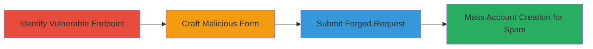

---
tags:
  - csrf
  - web
  - account-creation
  - spam
  - yelp
type: attack_chain
tools:
  - '[[tools/Charles-Proxy]]'
tactics:
  - '[[Initial Access]]'
verified: false
platforms:
  - Web
submitted: true
complexity: medium
created_at: '2023-10-01T00:00:00Z'
procedures:
  - '[[procedures/Identify-CSRF-Vulnerable-Signup-Endpoint]]'
  - '[[procedures/Craft-Malicious-HTML-Form-for-CSRF]]'
  - '[[procedures/Execute-CSRF-Account-Creation-via-Proxy]]'
  - '[[procedures/Demonstrate-CSRF-for-Mass-Account-Spam]]'
step_count: 4
techniques:
  - '[[Exploit Public-Facing Application]]'
updated_at: '2025-12-14T17:27:36.057Z'
description: >-
  Multi-stage attack exploiting CSRF vulnerabilities in Yelp's auto-api
  endpoints to create unauthorized accounts, logins, and password resets from a
  victim's browser.
skill_level: intermediate
impact_level: high
id: 85a1c587-9fcb-46f7-8e64-4ce941642d85
validated: true
mitre_tactics:
  - '[[Initial Access]]'
mitre_techniques:
  - '[[Exploit Public-Facing Application]]'
---
# CSRF on Yelp Signup Endpoint Enabling Unauthorized Account Creation and Spam

Multi-stage attack chain demonstrating exploitation of Cross-Site Request Forgery (CSRF) on Yelp's signup, login, and password reset endpoints to enable unauthorized actions from a victim's browser session.

## Chain Metrics Dashboard

| Metric | Value |
|--------|-------|
| Chain Status | Unverified |
| Total Steps | 4 |
| Execution Time | ~5 minutes |
| Skill Level | Intermediate |
| Complexity | Medium |
| Impact Level | High |

## Attack Flow Visualization



## Prerequisites & Requirements

### Required Tools

- [[tools/Charles-Proxy]]

### Target Environment

- Web platform
- Access to Yelp's auto-api.yelp.com endpoints
- No authentication required for exploitation

### Initial Access Requirements

- Victim's browser session (e.g., via malicious webpage)
- Network access to https://auto-api.yelp.com
- No prior credentials needed

## Detailed Attack Procedures

### Step 1: Identify Vulnerable Endpoint
procedure: [[procedures/Identify-CSRF-Vulnerable-Signup-Endpoint]]

**Objective**: Analyze the signup endpoint to confirm lack of CSRF protections, enabling forged requests.

**Instructions**: Inspect the endpoint behavior using network tools to verify no validation of cookies, CSRF tokens, or user-agent headers.

**Expected Output**: Confirmation that POST requests to /account/create_secure process without security checks.

**Success Indicators**:
- Endpoint identified without token requirements
- Similar issues noted on login and password reset endpoints

### Step 2: Craft Malicious Form
procedure: [[procedures/Craft-Malicious-HTML-Form-for-CSRF]]

**Objective**: Create an HTML form that submits forged signup data to the vulnerable endpoint.

**Instructions**: Build a simple HTML page with hidden inputs for required fields like name, email, password, and country, targeting the endpoint with necessary query parameters.

**Expected Output**: A functional HTML form ready for embedding on a malicious site.

**Success Indicators**:
- Form data matches endpoint requirements
- Includes query params like nonce, ywsid, and signature

### Step 3: Execute Forged Request
procedure: [[procedures/Execute-CSRF-Account-Creation-via-Proxy]]

**Objective**: Submit the forged POST request to create an unauthorized account.

**Instructions**: Use a proxy like Charles to capture and send the POST request with form data. Execute using [[commands/curl-post-csrf-signup]]:

```bash
curl -X POST 'https://auto-api.yelp.com/account/create_secure?time=1234567890&nonce=abc123&ywsid=def456&device_type=web&app_version=1.0&cc=US&lang=en&efs=1&signature=xyz789' \
  -H 'Content-Type: application/x-www-form-urlencoded' \
  -d 'first_name=Test1&last_name=Test2&email=test@example.com&password=123123qq&user_country_code=AR&city=12333&confirmed=0'
```

**Expected Output**: JSON response with user_id and account creation details.

**Success Indicators**:
- HTTP 200 response with user details
- Account created without authentication

### Step 4: Demonstrate Spam Potential
procedure: [[procedures/Demonstrate-CSRF-for-Mass-Account-Spam]]

**Objective**: Show how the CSRF can be used for mass account creation from victim IPs.

**Instructions**: Embed the crafted form in a hidden iframe on a malicious page, triggered by user actions like clickunders, to forge requests from the victim's browser.

**Expected Output**: Multiple accounts created tied to victim's IP, enabling spam.

**Success Indicators**:
- Accounts created from external IPs
- Similar exploitation possible on login and password reset

## Attack Chain Summary

### Key Achievements

1. Identified CSRF on signup endpoint without protections
2. Crafted and executed forged requests for account creation
3. Demonstrated potential for spam via victim browser hijacking
4. Highlighted risks on related endpoints

## Technique & Tactic Coverage

### MITRE ATT&CK Techniques

- [[Exploit Public-Facing Application]]

### MITRE ATT&CK Tactics

- [[Initial Access]]

---

*Last updated: 2023-10-01T00:00:00Z*
