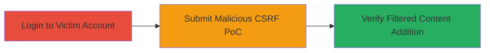

---
tags:
  - csrf
  - tumblr
  - web-vulnerability
  - account-modification
type: attack_chain
tools:
  - '[[tools/Burp-Suite]]'
tactics:
  - '[[Initial Access]]'
  - '[[Execution]]'
commands: []
platforms:
  - Web
complexity: medium
procedures:
  - '[[procedures/Exploit-Tumblr-CSRF-for-Filtered-Content]]'
step_count: 3
techniques:
  - '[[Exploit Public-Facing Application]]'
description: >-
  A multi-step attack exploiting CSRF in Tumblr's filtered content endpoint to
  add unwanted keywords to a victim's account without authentication or
  interaction.
skill_level: intermediate
impact_level: high
id: f33d06ff-134c-4e51-a94e-fd0640b9dd97
created_at: '2025-12-14T17:27:42.547Z'
updated_at: '2025-12-14T17:27:42.547Z'
verified: false
validated: true
submitted: true
mitre_tactics:
  - '[[Initial Access]]'
  - '[[Execution]]'
mitre_techniques:
  - '[[Exploit Public-Facing Application]]'
---
# CSRF to Add Arbitrary Filtered Content to Tumblr Account

Multi-stage attack chain demonstrating a complete CSRF workflow on Tumblr to modify account filtered content.

## Chain Metrics Dashboard

| Metric | Value |
|--------|-------|
| Chain Status | Unverified |
| Total Steps | 3 |
| Execution Time | ~5 minutes |
| Skill Level | Intermediate |
| Complexity | Medium |
| Impact Level | High |

## Attack Flow Visualization



## Prerequisites & Requirements

### Required Tools

- [[tools/Burp-Suite]]

### Target Environment

- Web platform (Tumblr.com)
- Victim must be authenticated in browser
- No specific ports or services beyond standard HTTPS (443)

### Initial Access Requirements

- Victim's browser session with active Tumblr login
- Attacker hosts or delivers malicious HTML PoC
- Network access to tumblr.com

## Detailed Attack Procedures

### Step 1: Authenticate Victim Session

procedure: [[procedures/Exploit-Tumblr-CSRF-for-Filtered-Content]]

**Objective**: Ensure the victim is logged into their Tumblr account to maintain an active session for the CSRF request.

**Instructions**: Direct the victim to log in to tumblr.com using their credentials. This can be done via a phishing link or social engineering. No tools are needed beyond a standard browser.

**Expected Output**: Successful login, visible in the browser with access to account settings.

**Success Indicators**:
- User sees personalized dashboard or account menu.
- Browser cookies/session tokens for tumblr.com are present.

### Step 2: Deliver and Execute Malicious CSRF PoC

procedure: [[procedures/Exploit-Tumblr-CSRF-for-Filtered-Content]]

**Objective**: Trick the victim into loading and submitting a forged POST request to the vulnerable endpoint, bypassing CSRF protection due to missing 'X-tumblr-form-key' validation.

**Instructions**: Use [[tools/Burp-Suite]] to generate a PoC HTML file. Create an HTML form that POSTs to https://www.tumblr.com/svc/user/filtered_content with a hidden input field 'filtered_content' set to the desired keyword (e.g., 'pwd777'). Host this HTML on an attacker-controlled site or deliver via email/phishing. When the victim opens it in their authenticated browser, the form auto-submits.

Example PoC HTML structure:

```html
<!DOCTYPE html>
<html>
<body>
<form action="https://www.tumblr.com/svc/user/filtered_content" method="POST" id="csrf-poc">
    <input type="hidden" name="filtered_content" value="pwd777">
</form>
<script>document.getElementById('csrf-poc').submit();</script>
</body>
</html>
```

The request succeeds because the custom 'X-tumblr-form-key' header is not enforced, allowing cross-origin forgery.

**Expected Output**: HTTP 200 response from the endpoint, indicating successful addition of the filtered content.

**Success Indicators**:
- No errors in browser console.
- Network tab shows successful POST to the endpoint.

### Step 3: Verify Account Modification

procedure: [[procedures/Exploit-Tumblr-CSRF-for-Filtered-Content]]

**Objective**: Confirm the attack by checking the victim's account settings for the added filtered keyword.

**Instructions**: Instruct the victim (or monitor if possible) to navigate to https://www.tumblr.com/settings/account. Look for the 'Filtered Content' section where the keyword (e.g., 'pwd777') should now appear. Note that duplicate submissions return a 400 error.

**Expected Output**: Keyword listed in the filtered content, blocking related posts or searches.

**Success Indicators**:
- New keyword visible in settings.
- Attempts to view content with the keyword are blocked.

## Attack Chain Summary

### Key Achievements

1. Bypassed CSRF protection on Tumblr's filtered content endpoint.
2. Added arbitrary keywords to victim's account without consent.
3. Demonstrated potential for persistent account tampering.

## Technique & Tactic Coverage

### MITRE ATT&CK Techniques

- [[Exploit Public-Facing Application]]

### MITRE ATT&CK Tactics

- [[Initial Access]]
- [[Execution]]

---
*Last updated: 2023-10-01*
