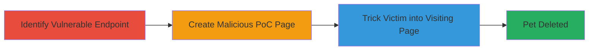

# CSRF to Delete Pet from Account on myroyalcanin.hu

Multi-stage attack chain demonstrating a complete CSRF workflow to unauthorizedly delete a pet from a user's account on myroyalcanin.hu.

## Chain Metrics Dashboard

| Metric | Value |
|--------|-------|
| Chain Status | Unverified |
| Total Steps | 3 |
| Execution Time | ~5 minutes |
| Skill Level | Intermediate |
| Complexity | Medium |
| Impact Level | High |

## Attack Flow Visualization

## Prerequisites & Requirements

### Required Tools

- None (uses basic HTML and browser)

### Target Environment

- Web platform
- Authenticated session on myroyalcanin.hu
- Knowledge of victim's ANIMAL_ID

### Initial Access Requirements

- Victim must be authenticated to myroyalcanin.hu
- Attacker needs to know or guess the ANIMAL_ID of the pet to delete
- No prior network access beyond public web

## Detailed Attack Procedures

### Step 1: Identify Vulnerable Endpoint
procedure: [[procedures/Identify-CSRF-Vulnerable-Endpoint]]

**Objective**: Locate the API endpoint responsible for pet deletion that lacks CSRF protections.

**Instructions**: Manually inspect the site's network traffic or documentation to find the /kisallataim/ANIMAL_ID/delete endpoint. Test by sending a POST request without CSRF tokens to confirm it processes the deletion when authenticated.

**Expected Output**: Confirmation that the endpoint deletes the pet without requiring a CSRF token.

**Success Indicators**:
- Endpoint responds with success (e.g., 200 OK) on unauthenticated cross-origin requests
- Pet is deleted from the account upon request

### Step 2: Create Malicious PoC Page
procedure: [[procedures/Craft-CSRF-PoC-HTML-Form]]

**Objective**: Build an HTML page that automatically submits a forged request to the vulnerable endpoint.

**Instructions**: Create an HTML file with a form targeting the delete endpoint, including the ANIMAL_ID, and use JavaScript to submit it on page load. Host this page on an attacker-controlled server or use a data URI for testing.

**Expected Output**: A self-submitting form that triggers the CSRF request.

**Success Indicators**:
- Form submits POST to /kisallataim/ANIMAL_ID/delete upon loading
- No user interaction required beyond visiting the page

### Step 3: Trigger CSRF via Malicious Page
procedure: [[procedures/Trigger-CSRF-via-Malicious-Page]]

**Objective**: Lure the authenticated victim to the malicious page to execute the deletion.

**Instructions**: Distribute the malicious page link via phishing email, social engineering, or malicious ads. When the victim visits while logged into myroyalcanin.hu, the form auto-submits, deleting the pet.

**Expected Output**: Pet removed from the victim's account without their knowledge.

**Success Indicators**:
- Victim's account shows the pet as deleted
- No alerts or confirmations triggered on the site

## Attack Chain Summary

### Key Achievements

1. Identified CSRF-vulnerable pet deletion endpoint
2. Crafted undetectable auto-submitting HTML PoC
3. Enabled unauthorized data loss via simple social engineering

## Technique & Tactic Coverage

### MITRE ATT&CK Techniques

- [[Exploit Public-Facing Application]]

### MITRE ATT&CK Tactics

- [[Initial Access]]

---
*Last updated: 2023-10-01T12:00:00Z*
