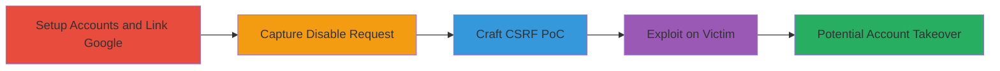

# CSRF to Disable Google-Linked Account in Insightly Leading to Potential Takeover

Multi-stage attack chain demonstrating a complete CSRF exploitation workflow in Insightly's user settings, allowing an authenticated attacker to disable a victim's Google-linked referral account without verification, potentially leading to account takeover.

## Chain Metrics Dashboard

| Metric | Value |
|--------|-------|
| Chain Status | Unverified |
| Total Steps | 4 |
| Execution Time | ~15 minutes |
| Skill Level | Intermediate |
| Complexity | Medium |
| Impact Level | High |

## Attack Flow Visualization

## Prerequisites & Requirements

### Required Tools

- [[tools/Burp-Suite]]

### Target Environment

- Insightly CRM platform (https://crm.na1.insightly.com)
- Web browser for account creation and navigation
- Attacker requires an authenticated session on Insightly

### Initial Access Requirements

- Valid Insightly account for attacker
- Victim must be authenticated in the same browser session when visiting attacker's site
- Access to Google accounts for linking referrals

## Detailed Attack Procedures

### Step 1: Setup Test Accounts and Link Google Referrals
procedure: [[procedures/Setup-Test-Accounts-and-Link-Google-Referrals]]

**Objective**: Create attacker and victim accounts on Insightly and link unique Google referral accounts to each, noting the distinct linked account IDs.

**Instructions**: Register two separate accounts (A for attacker, B for victim simulation) on Insightly. Navigate to the referrals settings and link a Google account to each, capturing the unique IDs assigned.

**Expected Output**: Two accounts with Google referrals linked, each with a unique ID (e.g., {attacker_id} and {victim_id}).

**Success Indicators**:
- Accounts created successfully
- Google referrals linked and IDs visible in the settings

### Step 2: Capture Disable Request with Burp Suite
procedure: [[procedures/Capture-Disable-Request-with-Burp-Suite]]

**Objective**: Intercept the legitimate disable request from the attacker's account to analyze the endpoint and parameters for replication in the CSRF PoC.

**Instructions**: Configure Burp Suite as a proxy. From account A, navigate to user settings, perform the disable action on its Google link, and capture the POST request to the endpoint.

**Expected Output**: Captured HTTP POST request showing the target URL (https://crm.na1.insightly.com/Users/GoogleDisable/{id}) and parameters like _pjax=#main.

**Success Indicators**:
- Request intercepted without errors
- Endpoint and payload details extracted

### Step 3: Craft CSRF PoC HTML Form
procedure: [[procedures/Craft-CSRF-POC-HTML-Form]]

**Objective**: Generate a malicious HTML page with an auto-submitting form that mimics the captured disable request, targeting the victim's linked account ID.

**Instructions**: Create an HTML file with a form that POSTs to the disable endpoint using the victim's ID. Host this on an attacker-controlled site.

**Expected Output**: A functional HTML PoC that, when loaded, submits the form automatically.

**Success Indicators**:
- HTML form validates against the captured request
- Auto-submit triggers on page load

### Step 4: Exploit CSRF to Disable Victim's Linked Account
procedure: [[procedures/Exploit-CSRF-to-Disable-Victims-Linked-Account]]

**Objective**: Trick the victim into visiting the PoC page while authenticated, causing their Google link to be disabled, allowing the attacker to associate it with a controlled email for takeover.

**Instructions**: Lure the victim (logged in as account B) to the attacker's site. The form submits, disabling the link. Follow up by attempting to claim the unconfirmed email via password reset.

**Expected Output**: Victim's Google referral disabled; attacker can potentially reset password if email is unconfirmed.

**Success Indicators**:
- Victim's linked account disabled in Insightly
- Successful password reset attempt on the now-unlinked account

## Attack Chain Summary

### Key Achievements

1. Bypassed CSRF protections to disable external account links
2. Enabled potential account takeover through email manipulation
3. Demonstrated impact on integrated services like Google referrals

## Technique & Tactic Coverage

### MITRE ATT&CK Techniques

- [[Drive-by Compromise]] Drive-by Compromise
- [[Exploit Public-Facing Application]] Exploit Public-Facing Application

### MITRE ATT&CK Tactics

- [[Initial Access]] Initial Access

---
*Last updated: 2023-10-01T00:00:00Z*
