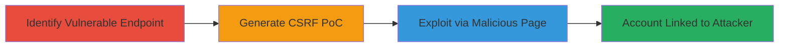

# CSRF to Force Unauthorized Third-Party Account Linking in Weblate

Multi-stage attack chain demonstrating a complete attack workflow exploiting CSRF in Weblate's third-party account connection feature.

## Chain Metrics Dashboard

| Metric | Value |
|--------|-------|
| Chain Status | Unverified |
| Total Steps | 3 |
| Execution Time | ~10 minutes |
| Skill Level | Intermediate |
| Complexity | Medium |
| Impact Level | High |

## Attack Flow Visualization

## Prerequisites & Requirements

### Required Tools

- [[tools/Burp-Suite-Professional]]

### Target Environment

- Web platform (Weblate hosted instance)
- Required services/ports: HTTPS (443)
- Network access requirements: Internet access to target Weblate instance (e.g., https://hosted.weblate.org)

### Initial Access Requirements

- No prior credentials needed for reconnaissance
- Victim must be authenticated in Weblate
- Attacker needs ability to host a malicious HTML page (e.g., via web server or file sharing)

## Detailed Attack Procedures

### Step 1: Identify Vulnerable Endpoint
procedure: [[procedures/Identify-Vulnerable-CSRF-Endpoint-in-Weblate-Authentication]]

**Objective**: Locate the third-party authentication endpoints lacking CSRF protection to target for exploitation.

**Instructions**: Examine the Weblate profile authentication page to identify links to external providers like Facebook. Note the absence of CSRF tokens in the POST requests for account linking.

**Expected Output**: Confirmation of vulnerable URL, e.g., https://hosted.weblate.org/accounts/login/facebook/.

**Success Indicators**:
- Endpoint identified without CSRF token requirement
- Profile page reveals authentication backends

### Step 2: Generate CSRF Proof-of-Concept
procedure: [[procedures/Generate-CSRF-Proof-of-Concept-with-Burp-Suite]]

**Objective**: Create a malicious HTML form that submits an unauthorized POST request to link the victim's account to the attacker's third-party service.

**Instructions**: Use Burp Suite to intercept a legitimate connection request, modify it to remove any protections, and generate an HTML PoC form that auto-submits with the 'next' parameter set to the profile page.

**Expected Output**: An HTML file containing the CSRF form, ready for hosting.

**Success Indicators**:
- PoC form generated and tested in browser
- Form submits without user interaction beyond visiting the page

### Step 3: Exploit via Malicious Page
procedure: [[procedures/Exploit-CSRF-to-Link-Third-Party-Account-in-Weblate]]

**Objective**: Trick the authenticated victim into visiting the hosted PoC, forcing the account link and enabling takeover.

**Instructions**: Host the PoC HTML on an attacker-controlled server and send a link to the victim (e.g., via phishing). When visited while logged into Weblate, the browser automatically submits the request.

**Expected Output**: Victim's Weblate account linked to attacker's Facebook account; verifiable via profile page or YouTube demo.

**Success Indicators**:
- Account connection confirmed in Weblate profile
- Unauthorized access to victim's data or control

## Attack Chain Summary

### Key Achievements

1. Identified CSRF-vulnerable endpoints in Weblate's social auth integration.
2. Crafted and hosted a functional PoC to bypass consent.
3. Demonstrated real-world impact leading to account compromise.

## Technique & Tactic Coverage

### MITRE ATT&CK Techniques

- [[Drive-by Compromise]]
- [[Valid Accounts]]

### MITRE ATT&CK Tactics

- [[Initial Access]]

---

*Last updated: 2023-10-01T00:00:00Z*
