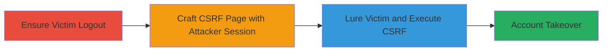

# CSRF to Log Victim into Attacker's Account on Unikrn

Multi-stage attack chain demonstrating a complete CSRF workflow to achieve account takeover on Unikrn's platform.

## Chain Metrics Dashboard

| Metric | Value |
|--------|-------|
| Chain Status | Unverified |
| Total Steps | 3 |
| Execution Time | ~5 minutes |
| Skill Level | Intermediate |
| Complexity | Medium |
| Impact Level | High |

## Attack Flow Visualization



## Prerequisites & Requirements

### Required Tools

- None (uses basic HTML and browser)

### Target Environment

- Web platform (Unikrn.com API v1/v2)
- Required services/ports: HTTPS on port 443
- Network access requirements: Internet access for attacker and victim

### Initial Access Requirements

- Attacker must have a valid Unikrn account and session
- Victim must be a user of Unikrn who can be socially engineered
- No prior access to victim account needed

## Detailed Attack Procedures

### Step 1: Ensure the Victim is Logged Out
procedure: [[procedures/Exploit-CSRF-for-Session-Hijacking]]

**Objective**: Prevent the victim's existing session from interfering with the attack, ensuring the CSRF request sets the new cookie without conflict.

**Instructions**: The victim must be logged out of unikrn.com. This can occur naturally or be forced via a separate logout CSRF if in scope, but here assume manual logout or out-of-scope method.

**Expected Output**: Victim's browser has no active 'CW' session cookie for unikrn.com.

**Success Indicators**:
- Victim confirms logout by attempting to access a protected page on unikrn.com
- Browser developer tools show no 'CW' cookie set for the domain

### Step 2: Attacker Obtains Session ID and Crafts CSRF Page
procedure: [[procedures/Exploit-CSRF-for-Session-Hijacking]]

**Objective**: Capture the attacker's own session ID to embed in a malicious HTML page that will forge a POST request to Unikrn's API.

**Instructions**: Log into unikrn.com as the attacker. Use browser developer tools to inspect the 'CW' cookie (e.g., value like 'ue9cpp0t2mitjpm0s45epj78l3kpig6j'). Create an HTML file with a hidden form that auto-submits a JSON POST to https://unikrn.com/apiv1/ containing {"session_id": "attacker_session_id"}. Sample HTML:

```html
<!doctype html><html><head></head><body><form action="https://unikrn.com/apiv1/" method="POST"><input type="hidden" name="session_id" id="session_id" value="cm8csktf7p485hmb7on32o5bm94nm71i"><input type="submit" style="display:none;"></form><script>document.getElementById('session_id').form.submit();</script></body></html>
```
Host this page on an attacker-controlled server (e.g., via GitHub Pages or a simple web host).

**Expected Output**: A hosted malicious webpage ready to be shared with the victim.

**Success Indicators**:
- HTML page loads and auto-submits when tested in a browser
- Server response includes Set-Cookie: CW=attacker_session_id (verifiable via curl or dev tools)

### Step 3: Lure Victim to Visit the Crafted CSRF Page
procedure: [[procedures/Exploit-CSRF-for-Session-Hijacking]]

**Objective**: Trick the victim into loading the CSRF page, triggering the browser to send the forged request and set the attacker's session cookie.

**Instructions**: Use social engineering (e.g., phishing email, malicious link in chat) to direct the logged-out victim to the hosted CSRF page. Upon loading, the victim's browser automatically POSTs to https://unikrn.com/apiv1/ with the session_id, and the server reflects it in the Set-Cookie header. The browser sets the cookie. Victim then navigates to unikrn.com, appearing logged in as the attacker.

**Expected Output**: Victim's browser sets the 'CW' cookie to the attacker's value; victim is logged into attacker's account.

**Success Indicators**:
- Victim reports being logged in unexpectedly on unikrn.com
- Attacker checks account activity for victim's IP or actions (e.g., password change attempts via social engineering)

## Attack Chain Summary

### Key Achievements

1. Forced session cookie overwrite via CSRF without victim interaction beyond visiting a page
2. Achieved account takeover, allowing extraction of victim data through further social engineering
3. Exploited lack of CSRF tokens and origin validation in API endpoints

## Technique & Tactic Coverage

### MITRE ATT&CK Techniques

- [[Exploit Public-Facing Application]] Exploit Public-Facing Application
- [[Valid Accounts]] Valid Accounts

### MITRE ATT&CK Tactics

- [[Initial Access]] Initial Access
- [[Lateral Movement]] Lateral Movement

---

*Last updated: 2024-10-01T00:00:00Z*
