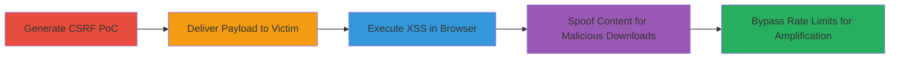

# CSRF to Reflected XSS on echo.urbandictionary.biz via Content Type Spoofing

Multi-stage attack chain demonstrating exploitation of a reflected XSS vulnerability on echo.urbandictionary.biz through CSRF, content type spoofing with file extensions, and rate limit bypass via reflected headers. The attack allows arbitrary JavaScript execution in victims' browsers, malicious file downloads, and evasion of IP-based restrictions, potentially leading to session hijacking, data exfiltration, or denial-of-service amplification.

## Chain Metrics Dashboard

| Metric | Value |
|--------|-------|
| Chain Status | Unverified |
| Total Steps | 5 |
| Execution Time | ~10 minutes |
| Skill Level | Intermediate |
| Complexity | Medium |
| Impact Level | High |

## Attack Flow Visualization

## Prerequisites & Requirements

### Required Tools

- [[tools/Burp-Suite-Professional]]

### Target Environment

- Web platform
- Access to https://echo.urbandictionary.biz
- No authentication required; public-facing endpoint

### Initial Access Requirements

- Ability to host HTML PoC files (e.g., local server or external hosting)
- Victim interaction (e.g., via phishing or malicious link)
- Network access to the target domain

## Detailed Attack Procedures

### Step 1: Generate CSRF PoC for XSS Exploitation
procedure: [[procedures/Generate-CSRF-PoC-for-XSS-Exploitation]]

**Objective**: Create an HTML form that submits a malicious XSS payload via POST to a .html endpoint on the target.

**Instructions**: Use Burp Suite to generate the CSRF PoC form targeting https://echo.urbandictionary.biz/xsxsxs.html with the payload  in the body, setting enctype=text/plain.

**Expected Output**: An HTML file that auto-submits the POST request with the unsanitized payload.

**Success Indicators**:
- PoC HTML file generated successfully
- Form submission triggers a POST request with the payload

### Step 2: Deliver XSS Payload via CSRF
procedure: [[procedures/Deliver-XSS-Payload-via-CSRF]]

**Objective**: Host the PoC and induce the victim to interact with it, triggering the CSRF submission.

**Instructions**: Host the generated HTML PoC on a server and send the link to the victim. The form auto-submits or is manually triggered, sending the POST to the target endpoint.

**Expected Output**: Victim's browser sends the POST request to echo.urbandictionary.biz, reflecting the payload.

**Success Indicators**:
- Victim accesses the PoC page
- POST request is observed in network traffic

### Step 3: Exploit Reflected XSS
procedure: [[procedures/Exploit-Reflected-XSS]]

**Objective**: Leverage the reflection to execute JavaScript in the victim's browser context.

**Instructions**: Upon POST submission to a .html path, the server reflects the body as HTML without sanitization, executing the script like alert(document.domain).

**Expected Output**: JavaScript alert or other payload executes in the browser, confirming XSS.

**Success Indicators**:
- Alert box appears or console logs payload execution
- Potential for session cookie theft via further payload refinement

### Step 4: Perform Content Spoofing with Extensions
procedure: [[procedures/Perform-Content-Spoofing-with-Extensions]]

**Objective**: Spoof MIME types using URL extensions to trick browsers into handling reflected content as malicious files.

**Instructions**: Modify requests to use extensions like .xml, .swf, or .exe in GET/POST paths; the server reflects data with spoofed content types, prompting downloads or execution.

**Expected Output**: Browser downloads or attempts to execute the reflected content as the spoofed type.

**Success Indicators**:
- Response headers show spoofed MIME (e.g., application/xml)
- Victim's browser prompts for file download or execution

### Step 5: Bypass Rate Limits with X-Forwarded-For
procedure: [[procedures/Bypass-Rate-Limits-with-X-Forwarded-For]]

**Objective**: Spoof IP origins to evade IP-based rate limiting on the endpoint.

**Instructions**: Include manipulated X-Forwarded-For headers in requests, such as setting it to bing.com, causing the server to reflect and treat requests as from different sources.

**Expected Output**: Multiple requests succeed without rate limit enforcement.

**Success Indicators**:
- Requests bypass limits, allowing high-volume attacks
- Reflected header confirms spoofing

## Attack Chain Summary

### Key Achievements

1. Successful XSS execution via CSRF, enabling client-side attacks
2. Content spoofing for malicious file delivery
3. Rate limit evasion for attack amplification

## Technique & Tactic Coverage

### MITRE ATT&CK Techniques

- [[Drive-by Compromise]] Drive-by Compromise
- [[JavaScript]] JavaScript
- [[Malicious File]] User Execution: Malicious File
- [[Direct Network Flood]] Direct Network Flood

### MITRE ATT&CK Tactics

- [[Initial Access]] Initial Access
- [[Execution]] Execution
- [[Collection]] Collection

---
*Last updated: 2023-10-01T00:00:00Z*
