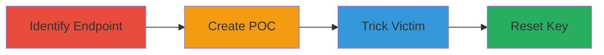

# CSRF to Reset Personal Security Key on secure.login.gov

Multi-stage attack chain demonstrating a complete CSRF workflow targeting the personal key management feature on secure.login.gov.

## Chain Metrics Dashboard

| Metric | Value |
|--------|-------|
| Chain Status | Unverified |
| Total Steps | 4 |
| Execution Time | ~5 minutes |
| Skill Level | Intermediate |
| Complexity | Medium |
| Impact Level | High |

## Attack Flow Visualization

## Prerequisites & Requirements

### Required Tools

- None (manual HTML crafting and browser-based execution)

### Target Environment

- Web platform
- Ruby on Rails tech stack
- Access to secure.login.gov account management
- Victim must be authenticated via session cookies

### Initial Access Requirements

- Attacker needs to host a malicious page
- Victim needs active login session on secure.login.gov
- No prior credentials required beyond social engineering to visit the page

## Detailed Attack Procedures

### Step 1: Identify Vulnerable Endpoint
procedure: [[procedures/Identify-Vulnerable-CSRF-Endpoint-in-Personal-Key-Management]]

**Objective**: Locate the unprotected endpoint that allows state-changing actions via simple GET requests.

**Instructions**: Manually test the site's account management functions by examining network requests in browser dev tools. Focus on the /manage/personal_key endpoint with ?resend=true parameter. Verify it triggers a key reset without CSRF tokens or additional auth checks beyond session cookies.

**Expected Output**: Confirmation that a GET request to https://secure.login.gov/manage/personal_key?resend=true performs the action.

**Success Indicators**:
- Endpoint responds with key reset confirmation
- No CSRF token required in request

### Step 2: Create Malicious CSRF POC Page
procedure: [[procedures/Create-Malicious-HTML-Page-for-CSRF-Exploitation]]

**Objective**: Build an HTML page that automatically submits the forged request using the victim's session.

**Instructions**: Craft a simple HTML file with an auto-submitting form targeting the vulnerable endpoint. Use JavaScript to submit on load or include a prompt for user interaction.

**Expected Output**: A functional HTML file that, when loaded, sends the GET request.

**Success Indicators**:
- Page loads and form submits without errors
- Request mimics legitimate origin but from attacker's domain

### Step 3: Trick Victim into Loading the POC While Logged In
procedure: [[procedures/Host-and-Distribute-CSRF-POC-to-Trick-Victim]]

**Objective**: Deliver the malicious page to the victim while they are authenticated on the target site.

**Instructions**: Host the HTML on an attacker-controlled server (e.g., GitHub Pages or personal web host). Distribute via phishing email, social engineering, or malicious link. Ensure victim visits while logged into secure.login.gov.

**Expected Output**: Victim's browser loads the page and submits the request using their cookies.

**Success Indicators**:
- Victim accesses the page
- Server logs show request from victim's IP

### Step 4: Reset Victim's Personal Security Key
procedure: [[procedures/Execute-CSRF-to-Reset-Victims-Security-Key]]

**Objective**: Confirm the unauthorized action completes, compromising the victim's recovery.

**Instructions**: Monitor for the server's response to the forged request. The endpoint processes the GET, resending/resetting the key without origin checks.

**Expected Output**: Victim receives a new key or notification of reset, locking out old recovery methods.

**Success Indicators**:
- Key reset email sent to victim
- Account recovery altered without authorization

## Attack Chain Summary

### Key Achievements

1. Identified CSRF vulnerability in key management
2. Crafted and delivered exploitable POC
3. Achieved unauthorized key reset via session forgery
4. Demonstrated potential for account compromise

## Technique & Tactic Coverage

### MITRE ATT&CK Techniques

- [[Drive-by Compromise]]
- [[Exploit Public-Facing Application]]

### MITRE ATT&CK Tactics

- [[Initial Access]]

---
*Last updated: 2023-10-01T00:00:00Z*
