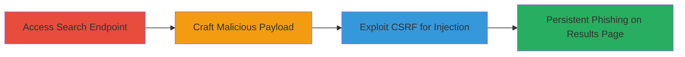

---
tags:
  - csrf
  - html-injection
  - phishing
  - stored-injection
  - web-vulnerability
type: attack_chain
tools:
  - '[[tools/Burp-Suite-Professional]]'
tactics:
  - '[[Initial Access]]'
  - '[[Collection]]'
verified: false
platforms:
  - Web
submitted: true
complexity: medium
created_at: '2023-10-01T00:00:00Z'
procedures:
  - '[[procedures/Access-Vulnerable-Search-Endpoint]]'
  - '[[procedures/Craft-HTML-Injection-Payload]]'
  - '[[procedures/Exploit-CSRF-for-HTML-Injection]]'
step_count: 3
techniques:
  - '[[Exploit Public-Facing Application]]'
  - '[[Drive-by Compromise]]'
updated_at: '2025-12-14T17:27:36.082Z'
description: >-
  A multi-stage attack exploiting CSRF to inject and persist malicious HTML
  content, such as phishing links, into a web application's case studies search
  results, enabling social engineering against users.
skill_level: intermediate
impact_level: high
id: 5dd604e0-2435-4c5d-9412-aeabd5ebdae6
validated: true
mitre_tactics:
  - '[[Initial Access]]'
  - '[[Collection]]'
mitre_techniques:
  - '[[Exploit Public-Facing Application]]'
  - '[[Drive-by Compromise]]'
---
# CSRF to Stored HTML Injection for Persistent Phishing Links

Multi-stage attack chain demonstrating a complete attack workflow exploiting lack of input sanitization and CSRF protections in a PHP-based web application to inject persistent HTML content for phishing.

## Chain Metrics Dashboard

| Metric | Value |
|--------|-------|
| Chain Status | Unverified |
| Total Steps | 3 |
| Execution Time | ~10 minutes |
| Skill Level | Intermediate |
| Complexity | Medium |
| Impact Level | High |

## Attack Flow Visualization

## Prerequisites & Requirements

### Required Tools

- [[tools/Burp-Suite-Professional]]

### Target Environment

- Web platform with PHP backend
- Access to case studies search endpoint at https://www.███████
- No specific ports required beyond standard HTTPS (443)

### Initial Access Requirements

- Network access to the target website
- Authenticated session for legitimate request interception (optional for PoC crafting)
- No prior credentials needed beyond browser access

## Detailed Attack Procedures

### Step 1: Access Vulnerable Search Endpoint
procedure: [[procedures/Access-Vulnerable-Search-Endpoint]]

**Objective**: Identify and navigate to the case studies search functionality to understand the vulnerable POST endpoint.

**Instructions**: Open a web browser and navigate to the target site's case studies search page. Perform a legitimate search to trigger the POST request to the endpoint, observing the 'keyword' parameter in the form data.

**Expected Output**: Access to the search interface, with the ability to submit POST requests containing the 'keyword' parameter.

**Success Indicators**:
- Search page loads successfully
- Legitimate POST request can be captured showing unsanitized 'keyword' reflection

### Step 2: Craft HTML Injection Payload
procedure: [[procedures/Craft-HTML-Injection-Payload]]

**Objective**: Create a malicious HTML snippet that will be injected via the 'keyword' parameter, resulting in persistent content like phishing links on the search results.

**Instructions**: Design an HTML payload such as a phishing anchor tag. Encode it appropriately for URL submission, e.g., '&lt;a&#32;href&#61;https&#58;&#47;&#47;evil&#46;site&gt;Click&#32;here&#32;to&#32;win&#32;1000&#36;&#33;&lt;&#47;a&gt;', ensuring it bypasses any partial XSS filters but allows HTML rendering.

**Expected Output**: A ready-to-use encoded HTML string for injection.

**Success Indicators**:
- Payload crafted without syntax errors
- Test reflection shows HTML tags preserved in results

### Step 3: Exploit CSRF for HTML Injection
procedure: [[procedures/Exploit-CSRF-for-HTML-Injection]]

**Objective**: Use CSRF to force submission of the malicious payload to the endpoint, chaining it with the HTML injection to store persistent malicious content visible to victims.

**Instructions**: Intercept a legitimate POST request using [[tools/Burp-Suite-Professional]]. Modify the 'keyword' parameter with the encoded payload and other form fields (e.g., 'crimetype'='none', 'year'='none'). Generate an auto-submitting HTML form PoC for CSRF exploitation, hosting it externally to trick victims into submission. Verify persistence by refreshing the search results page.

**Expected Output**: Malicious HTML (e.g., phishing link) appears in search results and persists across refreshes but clears in new tabs.

**Success Indicators**:
- CSRF PoC form submits successfully
- Injected HTML renders in results without escaping
- Content survives page refresh, enabling social engineering

## Attack Chain Summary

### Key Achievements

1. Bypassed input sanitization to store HTML content despite XSS protections
2. Chained CSRF to enable non-interactive payload submission
3. Achieved persistent phishing vectors on public search results for broad victim targeting

## Technique & Tactic Coverage

### MITRE ATT&CK Techniques

- [[Exploit Public-Facing Application]]
- [[Drive-by Compromise]]

### MITRE ATT&CK Tactics

- [[Initial Access]]
- [[Collection]]

---

*Last updated: 2023-10-01T00:00:00Z*
